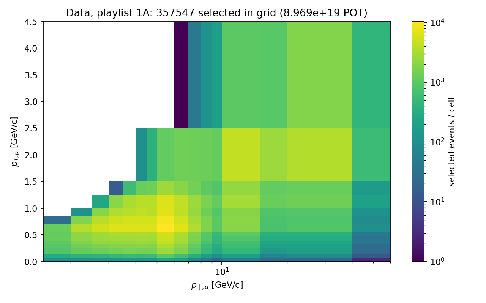
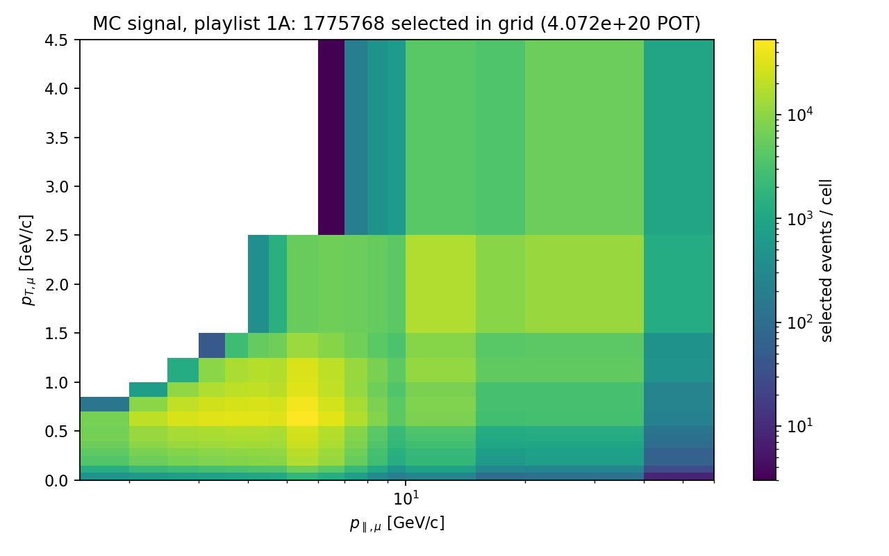
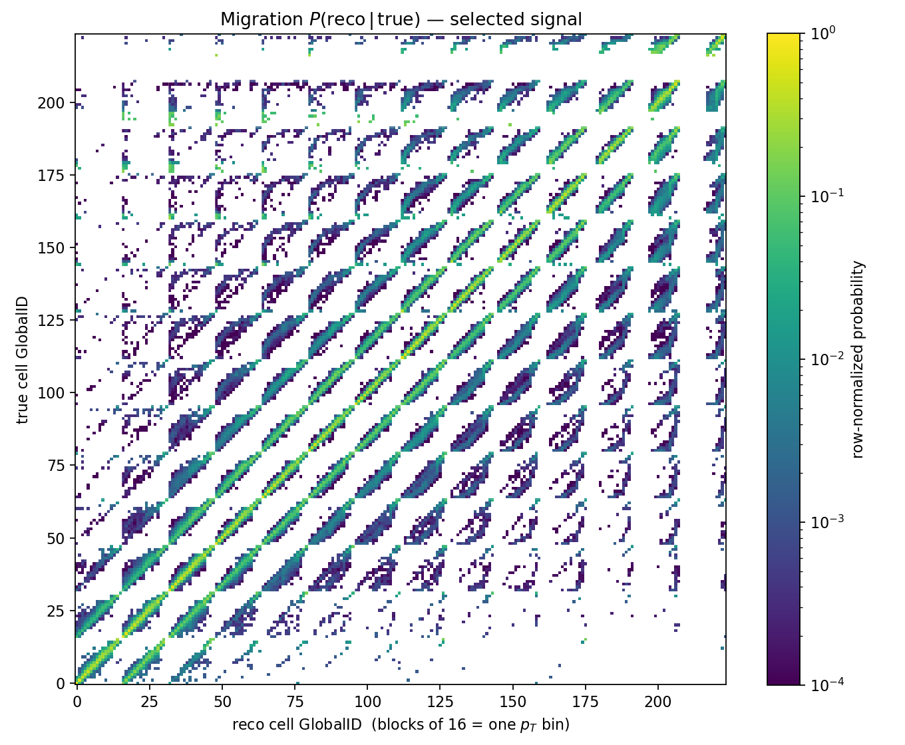

# Playlist 1A: 2D (p_T × p_∥) distributions + migration matrix

First full-playlist pass of the Stage-3 event loop: every minervame1A AnaTuple
streamed (no local copies), certified reco selection + truth signal split,
filled on the paper's 224-cell grid (`xsec/binning.py` ≡ `anc/bin_mapping.txt`).

**Provenance**
- script: `plot_2d_ptpl.py` (`--workers 8 --label playlist1A_full`, defaults otherwise)
- run: 2026-06-12, 394.7 s wall, **294/294 files, 0 failures**
- RunLog: `~/log/ndp-minerva-xsec/2026_06_12_205116.log`
- artifacts: `results/2026_06_12_204441__plot_2d_ptpl/{hists.npz,summary.json}` (untracked)
- plots embedded below are copies in `docs/results/img/playlist1A_2d/`

## Numbers

| | Data (253 files) | MC StandardMC (41 files) |
|---|---|---|
| Σ POT_Used | **8.969×10¹⁹** | 4.072×10²⁰ (MC/data = 4.54) |
| Reco entries | 2,791,649 | 7,605,892 |
| Selected (6 cuts) | 359,967 | 1,790,483 |
| → signal / background | — | 1,786,201 / 4,282 (**0.239 %**) |
| Selected in grid | 357,547 (99.33 %) | 1,775,768 |
| Migration fully in-grid | — | 99.25 % (reco-out 0.47 %, true-out 0.17 %, both-out 0.11 %) |

**Validations**
1. Σ POT_Used (data) = 0.90×10²⁰ — reproduces the published getdata-page POT
   for 1A at its quoted precision (data POT-ledger item closed).
2. Background fraction 0.239 % at full statistics — consistent with the
   paper's 0.2 % for the inclusive selection.
3. Scaling: the paper's 4,105,696 selected events at 10.61×10²⁰ POT predict
   ≈347 k at this exposure; observed 360 k (few-% level, as expected from
   playlist mix).

## Data, reco (p_T × p_∥), selected

Beam-energy ridge at p_∥ ≈ 5–6 GeV/c, p_T ≈ 0.5–0.7 GeV/c; the θ<20°
acceptance staircase bounds the populated region; the empty high-p_T/low-p_∥
corner is exactly where the paper leaves 19 cells unreported.



## MC signal, reco (p_T × p_∥), selected

Same structure at 4.54× the exposure (unweighted CV — MnvTunev1 weights are a
later stage).



## Migration matrix, P(reco | true), selected signal

Flat GlobalID axes (gid = (pt−1)·16 + (pl−1); blocks of 16 = one p_T bin).
Sharp main diagonal (p_∥ resolution within a p_T block); first off-diagonal
blocks = single-bin p_T migration. Row-normalized; log color.



## Reproduce

```bash
pixi run python plot_2d_ptpl.py --workers 8 --label playlist1A_full
```

(or query `~/log/ndp-minerva-xsec/*.log` with jq for the exact recorded command)
