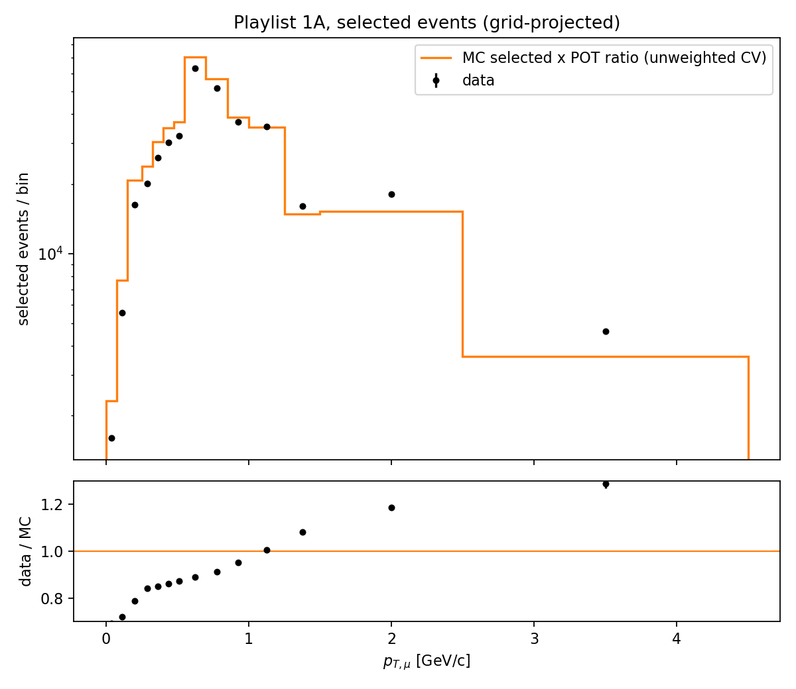
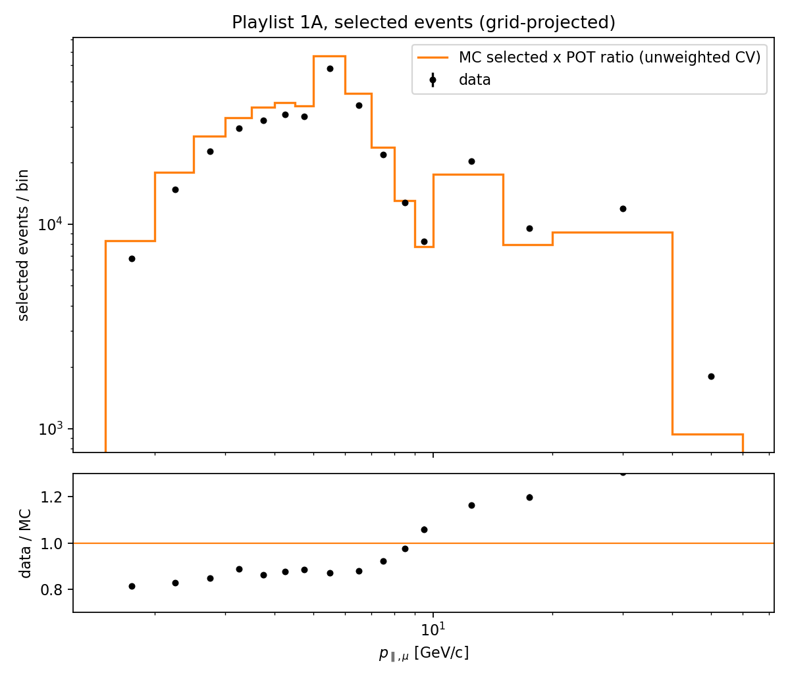
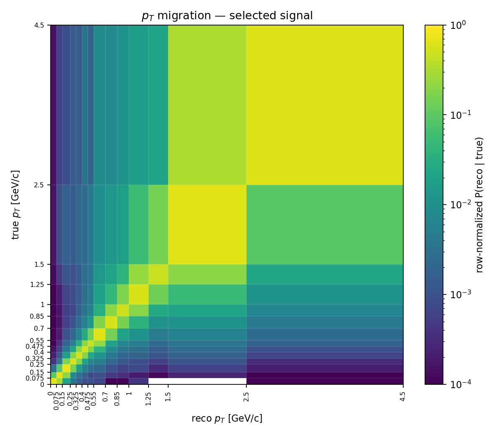
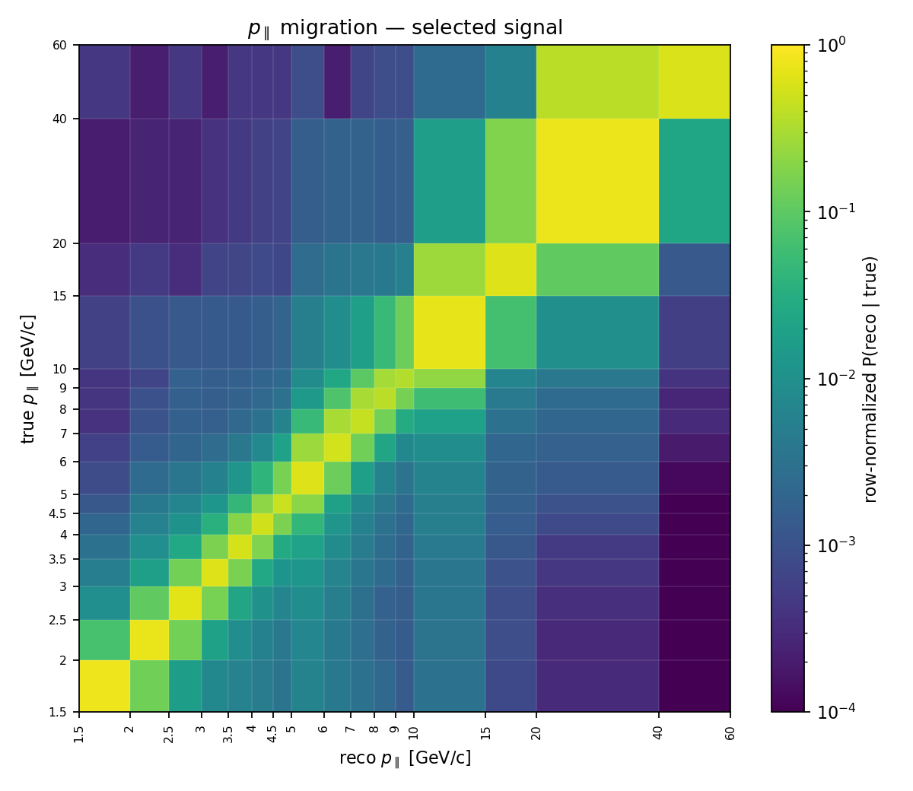

# Playlist 1A: 2D (p_T × p_∥) distributions + migration matrix

First full-playlist pass of the Stage-3 event loop: every minervame1A AnaTuple
streamed (no local copies), certified reco selection + truth signal split,
filled on the paper's 224-cell grid (`xsec/binning.py` ≡ `anc/bin_mapping.txt`).

**Provenance**
- script: `plot_2d_ptpl.py` (`--workers 8 --label playlist1A_full`, defaults otherwise)
- run: 2026-06-12, 394.7 s wall, **294/294 files, 0 failures**
- RunLog: `~/log/ndp-minerva-xsec/2026_06_12_205116.log`
- artifacts: `results/2026_06_12_204441__plot_2d_ptpl/{hists.npz,summary.json}` (untracked)
- plots embedded below are copies in `docs/results/img/playlist1A_2d/`

## Binning

The 2D grid is 14 muon-p_T bins × 16 p_∥ bins = 224 cells
(`xsec/binning.py` ≡ `anc/bin_mapping.txt`, GlobalID = (pt_bin−1)·16 + (pl_bin−1),
ROOT-style [low, high) — top edges are overflow). **The paper's 1D binnings are
exactly these axes** (tutorial `dansPTBins`/`dansPzBins`, runEventLoop.cpp:413-414);
1D distributions are projections of this grid.

| axis | bins | edges [GeV/c] |
|---|---|---|
| p_T | 14 | 0, 0.075, 0.15, 0.25, 0.325, 0.40, 0.475, 0.55, 0.70, 0.85, 1.00, 1.25, 1.50, 2.50, 4.50 |
| p_∥ | 16 | 1.5, 2, 2.5, 3, 3.5, 4, 4.5, 5, 6, 7, 8, 9, 10, 15, 20, 40, 60 |

(The anc file prints the p_T edges %.2f-rounded: 0.075→0.07, 0.325→0.33,
0.475→0.47; the 3-decimal values above are the tutorial's and are what the
code uses — verified by the bin-mapping round-trip test.)

## Numbers

| | Data (253 files) | MC StandardMC (41 files) |
|---|---|---|
| Σ POT_Used | **8.969×10¹⁹** | 4.072×10²⁰ (MC/data = 4.54) |
| Reco entries | 2,791,649 | 7,605,892 |
| Selected (6 cuts) | 359,967 | 1,790,483 |
| → signal / background | — | 1,786,201 / 4,282 (**0.239 %**) |
| Selected in grid | 357,547 (99.33 %) | 1,775,768 |
| Migration fully in-grid | — | 99.25 % (reco-out 0.47 %, true-out 0.17 %, both-out 0.11 %) |

**Validations**
1. Σ POT_Used (data) = 0.90×10²⁰ — reproduces the published getdata-page POT
   for 1A at its quoted precision (data POT-ledger item closed).
2. Background fraction 0.239 % at full statistics — consistent with the
   paper's 0.2 % for the inclusive selection.
3. Scaling: the paper's 4,105,696 selected events at 10.61×10²⁰ POT predict
   ≈347 k at this exposure; observed 360 k (few-% level, as expected from
   playlist mix).

## Data, reco (p_T × p_∥), selected

Beam-energy ridge at p_∥ ≈ 5–6 GeV/c, p_T ≈ 0.5–0.7 GeV/c; the θ<20°
acceptance staircase bounds the populated region; the empty high-p_T/low-p_∥
corner is exactly where the paper leaves 19 cells unreported.


## MC signal, reco (p_T × p_∥), selected

Same structure at 4.54× the exposure (unweighted CV — MnvTunev1 weights are a
later stage).


## Migration matrix, P(reco | true), selected signal

Flat GlobalID axes (gid = (pt−1)·16 + (pl−1); blocks of 16 = one p_T bin).
Sharp main diagonal (p_∥ resolution within a p_T block); first off-diagonal
blocks = single-bin p_T migration. Row-normalized; log color.


## 1D projections (from the same hists.npz — no re-streaming)

Produced by `plot_1d_from_hists.py` (RunLog 2026_06_12_205930; artifacts in
`results/2026_06_12_205929__plot_1d_from_hists/`). All 1D quantities are
projections of the in-grid 2D objects, i.e. defined within the 2D phase space
exactly like the paper's 1D results. MC is POT-scaled (×0.2203), **unweighted
CV** — the MnvTunev1 weights are a later stage, and the data/MC ratios below
show precisely the structure those weights correct:

- **overall data/MC = 0.912** (POT-scaled MC ~9.6 % high — Stage B saw −6.3 %
  on the single-run pair; same direction, the flux CV weight is per-event and
  E_ν-dependent so the gap is not one universal number);
- **p_T ratio slopes** from ~0.7 (lowest p_T) through 1.0 (~1.1 GeV/c) to ~1.3
  (highest p_T) — the classic pre-tune shape that RPA + 2p2h + low-Q² pion
  weights flatten;
- **p_∥ ratio** sits ~0.85 below ~8 GeV/c and rises above 1 beyond 10 GeV/c
  (≈1.9 in the 40–60 bin) — the energy-dependent flux-CV-weight signature
  (generated vs PPFX-corrected flux differ most in the falling edge above the
  focusing peak).





### 1D migration matrices (selected signal, row-normalized)

Projections of the 224×224 migration (reshape to (14,16,14,16), sum the other
axis), drawn on **physical axes** so cell sizes show the real bin widths
(p_T linear; p_∥ log–log). Both are strongly diagonal with mostly one-bin
spill; p_∥ shows the expected mild low-side reconstruction tail at high p_∥.





## Reproduce

```bash
pixi run python plot_2d_ptpl.py --workers 8 --label playlist1A_full
pixi run python plot_1d_from_hists.py --hists results/<ts>__plot_2d_ptpl/hists.npz
```

(or query `~/log/ndp-minerva-xsec/*.log` with jq for the exact recorded commands)
