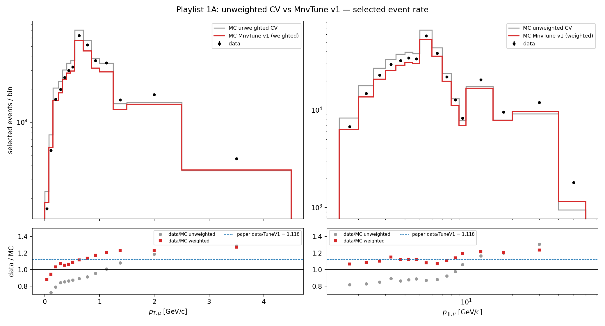
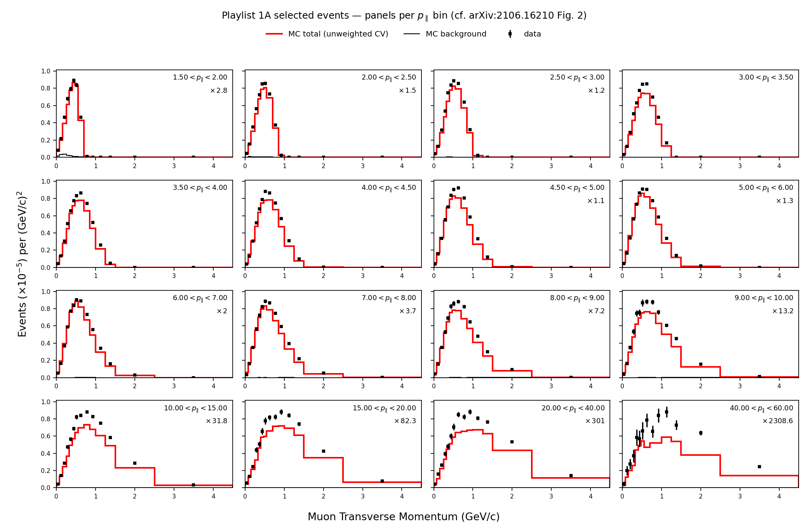

# Playlist 1A with MnvTune v1 CV weights — end-to-end validation

Re-streamed all of minervame1A (253 data + 41 MC files, 0 failures, 441.6 s)
with the full five-weight MnvTune v1 CV stack applied to every MC fill
(`plot_2d_ptpl.py --weights cv`, RunLog 2026_06_15_225103). Data is never
weighted. Streaming-only — nothing saved beyond the histograms.

## Headline: the weights land on the paper

| selected event rate, data / (POT-scaled MC) | value |
|---|---|
| unweighted CV (signal only) | 0.914 — MC **over**-predicts |
| **weighted MnvTune v1 (signal only)** | **1.124** — MC under-predicts |
| weighted, including background (total MC) | **1.121** |
| **paper data / MnvTune v1 (anc, integrated)** | **1.118** |

The weights swing MC from +9.4 % over data to −11 % under, and the resulting
data/MC ratio matches the paper's published data/MnvTune v1 = 1.118 to
**within 0.3 %**. Net weight on selected signal: **×0.8136**.

This is the *selected event rate* (Fig.-2 level), not the unfolded cross
section — but it exercises the entire CV weight chain end-to-end against an
external number, and agreement to <0.5 % is strong evidence the flux +
non-res-π + 2p2h + RPA + MINOS-efficiency ports are all correct.

## Before / after

Gray = unweighted CV, red = MnvTune v1, points = data; bottom panels show
data/MC for both with the paper's 1.118 line. The unweighted ratio sits ~0.85
and slopes (the uncorrected flux shape); the weighted ratio snaps flat onto
the paper line — most visibly the p_∥ flux tail above 10 GeV/c, which the
per-event flux CV weight (rising to ~1.6 near 45 GeV) lifts into place.



## Per-component weight means (selected signal)

flux 0.874 · non-res-π 0.942 (10 % tagged) · 2p2h 1.025 (3 % MEC) ·
RPA 0.979 (15 % QE-on-nuclei) · MINOS-eff 0.984 → product ≈ 0.814.
The flux CV weight dominates the normalization shift; RPA + 2p2h reshape the
low-p_T region; MINOS-eff is a small intensity-dependent reco correction.

## Weighted Fig.-2 panels (p_∥ view)

The red MnvTune v1 curve now tracks the data points across all 16 p_∥ panels
(cf. the unweighted version in `2026-06-12_playlist1A_2d_migration.md`, where
it sat systematically high at low p_T and low at high p_∥).



## Reproduce

```bash
pixi run python plot_2d_ptpl.py --weights cv --workers 8 --playlist minervame1A
pixi run python compare_weight_modes.py \
    --unweighted results/<unweighted>/hists.npz \
    --weighted   results/<weighted>/hists.npz
```
