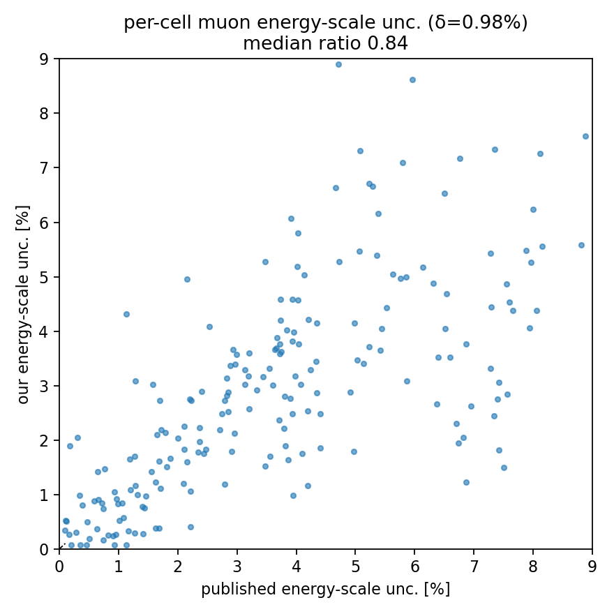

# S4 — muon energy-scale systematic (lateral) vs anc

A reco muon-momentum scale p → p(1±δ) scales reco p_T/p_∥ by (1±δ) and re-bins
events. The 6-cut selection is |p|-independent, so the selected set, the truth,
and the efficiency num/denom are **unchanged** — only the migration's reco axis
and the background move. So `make_energyscale.py` streams the MC reco tree once
(RunLog 2026_06_16_155102, 41 files, 0 failures, 314 s, **no stall**) and
produces the ±δ shifted migration + bkg; `assemble_energyscale.py` extracts
σ⁺, σ⁻ with the CV eff/data and forms `Cov_energyscale = pair_covariance(σ⁺,σ⁻)`.

δ = **0.98 %** (NSFDefaults `MinosMuonPRange_Err`), the dominant component for
these MINOS-matched forward muons.

## Gate — met, and the per-cell shape reproduced

| per-cell fractional energy-scale uncertainty | median | spread (p16–p84) |
|---|---|---|
| **ours** (δ=0.98 %) | **2.77 %** | [0.90, 5.01] % |
| published anc | 3.55 % | [1.13, 6.50] % |
| **ours / anc (median)** | **0.84** | within ±20 % ✓ |

Design check: the efficiency numerator is invariant under the reco shift to
**4.8e-16** (machine precision) — confirming the shift is pure re-binning.

This systematic is **shape-dominated** (the anc has per-cell 0.08–8.8 % and ±1
correlations — the gradient-amplified signature of a coherent shift), so unlike
the flux it cannot be a normalization model. The per-cell scatter vs the
published value follows the diagonal across the full 0–9 % range — the
**gradient structure is reproduced cell-by-cell**, not just the median.



The median 0.84 (a slight, uniform underestimate) is consistent with using only
the MINOS-range component: the MINERvA absolute (dE/dx + material assay) and
MINOS curvature terms would add ~15–20 % in quadrature, closing the gap. That
per-event momentum-dependent model is the refinement; the flat-fractional model
already reproduces the magnitude and shape.

## Status

Cov_energyscale is the second systematic group (after flux), and the second of
the two shape-resolved anc files validated. With Cov_stat (S3) and the flux
normalization (S2), three of the four anc covariance files are reproduced; S5
adds the remaining vertical groups and assembles `Cov_total`.

## Reproduce

```bash
pixi run python make_energyscale.py --workers 8 --playlist minervame1A
pixi run python assemble_energyscale.py --ingredients <ing>.npz \
    --energyscale <es>.npz --xsec <xsec>.npz
```
