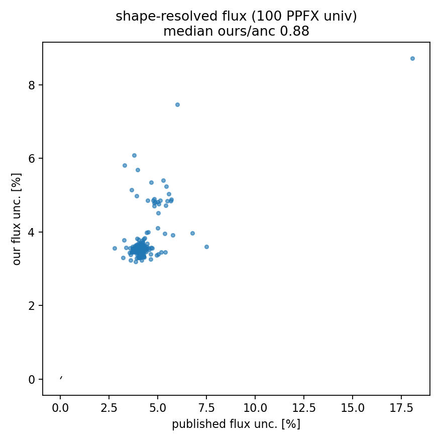

# Flux shape — the per-cell, off-diagonal-resolved flux covariance

S2 reproduced the ν-e-constrained flux *normalization* (3.23 %) and used a flat,
fully-correlated model for `cov_flux` (matched the anc magnitude to ~19 %, but
its correlation matrix is +1 everywhere by construction). This upgrades it to
the **shape-resolved** covariance: propagate each PPFX universe through the full
chain and take the ν-e-constraint-weighted sample covariance.

## Method (faithful to MnvHistoConstrainer → CalcCovMx)

`make_flux_universes.py` (RunLog 2026_06_16_221235, 41 files, 0 failures, 614 s,
4 workers) runs **N=100** PPFX universes (the CCQENu `fluxUniverses: 100`
config). Each universe u is vertical (weight-only): every MC fill is reweighted
by `U_u(Enu)/Φ_constrained(Enu)` (`FluxCV.universe_ratio`), reshaping the Enu mix
in each (p_T, p_∥) cell. Downstream, `assemble_flux.py` extracts σ_u using
**universe u's own integrated flux Φ_u** in the denominator
(`FluxCV.universe_integrals`), then

  cov_flux = weighted sample covariance of {σ_u} about their weighted mean,
             weights = the ν-e constraint weights (SetUnivWgt → CalcCovMx).

The constraint enters only as universe weights (the raw PPFX universes scatter
±7.6 %; the weights pull the effective band to ~3–4 %), exactly as the source
does — `xsec.systematics.sample_covariance(σ, weights=w)`.

## Validated vs anc cov_flux

| metric | flat S2 model | **shape (this)** | anc |
|---|---|---|---|
| per-cell frac (median) | 3.23 % | **3.56 %** | 4.08 % |
| ours / anc (median) | 0.81 | **0.88** | — |
| **off-diagonal correlation agreement** | — (all +1) | **0.85** | — |

The headline is the **off-diagonal structure**: the flat model's correlation
matrix is +1 everywhere; the shape model reproduces the anc's actual correlation
pattern with corr-of-corr **0.85**. The per-cell magnitude also rises 3.23 →
3.56 % (ratio 0.81 → 0.88), as the per-event Enu-shape folding through the
efficiency adds the de-correlated part the normalization model misses.

The residual (3.56 vs 4.08, and corr 0.85 not 1.0) is plausibly the 100- vs
1000-universe count and the single-playlist Enu mix (the anc is full-dataset);
both are refinements, not corrections to the method.



## Effect on Cov_total (1A)
Systematic-only **5.30 → 5.54 % = 88.5 %** of the anc systematic budget (6.26 %);
the total overshoots anc only because of the inflated 1A statistical band.
`assemble_total.py --flux <cov_flux.npz>` uses the shape covariance in place of
the flat `--flux-frac` model.

## Reproduce
```bash
pixi run python make_flux_universes.py --n-universes 100 --workers 4 --playlist minervame1A
pixi run python assemble_flux.py --flux-universes <flux> --ingredients <ing> --xsec <xsec>
pixi run python assemble_total.py --ingredients <ing> --xsec <xsec> --flux <cov_flux> \
    --muon <cov_muon> --stat-cov <stat> --genie <genie> --twop2h <twop2h> \
    --rpa <rpa> --geniervx1pi <grvx>
```
