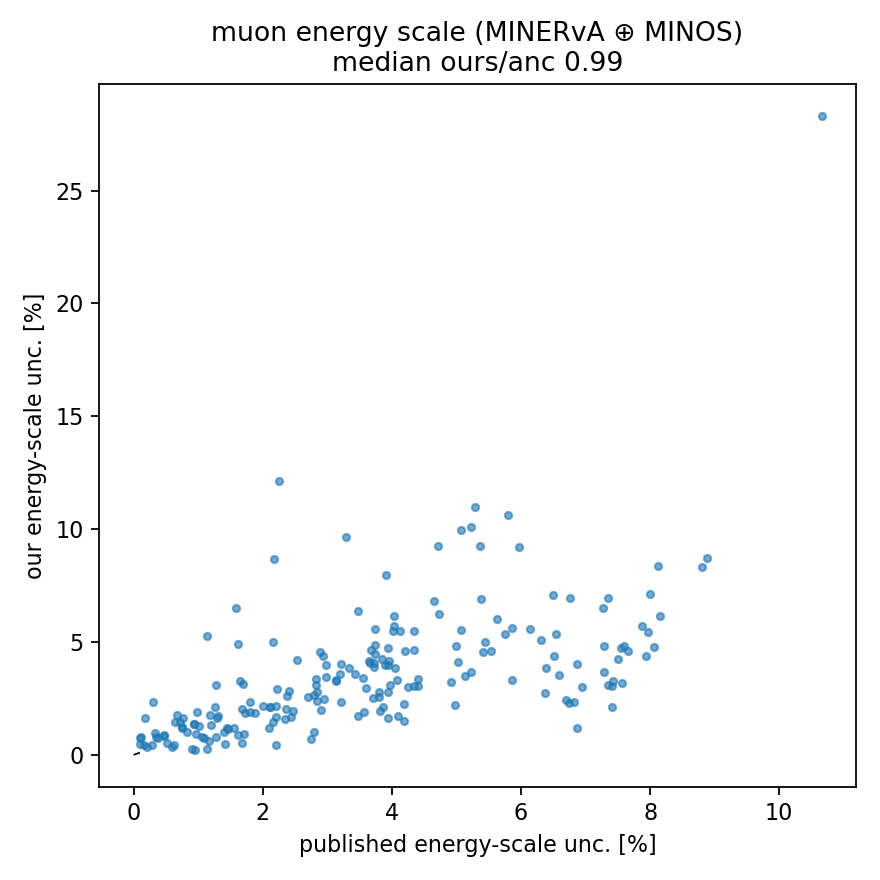

# Muon-reconstruction systematics (the dominant category)

Fig 8's "Muon Reconstruction" is the largest systematic in the measurement.
`make_muon_systematics.py` builds the whole category in **one reco-only
streaming pass** (RunLog 2026_06_16_190552, 41 files, 0 failures, 247 s, 8
workers): every band is a reco-side shift, so the Truth tree (efficiency
denominator) is untouched — only the migration + background move (the vertical
MINOS-efficiency band reweights). `assemble_muon.py` extracts each ±1σ pair and
forms `pair_covariance`; the energy-scale subset is validated against the anc.

## Bands and source (xsec/muon_syst.py, magnitudes from NSFDefaults.h)

| band | kind | shift (source) | frac/cell (1A) |
|---|---|---|---|
| Muon_Energy_MINOS | momentum | √(range²+curv²) on p_minos; range 0.984%, curv 0.6/2.5% hi/lo-p if `minos_used_curvature` (MuonSystematics.cxx:122-152) | **2.36 %** |
| Muon_Energy_MINERvA | momentum | absolute √(30²+11²)=**31.95 MeV** (tracker/NoNuke, MuonSystematics.cxx:89-103) | 1.41 % |
| MINOS_Efficiency | vertical | weight × (1+nσ·err/cv), err=√(0.01²+θ-dep²) (MinosEfficiencySystematics.cxx) | 1.37 % |
| BeamAngleX / Y | angle | θ_x/y += ±0.001 / ±0.0009 rad (AngleSystematics.cxx) | 0.34 / 0.30 % |
| Muon_Energy_Resolution | momentum | (p_true−p_reco)·nσ·0.004 (MuonResolutionSystematics.cxx) | 0.13 % |
| MuonAngleX / YResolution | angle | (θ_true−θ_reco)·nσ·0.02 | 0.12 / 0.11 % |

The total reco momentum splits **p_total = p_minerva + p_minos** with
p_minos=`minos_trk_p`, p_total=`|leptonE|` (MuonFunctions.h:57-112). Momentum
bands rescale p at fixed angle (re-bin only — the selection is angle-only);
angle bands shift the track angle and **re-apply the 20° muon-angle cut**.

## Energy scale validated — the 0.84 is closed

The anc `cov_energyscale` is the muon energy scale (MINERvA ⊕ MINOS). The
earlier S4 used a single flat 0.984 % on the *total* momentum and reached
ratio 0.84. The faithful two-band, momentum-dependent model:

| muon energy scale, per-cell frac (median, reported cells) | value |
|---|---|
| ours (MINERvA ⊕ MINOS) | **3.07 %** |
| published anc | 3.55 % |
| **ours / anc (median)** | **0.99** |

What closed it (0.84 → 0.99): the **MINERvA absolute 31.95 MeV** term (missing
before) and the **MINOS curvature** term for curvature-reconstructed tracks
(missing before), applied to the *MINOS momentum component* rather than a flat
fraction of the total. Still omitted (small): the MINOS band's flux-weight
correlation (Amit's wiggle-study fluxes, `GetSysUniFluxWeightCorrection`) — a
second-order flux↔muon-scale correlation.



## Full muon-reconstruction group

| | per-cell frac (median, 1A) |
|---|---|
| **muon reconstruction (all 8 bands)** | **3.79 %** |

Dominated by the energy scale (3.07 %) and MINOS efficiency (1.37 %); beam
angle adds ~0.45 % (mostly at low p_T); momentum and angle resolution are
negligible (~0.1 %), confirming the expectation. This is the dominant
systematic, matching the Fig 8 orange curve (bulk 3–5 %, spiking higher at the
muon-momentum-peak edges).

## Effect on Cov_total (1A)

| | systematic-only (median/cell) | total (median/cell) |
|---|---|---|
| flat S4 energy scale (prev.) | 4.78 % | 6.93 % |
| **full muon reco** | **5.30 %** | 7.30 % |
| published anc | 6.26 % (systematic) | 6.83 % (total) |

Systematic-only is now **85 %** of the anc systematic budget (was 76 %). The
total overshoots the anc (7.30 vs 6.83) only because our 1A statistical band
(4.7 %) is much larger than the full-dataset stat (~1.5 %) inside the published
total — the full-12-playlist combine resolves this. Remaining systematic gaps:
RPA (variation modes; CV done), flux shape, Geant-hadron, and a normalization
band.

## Reproduce

```bash
pixi run python make_muon_systematics.py --workers 8 --playlist minervame1A
pixi run python assemble_muon.py --muon <muon> --ingredients <ing> --xsec <xsec>
pixi run python assemble_total.py --ingredients <ing> --xsec <xsec> --muon <cov_muon> \
    --stat-cov <stat> --genie <genie> --twop2h <twop2h>
```
