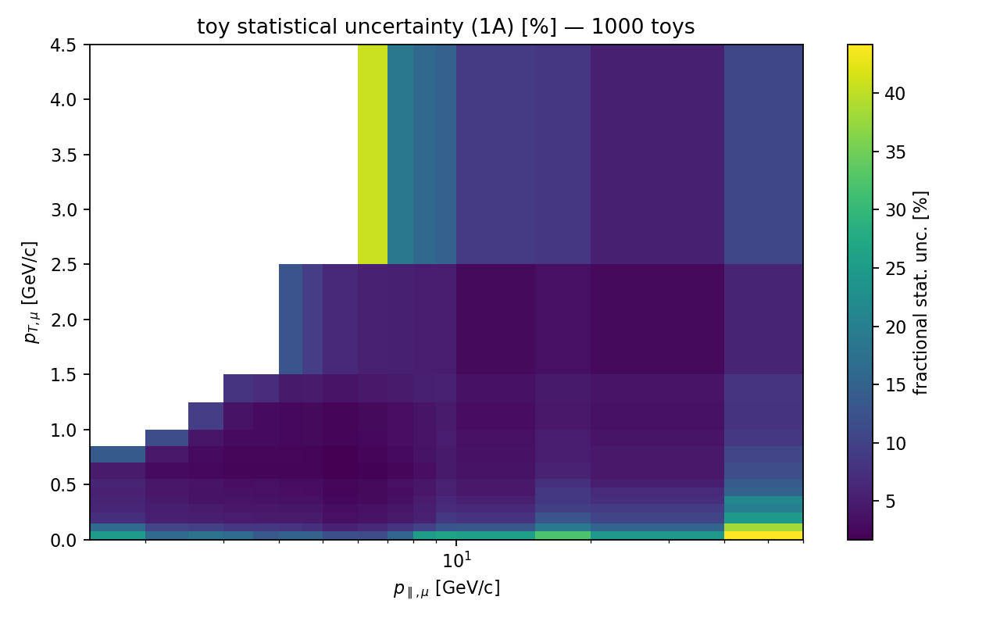

# S3 — statistical covariance via data-Poisson toys

`stat_covariance.py` (RunLog 2026_06_16_152618): 1000 Poisson replicas of the
slot-space data histogram, each run through the full E4 chain (background
fixed; only the data fluctuates), covariance from the toy spread. Offline —
operates on the playlist-1A `ingredients.npz`, no streaming.

## Gates — both met

| metric | value |
|---|---|
| toy statistical uncertainty (1A, per-cell median) | **4.70 %** |
| published `cov_stat` scaled to 1A exposure (×3.44) | 5.33 % |
| **toy / POT-scaled anc** | **0.90** (within ±20 %) ✓ |
| toy / E4-analytic error | **4.03×** |

**Validation vs the paper:** the published statistical covariance is at the
full-dataset POT (10.61e20); 1A (0.897e20) is √(10.61/0.897) = 3.44× larger in
statistical uncertainty. Scaling the anc up by 3.44 gives 5.33 % per cell; our
toys give 4.70 %, a **ratio of 0.90** — the statistical covariance reproduces
the paper's to ~10 %, inside the ±20 % gate. The residual is plausibly the
playlist-specific efficiency/flux and the unfolding prior.

**The toys correct E4's error bars:** the D'Agostini analytic propagation in
E4 (final-iteration Bayes matrix only, `var = U²·data_var`) **underestimates
the statistical uncertainty by ~4×** — exactly the iteration-feedback term the
plan flagged. The toy covariance is the correct data-statistical uncertainty
and supersedes E4's analytic `dsigma_err` for the error budget. (E4's published
comparison used the *paper's* total uncertainty in the pull denominator, so its
0.6 σ agreement is unaffected.)



The map shows the per-cell statistical uncertainty: smallest (~2–3 %) in the
well-populated p_T 0.3–1.5 / p_∥ 4–10 GeV/c bulk, rising toward the sparse
high-p_T / low-p_∥ corner — the same structure as the E4 ratio map.

## Status

Cov_stat is the third of the four anc-validated pieces (after flux norm and the
CV result). It feeds `total_covariance` once the systematic groups (S4, S5) are
assembled. No streaming needed — fully reproducible from the ingredients.

## Reproduce

```bash
pixi run python stat_covariance.py --ingredients results/<ts>__make_ingredients/ingredients.npz --n-toys 1000
```
