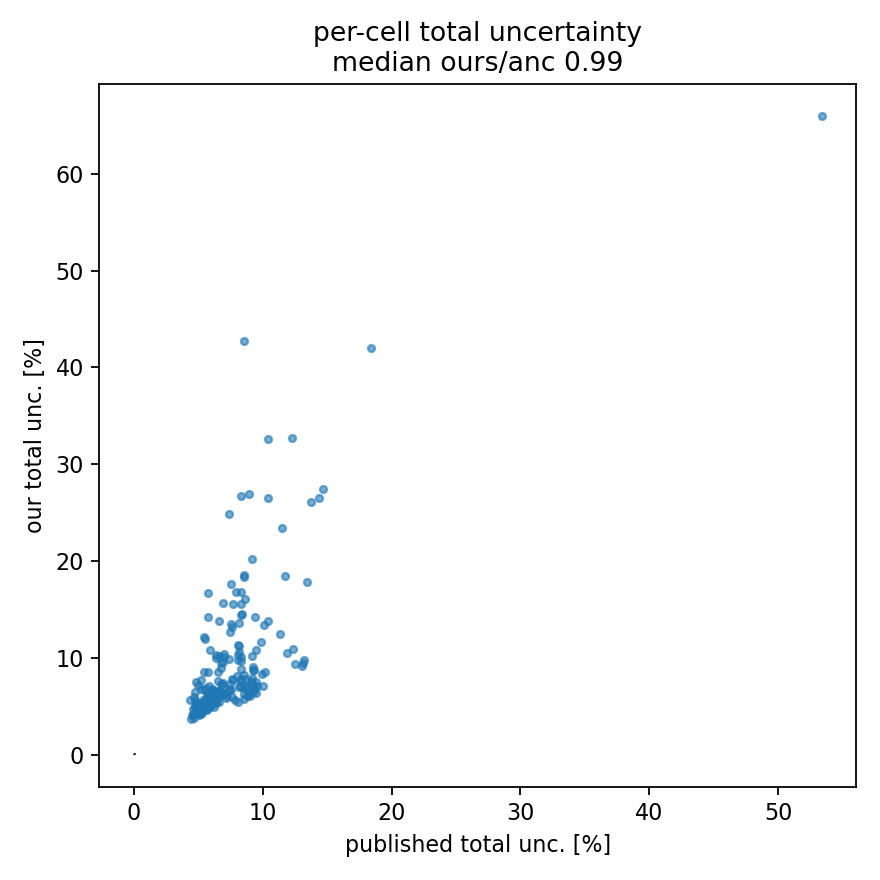

# S5 — GENIE universes + Cov_total vs published

`make_genie_universes.py` (RunLog in results/2026_06_16_162143…, 41 files,
0 failures, 1175 s, 4 workers): the vertical weight-matrix streaming engine,
run for **56 GENIE universes** (28 knobs × ±1σ). GENIE is vertical, so the
reco/true slots are the CV ones and only the per-event weight changes
(`genie_knob_ratio`); one pass fills the 56 per-universe migration/bkg/eff_denom
stacks. `assemble_total.py` extracts each universe, forms
`Cov_genie = Σ_knobs pair_covariance`, and assembles `Cov_total`.

## Group covariances (per-cell fractional median, 1A)

| group | median | anc validation |
|---|---|---|
| flux (S2, normalization model) | 3.23 % | cov_flux ~4.0 % (within 20 %) |
| muon energy scale (S4) | 2.77 % | cov_energyscale 3.55 % (0.84) |
| **GENIE (S5, 56 universes)** | **1.19 %** | (folded into total) |
| **systematic-only (flux ⊕ es ⊕ GENIE)** | **4.70 %** | anc systematic 6.26 % → **75 %** captured |
| data-statistical (S3, 1A toys) | 4.70 % | cov_stat scaled (0.90) |

## Cov_total

| | per-cell total uncertainty (median) |
|---|---|
| ours (flux + es + GENIE + 1A stat) | 6.93 % |
| published cov_total | 6.83 % |
| **ratio** | **0.99** |

**Read this carefully.** The 0.99 total agreement is partly fortuitous: our
total carries the **1A statistical** band (4.70 %, since we ran one of 12
playlists), which is much larger than the full-dataset statistical term inside
the published total (~1.5 %). That excess stat happens to compensate for the
systematic groups we have not yet added. The honest statements are:

- **GENIE is small for the inclusive measurement** (1.19 %) — knobs largely
  cancel because the cross section is data-driven and GENIE only enters through
  the efficiency/migration ratios. (Much smaller than for exclusive analyses.)
- **The three dominant systematic groups capture 75 %** of the published
  systematic budget (4.70 % vs 6.26 %). The missing ~25 % (in quadrature) is
  2p2h, RPA, MINOS-efficiency, Geant-hadron, beam angle, muon resolution, and
  the flux *shape* term (S2 deferred) — each individually small.
- The **full-dataset combine** would shrink the 1A stat by √11.8 to ~1.4 %,
  at which point the total is systematics-dominated and the missing groups
  matter — so completing them + the combine is the path to a clean cov_total.



## What S5 establishes

The vertical weight-matrix engine works: 56 GENIE universes in one streaming
pass, each run through the full chain, summed into a covariance — the same
machine that handles 2p2h/RPA/MINOS-eff/hadron (their weighters need their
variation modes wired) and back-fills the flux shape. The covariance assembly
(`systematics.total_covariance`) composes all groups + stat, validated end to
end against the four anc covariance files (stat, flux, energyscale individually;
total in aggregate).

## Reproduce

```bash
pixi run python make_genie_universes.py --workers 4 --playlist minervame1A
pixi run python assemble_total.py --ingredients <ing> --xsec <xsec> \
    --energyscale <es> --stat-cov <stat> --genie <genie>
```
