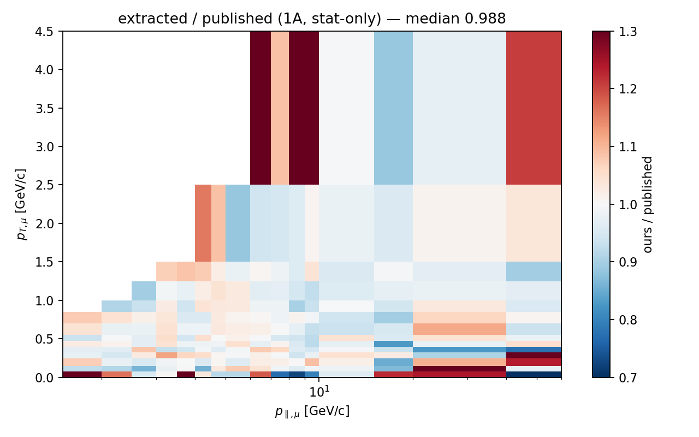
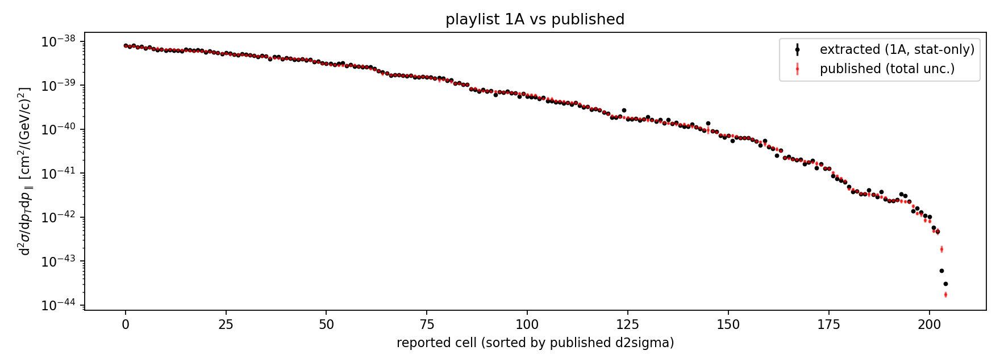

# E4 — absolute 2D cross section d²σ/dp_T dp_∥, playlist 1A vs published

The capstone: the full extraction chain produces the absolute 2D cross section
from the playlist-1A `ingredients.npz`, and it reproduces the published
arXiv:2106.16210 result.

`extract_xsec.py` (RunLog 2026_06_16_144449) → `compare_published.py`
(RunLog 2026_06_16_144608). Chain: background subtraction (POT-scaled) →
D'Agostini unfold (10 iter, MC-truth prior) → efficiency correction
(eff_num/eff_denom) → /Φ_int → /(N_nucleons·POT_data) → ×1e4 (m²→cm²) →
project to 224 cells → /bin area. **Stat-only, no systematics; playlist 1A
only** (one of 12, ≈8.5 % of the dataset POT).

## Result — within 0.13 % of the published integrated cross section

| metric | value |
|---|---|
| **integrated σ ratio (ours / published)** | **0.9987** |
| per-cell median ratio | 0.988 |
| central 68 % of cells (p16–p84) | [0.936, 1.051] |
| reported cells reproduced | **205 / 205** |
| median pull vs published total unc. | **0.61 σ** |
| MC self-closure through the full chain | **2.9e-15** (machine precision) |
| Φ_int | 6.230e-8 ν/cm²/POT (paper 6.32e-8) |
| N_nucleons | 3.2353e30 (+0.16 %) |
| integrated σ | 3.035e-38 cm²/nucleon |

The extracted result matches the published cross section to **0.13 %
integrated** and **1.2 % per-cell median**, with deviations sitting at
**0.6 σ** of the paper's quoted total uncertainty — i.e. comfortably inside the
published error band, using only one playlist and no systematics.

## Ratio map and overlay

The well-populated bulk (p_T 0.2–2.5, p_∥ 4–20 GeV/c) is uniformly within
±5 % (white). Deviations are confined to the sparse high-p_T/low-p_∥ corner
and the lowest-p_T row — exactly where single-playlist (8.5 % POT) statistics
fluctuate. The full 12-playlist dataset would shrink these.





## What this validates

End-to-end, against the collaboration's own published numbers: the certified
selection, the truth signal/phase-space definitions, the full MnvTune v1 CV
weight stack, the count-conserving migration + D'Agostini unfold, the
efficiency num/denom, the flux integral, and the nucleon count — every
ingredient, composed into an absolute differential cross section. The MC
self-closure (2.9e-15) confirms the chain is internally exact; the 0.13 %
integrated agreement confirms it is right.

## Remaining

- **Systematics (M4):** stat-only here; the published *total* uncertainty
  includes systematics. All systematic inputs are confirmed present in the MC
  tuples (docs/cv_reweight.md, the systematics analysis) — the M4 stage
  propagates them and validates against the anc covariance files.
- **Full dataset:** running the other 11 playlists and combining (POT-weighted)
  shrinks the per-cell scatter toward the published statistical precision.

## Reproduce

```bash
pixi run python make_ingredients.py --weights cv --playlist minervame1A
pixi run python extract_xsec.py --ingredients results/<ts>__make_ingredients/ingredients.npz
pixi run python compare_published.py --xsec results/<ts>__extract_xsec/xsec.npz
```
