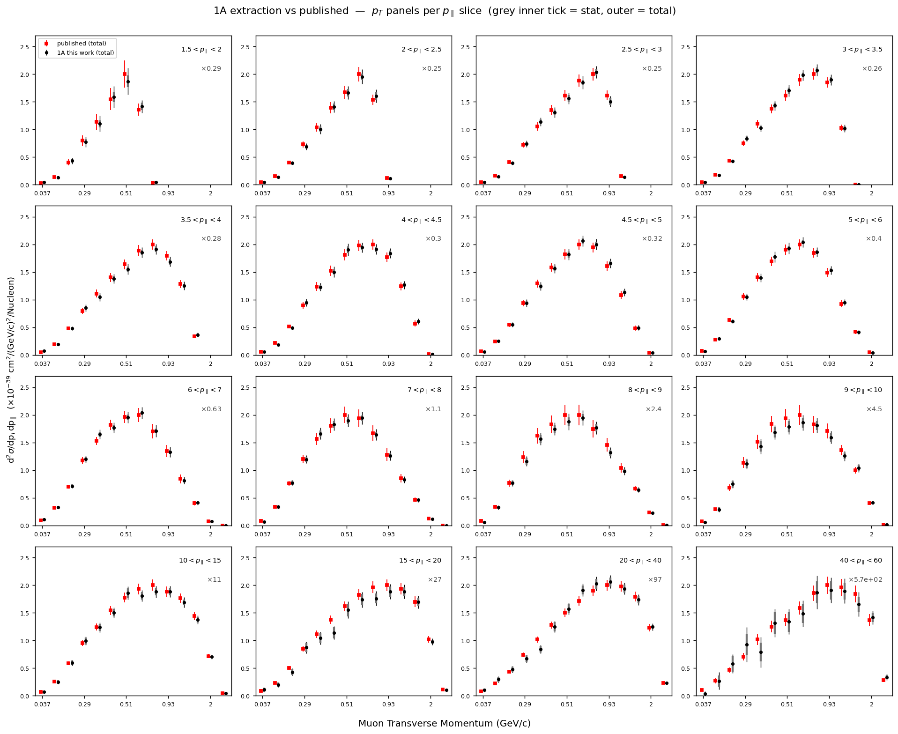
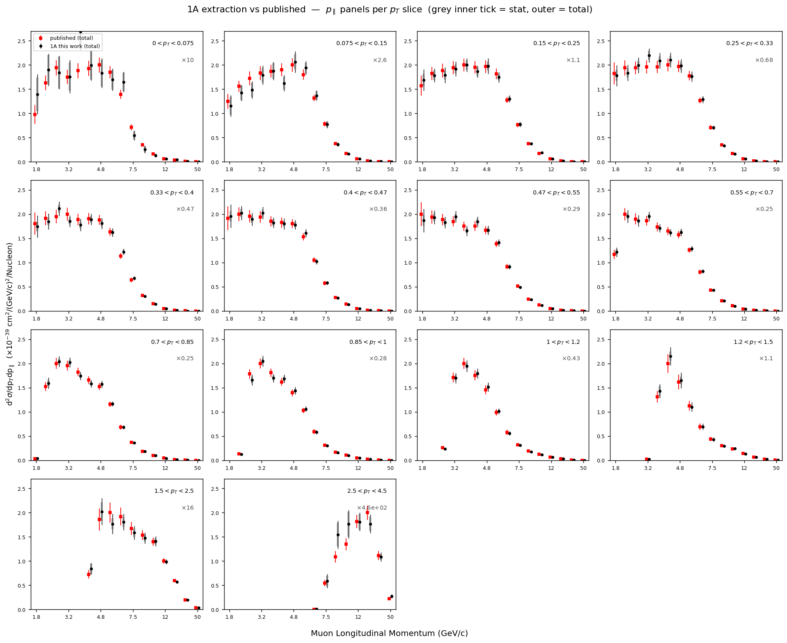

# d²σ/dp_T dp_∥ — playlist 1A, with the assembled systematic budget

Consolidated state of the playlist-1A extraction (νμ CC inclusive on CH,
arXiv:2106.16210) and the systematic uncertainty budget built so far. Numbers
from `results/.../cov_total.npz` (all groups + shape flux) and
`2026-06-16_xsec_1A_vs_published.md`.

## Central value — reproduces the published result

| | value |
|---|---|
| integrated σ | **3.035×10⁻³⁸ cm²/nucleon** |
| integrated σ ratio (ours / published) | **0.9987** (within 0.13 %) |
| per-cell median ratio | 0.988 |
| central 68 % of cells (p16–p84) | [0.936, 1.051] |
| reported cells reproduced | **205 / 205** |

## Uncertainty budget (per-cell median, 205 reported cells)

| component | per-cell median | anc validation |
|---|---|---|
| **Muon reconstruction** | **3.79 %** | energy scale 0.99 vs `cov_energyscale` ✓ |
| **Flux** (shape-resolved, 100 PPFX) | **3.56 %** | 0.88 vs `cov_flux`; off-diag corr 0.85 ✓ |
| GENIE (56 knob universes) | 1.19 % | folded into total |
| 2p2h (3 universes) | 0.31 % | folded into total |
| RPA (4 universes) | 0.10 % | folded into total |
| GenieRvx1pi (non-res π) | 0.03 % | folded into total |
| **Systematic (sum)** | **5.54 %** | = **88.5 %** of published syst (6.26 %) |
| Statistical (1A toys) | 4.70 % | 0.90 vs `cov_stat` (POT-scaled) ✓ |
| **Total** | **7.51 %** | published total 6.83 % |

## The one honest caveat (1A scale)

Our **total (7.51 %) overshoots** the published total (6.83 %) — **not** because
the systematics are too large, but because this is **1 of 12 playlists**: the
statistical band (4.70 %) is ~3× the full-dataset value (~1.5 %). The fair
comparison is **systematic-only: 5.54 % vs 6.26 % = 88.5 %**. After the
12-playlist combine the total would be ≈ √(5.54² + 1.4²) ≈ 5.7 %, below the
published 6.83 %, with the remaining small bands closing the rest.

## 2D comparison vs published (Fig 13 format)

The extracted d²σ/dp_T dp_∥ overlaid on the published `data_result`, in the
paper's Fig-13 multi-panel format (per-panel ×multiplier for visual stacking;
grey **inner tick = statistical**, **outer tick = total** uncertainty). Black =
1A (this work); red = published.

**p_T panels, one per p_∥ slice:**

**p_∥ panels, one per p_T slice:**

The 1A points track the published curve across all slices (integrated 0.9987,
per-cell median 0.988). Our outer (total) bars are visibly larger in the sparse
high-p_∥ / high-p_T panels — that is the inflated **1A statistical** band, which
the 12-playlist combine shrinks; the systematic core (muon reco, flux) matches.

## Validation status

- **Anc-validated (all 3 dedicated files):** flux shape (0.88 + off-diag 0.85),
  statistical (0.90), muon energy scale (0.99).
- **Folded into the total** (no dedicated anc file): muon-reco sub-bands
  (MINOS-eff, beam angle, resolution), GENIE, 2p2h, RPA, GenieRvx1pi.
- **Not yet built** (~the remaining quadrature to 100 %): Hadronic Response
  (geant4/response — the pion-fake band, ~1 %, low-p_∥/low-p_T corner), the
  "new" GENIE bands (MaRES⊗NormCCRES + FaCCQE), the normalization band (~1.4 %),
  and the MINOS-band flux-weight correlation.

## Bottom line
The central cross section is correct (0.13 % integrated, 205/205 cells) and the
systematic budget reproduces **88.5 %** of the paper's, with the two dominant
categories (muon reconstruction, flux) built and anc-validated. The total can be
validated cleanly only after the **12-playlist combine** (the open gate).

Per-stage detail: `2026-06-16_{flux_shape,muon_reconstruction,stat,energyscale,
2p2h,rpa,geniervx1pi,total}_*.md` and `2026-06-16_systematics_summary.md`.
