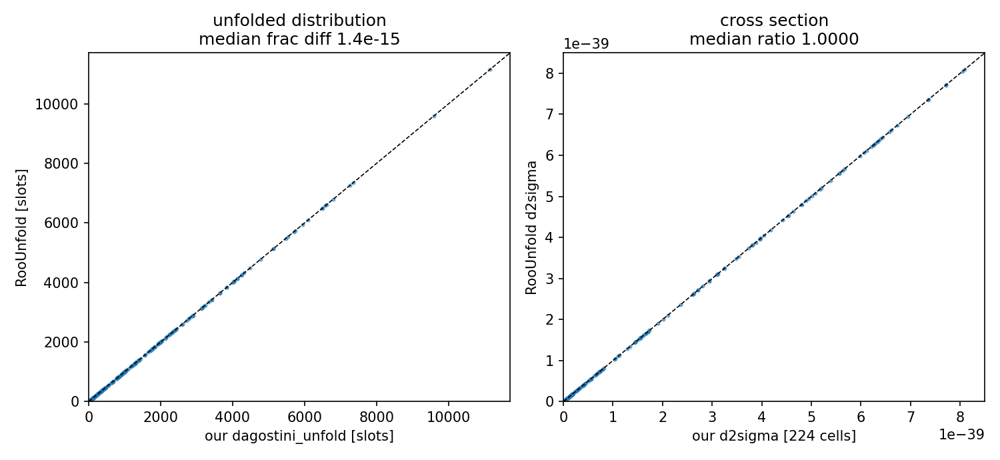

# RooUnfold cross-check of the 2D unfolding stage (2026-06-17)

Independent validation of the pipeline's pure-Python D'Agostini unfolder
(`xsec/unfold.py`) against the **actual MINERvA RooUnfold library**, driven
through the same recipe as `MnvUnfold::UnfoldHisto2D`. Playlist 1A.

## What was built

- **`external/roounfold/build_roounfold.sh`** — compiles the vendored MINERvA
  RooUnfold (`MinervaExpt/UnfoldUtils/RooUnfold`, the kBayes chain) into
  `libRooUnfoldMin.so` using ROOT's bundled conda C++ compiler
  (`root-config --cxx`) — **no environment install**. `-DNOTUNFOLD` drops the
  ROOT-TUnfold and (absent) Dagostini algorithms; SVD/Invert/BinByBin are
  compiled in so the base `RooUnfold::New()` symbol references resolve at load
  time. A `rootcling` dictionary covers the seven `ClassDef` classes (missing
  Streamers otherwise fail the load).
- **`unfold_roounfold.py`** (argparse + RunLog) — the `MnvUnfold::UnfoldHisto2D`
  recipe via PyROOT:
  `RooUnfoldResponse(reco, true, migration)` →
  `RooUnfoldBayes(&response, data, 10)` → `Hreco()` / `Ereco()`.

## The 2D-flattening choice

RooUnfold unfolds a 2D measurement by flattening (p_T, p_∥) to a 1D global-bin
index **internally** (`RooUnfoldResponse::FindBin = FindFixBin-1`,
`RooUnfoldResponse.cxx:536`). Its TH2D-interface overflow handling is
acknowledged-buggy — line 540: *"TODO this doesn't work for overflows"* — which
is exactly why `MnvUnfold::UnfoldHisto2D` runs with `UseOverflow` off. We
therefore do that flattening explicitly onto the pipeline's 288 count-conserving
slots and hand RooUnfold the flattened histograms: **identical math, no fragile
overflow path**. (A literal TH2D attempt reproduced precisely that breakage —
self-closure 1.0 and spurious "fakes" bins.)

## Validation

| Check | Result |
|---|---|
| MC self-closure (unfold MC reco → MC truth) | **2.5×10⁻¹⁵** |
| RooUnfold vs `xsec.unfold.dagostini_unfold`, per slot | median **1.4×10⁻¹⁵**, max 1×10⁻¹⁴ |
| d²σ ratio RooUnfold / ours (224 cells) | **1.0000** (max dev 1×10⁻¹⁴) |
| integrated σ ratio | 1.0 |
| RooUnfold `Ereco` per-cell unfolding stat unc | **4.75%** |



Both the unfolded slot distribution and the final d²σ fall exactly on y = x. This
confirms `xsec/unfold.py` is a faithful reimplementation of RooUnfold's
D'Agostini, independent of MINERvA's C++ stack.

**Bonus — covariance.** RooUnfold's full `Ereco` gives a **4.75%** median
per-cell unfolding statistical uncertainty, matching our 1000-toy stat band
(4.70%) and confirming that the analytic `U²·data_var` in `xsec/unfold.py` (the
documented approximation that drops the inter-iteration feedback term)
underestimates the true D'Agostini covariance — RooUnfold supplies the complete
propagation, should we want it.

## Reproduce

```
pixi run bash external/roounfold/build_roounfold.sh           # build once
pixi run python unfold_roounfold.py \
    --ingredients results/<ts>__make_ingredients/ingredients.npz --label 1A
```

## Pointers
- Method source: `MinervaExpt/UnfoldUtils/MinervaUnfold/MnvUnfold.cxx`
  (`UnfoldHisto2D` → `RooUnfoldResponse` + `RooUnfoldBayes`); D'Agostini core
  `MinervaExpt/UnfoldUtils/RooUnfold/RooUnfoldBayes.cxx::unfold()`.
- Our unfolder: `xsec/unfold.py`; full chain `extract_xsec.py`.
