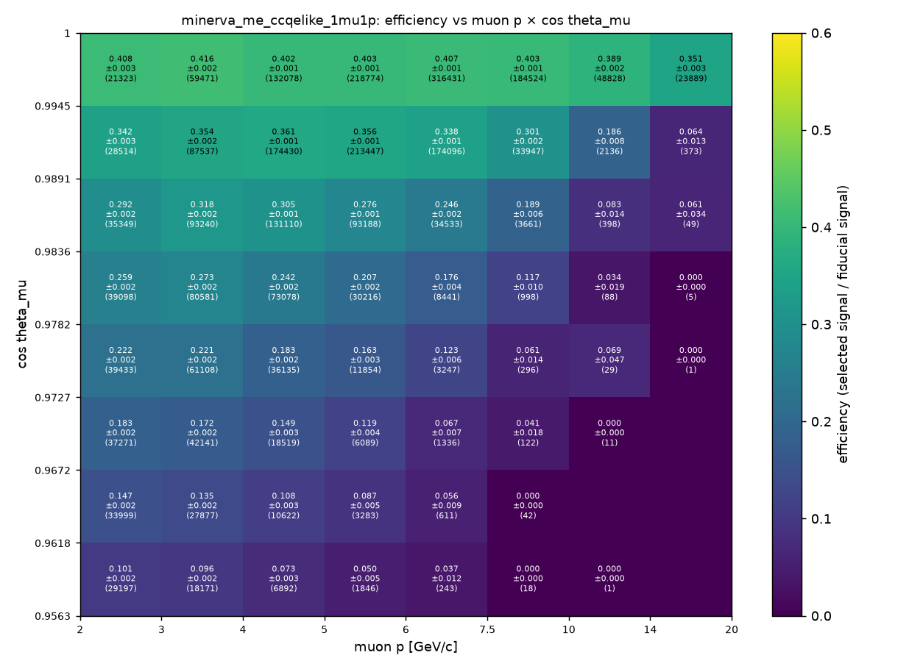
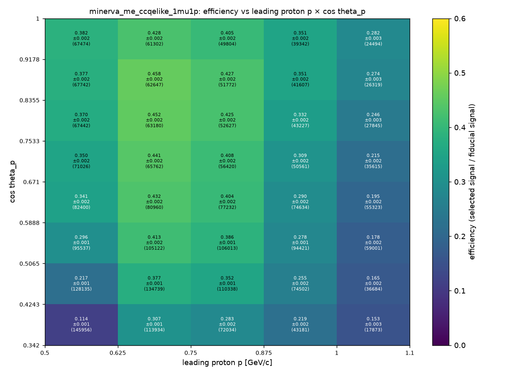
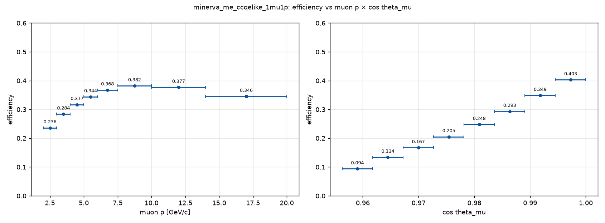
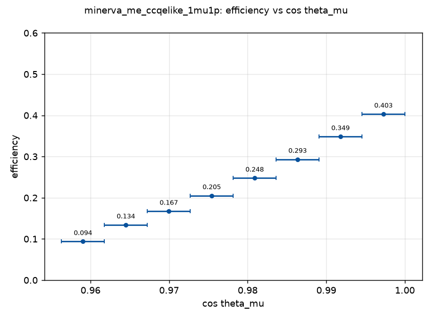
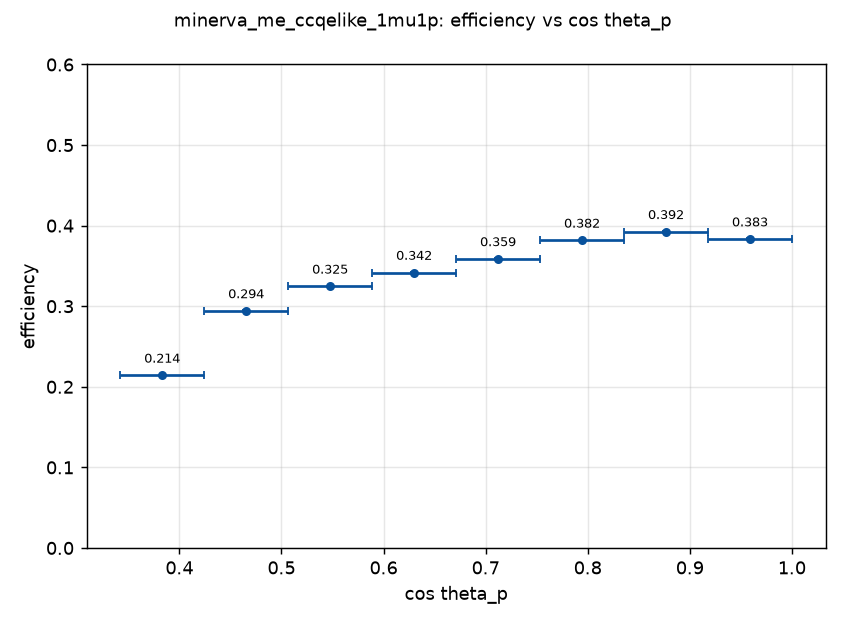
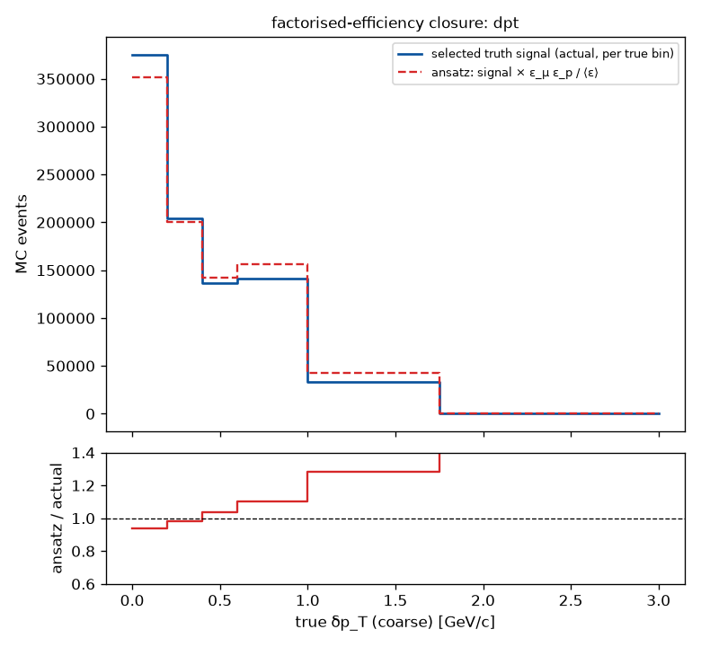
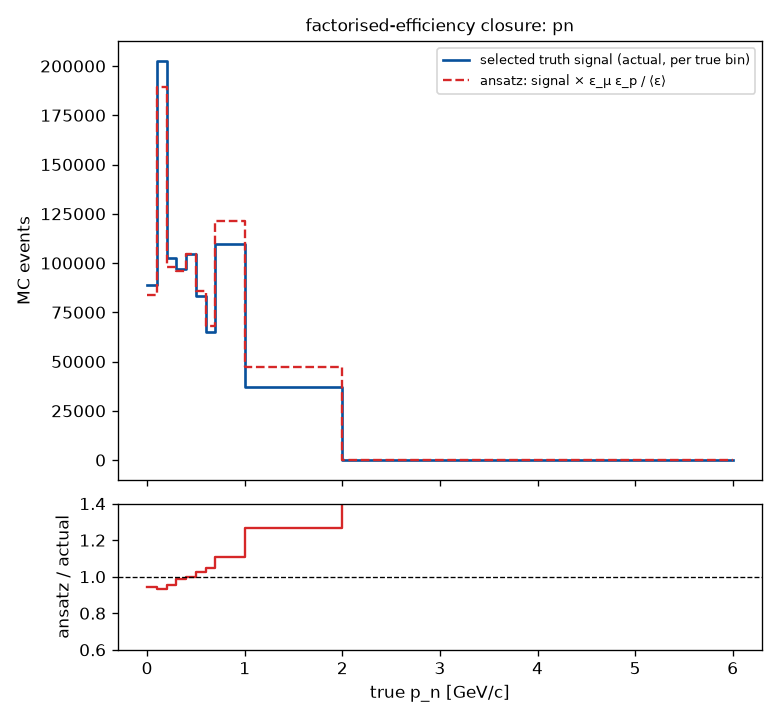
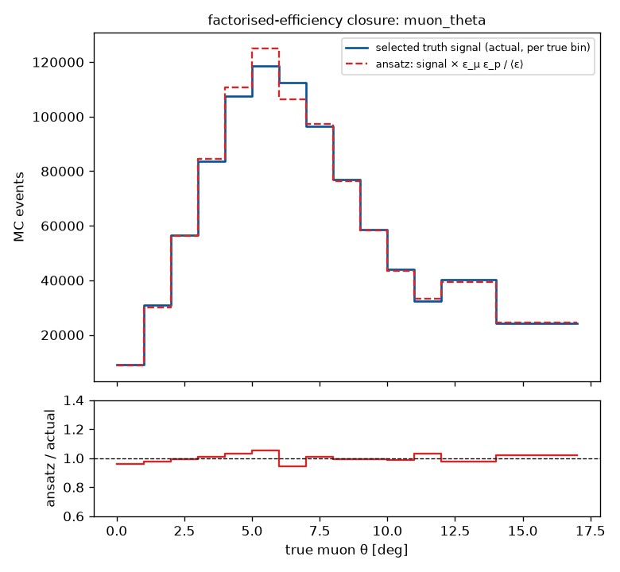
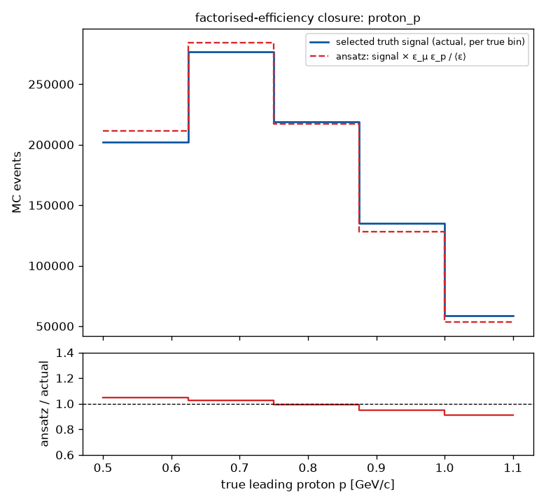

# Selection efficiency maps and background of the MINERvA 1μ1p selection (full ME FHC official MC)

**Status:** rendered 2026-09-15 from `runs/2026-09-15_efficiency_minerva_me_ccqelike_1mu1p/` (`ndp efficiency run`), which reads the
binned responses built by `ndp surrogate build --measurement all` over the 12 FHC playlists (`surrogates/minerva_me_ccqelike_1mu1p/<grid>/binned_FHC_1A-1P/`,
18 of 18 closures exact). Per-grid tables: `eff_<grid>.json` / `.npz` (edges, efficiency, binomial error, denominator, numerator) and
`background_<grid>.json` (total, by category, feed-in, at the data POT) in that directory; `ansatz_closure.json` holds the per-bin closure.

**How to use the maps on a truth sample:** `python -m ndp efficiency apply --channel minerva_me_ccqelike_1mu1p --run runs/2026-09-15_efficiency_minerva_me_ccqelike_1mu1p --sample <truth.npz> --out weights.npz`
writes w = ε_μ(p_μ, cos θ_μ) · ε_p(p_p, cos θ_p) / ⟨ε⟩ per event (0 outside the maps or without a leading proton in the window). The closure table
below says how well that factorised weight reproduces the actually selected signal on each released grid; for the transverse-imbalance grids the
muon–proton correlation matters and the full response (`ndp run ... --measurement all --modes folded`) should be used instead.

---

Official MC 4.978e+21 POT: 2734225 truth signal events in the fiducial volume, 891177 of them selected: mean efficiency 0.3259. Backgrounds are scaled to the data POT 1.057e+21. Efficiency = selected truth signal / truth signal in the fiducial volume per true cell (the paper's definition); error = binomial.

## Efficiency per grid

| measurement | grid | <eff> | den | background at data POT |
|---|---|---|---|---|
| muon_p_costheta | 8 × 8 | 0.3259 | 2734225 | 202110 |
| proton_p_costheta | 5 × 8 | 0.3259 | 2734227 | 166633 |
| muon_costheta | 8 | 0.3259 | 2734225 | 202110 |
| proton_costheta | 8 | 0.3259 | 2734227 | 198410 |
| alpha | 5 | 0.3259 | 2734227 | 201982 |
| dpt | 6 | 0.3259 | 2734207 | 201827 |
| dpt_fine | 9 | 0.3259 | 2734207 | 201827 |
| dptx | 8 | 0.3259 | 2734227 | 201982 |
| dpty | 12 | 0.3259 | 2734227 | 201982 |
| muon_p | 8 | 0.3259 | 2734227 | 202110 |
| muon_pt | 10 | 0.3259 | 2734227 | 202105 |
| muon_theta | 14 | 0.3259 | 2734227 | 202110 |
| phi | 6 | 0.3259 | 2734227 | 201982 |
| pl | 8 | 0.3259 | 2734227 | 201947 |
| pn | 10 | 0.3259 | 2734227 | 201982 |
| proton_p | 5 | 0.3259 | 2734227 | 170230 |
| proton_pt | 7 | 0.3259 | 2734227 | 201926 |
| proton_theta | 10 | 0.3259 | 2734227 | 198410 |

### muon_p_costheta: ε(muon p, cos theta_mu)

| muon p \ cos theta_mu | [0.9563, 0.9618) | [0.9618, 0.9672) | [0.9672, 0.9727) | [0.9727, 0.9782) | [0.9782, 0.9836) | [0.9836, 0.9891) | [0.9891, 0.9945) | [0.9945, 1) |
|---|---|---|---|---|---|---|---|---|
| [2, 3) | 0.101 ± 0.002 | 0.147 ± 0.002 | 0.183 ± 0.002 | 0.222 ± 0.002 | 0.259 ± 0.002 | 0.292 ± 0.002 | 0.342 ± 0.003 | 0.408 ± 0.003 |
| [3, 4) | 0.096 ± 0.002 | 0.135 ± 0.002 | 0.172 ± 0.002 | 0.221 ± 0.002 | 0.273 ± 0.002 | 0.318 ± 0.002 | 0.354 ± 0.002 | 0.416 ± 0.002 |
| [4, 5) | 0.073 ± 0.003 | 0.108 ± 0.003 | 0.149 ± 0.003 | 0.183 ± 0.002 | 0.242 ± 0.002 | 0.305 ± 0.001 | 0.361 ± 0.001 | 0.402 ± 0.001 |
| [5, 6) | 0.050 ± 0.005 | 0.087 ± 0.005 | 0.119 ± 0.004 | 0.163 ± 0.003 | 0.207 ± 0.002 | 0.276 ± 0.001 | 0.356 ± 0.001 | 0.403 ± 0.001 |
| [6, 7.5) | 0.037 ± 0.012 | 0.056 ± 0.009 | 0.067 ± 0.007 | 0.123 ± 0.006 | 0.176 ± 0.004 | 0.246 ± 0.002 | 0.338 ± 0.001 | 0.407 ± 0.001 |
| [7.5, 10) | 0.000 ± 0.000 | 0.000 ± 0.000 | 0.041 ± 0.018 | 0.061 ± 0.014 | 0.117 ± 0.010 | 0.189 ± 0.006 | 0.301 ± 0.002 | 0.403 ± 0.001 |
| [10, 14) | 0.000 ± 0.000 | 0.000 ± 0.000 | 0.000 ± 0.000 | 0.069 ± 0.047 | 0.034 ± 0.019 | 0.083 ± 0.014 | 0.186 ± 0.008 | 0.389 ± 0.002 |
| [14, 20) | 0.000 ± 0.000 | 0.000 ± 0.000 | 0.000 ± 0.000 | 0.000 ± 0.000 | 0.000 ± 0.000 | 0.061 ± 0.034 | 0.064 ± 0.013 | 0.351 ± 0.003 |

### proton_p_costheta: ε(leading proton p, cos theta_p)

| leading proton p \ cos theta_p | [0.342, 0.4243) | [0.4243, 0.5065) | [0.5065, 0.5888) | [0.5888, 0.671) | [0.671, 0.7533) | [0.7533, 0.8355) | [0.8355, 0.9178) | [0.9178, 1) |
|---|---|---|---|---|---|---|---|---|
| [0.5, 0.625) | 0.114 ± 0.001 | 0.217 ± 0.001 | 0.296 ± 0.001 | 0.341 ± 0.002 | 0.350 ± 0.002 | 0.370 ± 0.002 | 0.377 ± 0.002 | 0.382 ± 0.002 |
| [0.625, 0.75) | 0.307 ± 0.001 | 0.377 ± 0.001 | 0.413 ± 0.002 | 0.432 ± 0.002 | 0.441 ± 0.002 | 0.452 ± 0.002 | 0.458 ± 0.002 | 0.428 ± 0.002 |
| [0.75, 0.875) | 0.283 ± 0.002 | 0.352 ± 0.001 | 0.386 ± 0.001 | 0.404 ± 0.002 | 0.408 ± 0.002 | 0.425 ± 0.002 | 0.427 ± 0.002 | 0.405 ± 0.002 |
| [0.875, 1) | 0.219 ± 0.002 | 0.255 ± 0.002 | 0.278 ± 0.001 | 0.290 ± 0.002 | 0.309 ± 0.002 | 0.332 ± 0.002 | 0.351 ± 0.002 | 0.351 ± 0.002 |
| [1, 1.1) | 0.153 ± 0.003 | 0.165 ± 0.002 | 0.178 ± 0.002 | 0.195 ± 0.002 | 0.215 ± 0.002 | 0.246 ± 0.003 | 0.274 ± 0.003 | 0.282 ± 0.003 |

## Factorised ansatz w = ε_μ(p_μ, cos θ_μ) · ε_p(p_p, cos θ_p) / ⟨ε⟩ — closure on the MC

⟨ε⟩ = 0.3259; total ansatz-selected / actually selected = 1.0032.

| grid | ansatz / actual (total) | max |rel. dev.| over bins with > 50 events |
|---|---|---|
| muon_p_costheta | 1.0032 | 0.098 |
| proton_p_costheta | 1.0032 | 0.133 |
| muon_costheta | 1.0032 | 0.022 |
| proton_costheta | 1.0032 | 0.012 |
| alpha | 1.0032 | 0.039 |
| dpt | 1.0032 | 0.458 |
| dpt_fine | 1.0032 | 0.398 |
| dptx | 1.0032 | 0.124 |
| dpty | 1.0032 | 0.507 |
| muon_p | 1.0032 | 0.043 |
| muon_pt | 1.0032 | 0.237 |
| muon_theta | 1.0032 | 0.054 |
| phi | 1.0032 | 0.164 |
| pl | 1.0032 | 0.458 |
| pn | 1.0032 | 0.582 |
| proton_p | 1.0032 | 0.088 |
| proton_pt | 1.0032 | 0.061 |
| proton_theta | 1.0032 | 0.070 |

The ansatz is exact by construction for the two map grids' totals; the per-grid deviations are the error made by weighting a truth sample with the maps instead of folding it through the full response.

## Background composition (selected non-signal MC at the data POT)

| grid | total | bkg 1 pi+- | bkg 1 pi0 | bkg multi-pi | bkg other (no pion) | feed-in |
|---|---|---|---|---|---|---|
| muon_p_costheta | 202110 | 94927 | 45622 | 25375 | 36185 | 0 |
| proton_p_costheta | 166633 | 83791 | 40141 | 22151 | 20551 | 0 |
| muon_costheta | 202110 | 94927 | 45622 | 25375 | 36185 | 0 |
| proton_costheta | 198410 | 94477 | 45456 | 25320 | 33157 | 0 |
| alpha | 201982 | 94892 | 45609 | 25371 | 36111 | 0 |
| dpt | 201827 | 94840 | 45570 | 25334 | 36082 | 0 |
| dpt_fine | 201827 | 94840 | 45570 | 25334 | 36082 | 0 |
| dptx | 201982 | 94892 | 45609 | 25371 | 36111 | 0 |
| dpty | 201982 | 94892 | 45609 | 25371 | 36111 | 0 |
| muon_p | 202110 | 94927 | 45622 | 25375 | 36185 | 0 |
| muon_pt | 202105 | 94925 | 45622 | 25374 | 36184 | 0 |
| muon_theta | 202110 | 94927 | 45622 | 25375 | 36185 | 0 |
| phi | 201982 | 94892 | 45609 | 25371 | 36111 | 0 |
| pl | 201947 | 94879 | 45600 | 25366 | 36103 | 0 |
| pn | 201982 | 94891 | 45609 | 25371 | 36110 | 0 |
| proton_p | 170230 | 84202 | 40297 | 22200 | 23531 | 0 |
| proton_pt | 201926 | 94870 | 45603 | 25367 | 36085 | 0 |
| proton_theta | 198410 | 94477 | 45456 | 25320 | 33157 | 0 |

## Figures

