# GENIE and GiBUU side by side against the MINERvA muon + leading-proton data

**The sample.** This is not an exclusive one-muon-one-proton final state. The signal asks for a forward muon (2–20 GeV/c, θ < 17°) and **at least one** proton in 0.5–1.1 GeV/c below 70°, vetoing mesons, baryons heavier than the neutron and photons above 10 MeV; an event with a second proton in the window is kept. The muon and the **highest-momentum** proton define the transverse-imbalance variables, a choice the paper makes explicitly because it “is not changed based on the number of protons in the final state since secondary protons may not be reconstructed” (arXiv:2503.15047). So every signal block below is one muon plus the leading proton, and the `1mu1p` in the channel and run paths is only the identifier those manifests were created with, not a statement of proton multiplicity.

**What is plotted.** Every figure has two panels built identically: the same reconstructed data points, the same official-MC background stacked by category, and on top of it the signal predicted by one generator — the official GENIE MC scaled by POT on the left, GiBUU folded through the detector response learned from that same MC on the right. Only the signal block differs between the panels, so the comparison is visual and direct. Both panels share the vertical scale.

**Sources.** GENIE: `2026-09-14_selection_minerva_me_ccqelike_1mu1p_FHC`. GiBUU: `2026-09-16_gibuu_2025_me_fhc_c12__minerva_me_ccqelike_1mu1p__all_3` (σ_CC = 4.1245e-38 cm²/nucleon, 979,395 events, 0.946 of the flux). Rendered by `report/make_genie_gibuu_comparison.py`; the physics discussion is in `report/GiBUU_reco_comparison_FHC.md`.

---

## Summary

| grid | data | background | GENIE signal | GiBUU signal | data/GENIE | data/GiBUU | GENIE shape rms | GiBUU shape rms |
|---|---|---|---|---|---|---|---|---|
| muon p [GeV/c] | 329653 | 202110 | 189275 | 175118 | 0.842 | 0.874 | 0.138 | 0.148 |
| muon θ [deg] | 329653 | 202110 | 189275 | 174171 | 0.842 | 0.876 | 0.132 | 0.105 |
| muon p_T [GeV/c] | 329650 | 202105 | 189270 | 171649 | 0.842 | 0.882 | 0.203 | 0.165 |
| leading proton p [GeV/c] | 289289 | 170230 | 179979 | 164720 | 0.826 | 0.864 | 0.054 | 0.051 |
| leading proton θ [deg] | 323116 | 198410 | 188125 | 175747 | 0.836 | 0.864 | 0.064 | 0.131 |
| leading proton p_T [GeV/c] | 329382 | 201926 | 189231 | 175313 | 0.842 | 0.873 | 0.111 | 0.117 |
| δp_T [GeV/c] | 329293 | 201827 | 189173 | 175508 | 0.842 | 0.873 | 0.018 | 0.072 |
| δp_T (fine) [GeV/c] | 329293 | 201827 | 189173 | 175881 | 0.842 | 0.872 | 0.032 | 0.095 |
| δp_Tx [GeV/c] | 329467 | 201982 | 189245 | 174228 | 0.842 | 0.876 | 0.097 | 0.061 |
| δp_Ty [GeV/c] | 329467 | 201982 | 189245 | 174278 | 0.842 | 0.876 | 0.120 | 0.101 |
| δα_T [deg] | 329467 | 201982 | 189245 | 173708 | 0.842 | 0.877 | 0.059 | 0.022 |
| φ_T [deg] | 329467 | 201982 | 189245 | 175002 | 0.842 | 0.874 | 0.065 | 0.071 |
| δp_L [GeV/c] | 329420 | 201947 | 189223 | 177527 | 0.842 | 0.868 | 0.151 | 0.194 |
| p_n [GeV/c] | 329467 | 201982 | 189245 | 177293 | 0.842 | 0.869 | 0.070 | 0.194 |

Averaged over the 14 released grids: data/GENIE = 0.841, data/GiBUU = 0.873. The shape columns are the root-mean-square of the per-bin ratio after each generator's own normalisation is divided out, so they measure shape only.

## Figures

### muon p [GeV/c]

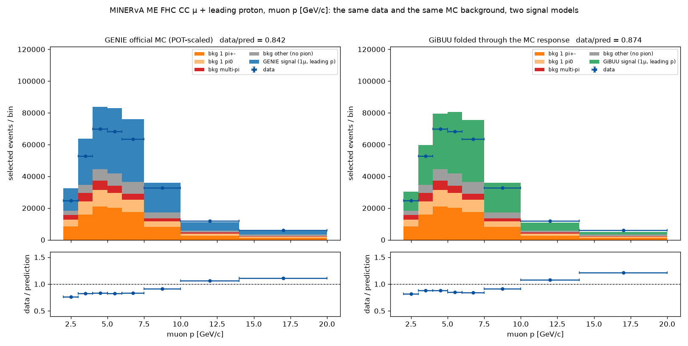

*data/GENIE 0.842, shape rms 0.138 (worst bin 0.316); data/GiBUU 0.874, shape rms 0.148 (worst bin 0.386).*

### muon θ [deg]

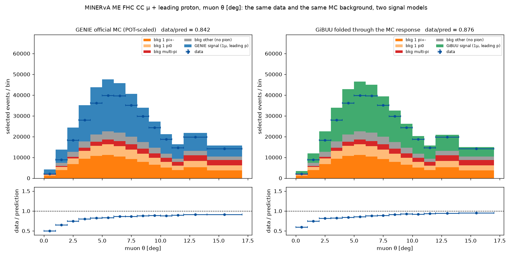

*data/GENIE 0.842, shape rms 0.132 (worst bin 0.401); data/GiBUU 0.876, shape rms 0.105 (worst bin 0.315).*

### muon p_T [GeV/c]

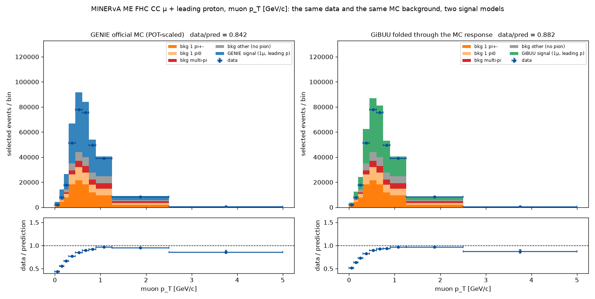

*data/GENIE 0.842, shape rms 0.203 (worst bin 0.485); data/GiBUU 0.882, shape rms 0.165 (worst bin 0.416).*

### leading proton p [GeV/c]

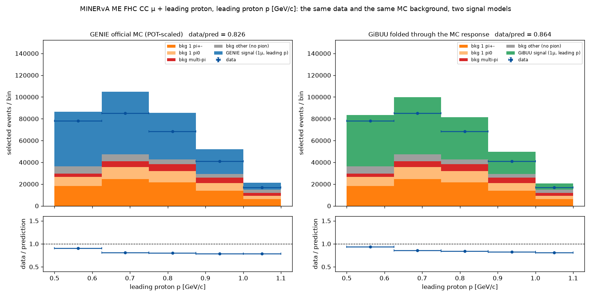

*data/GENIE 0.826, shape rms 0.054 (worst bin 0.094); data/GiBUU 0.864, shape rms 0.051 (worst bin 0.083).*

### leading proton θ [deg]

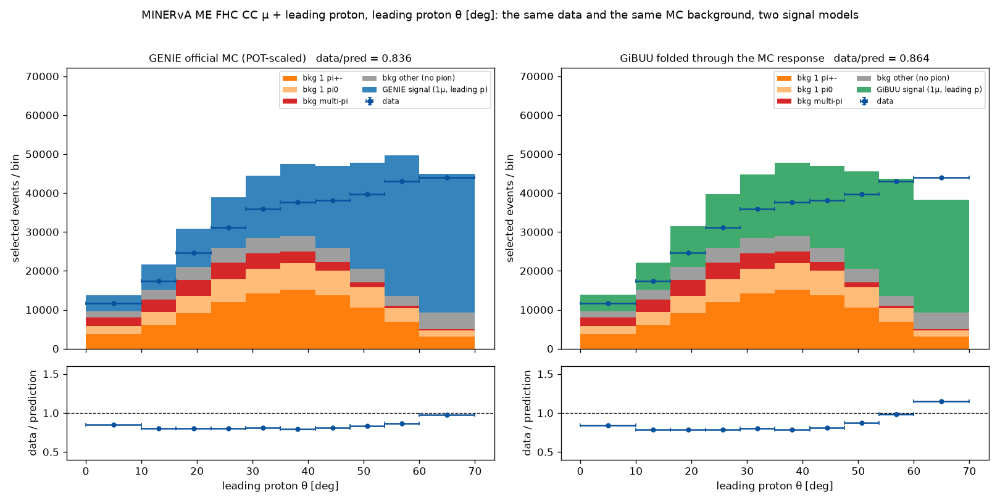

*data/GENIE 0.836, shape rms 0.064 (worst bin 0.171); data/GiBUU 0.864, shape rms 0.131 (worst bin 0.332).*

### leading proton p_T [GeV/c]

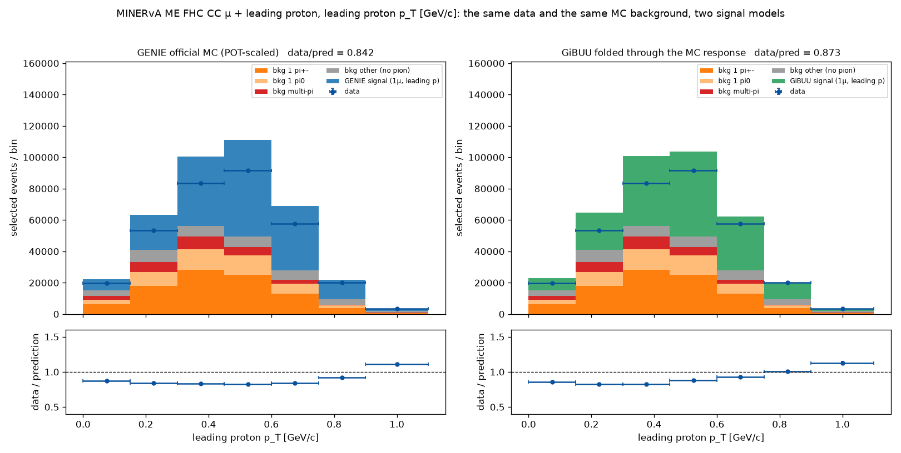

*data/GENIE 0.842, shape rms 0.111 (worst bin 0.317); data/GiBUU 0.873, shape rms 0.117 (worst bin 0.291).*

### δp_T [GeV/c]

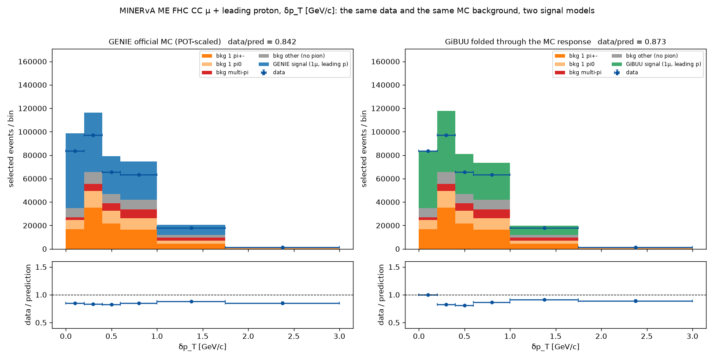

*data/GENIE 0.842, shape rms 0.018 (worst bin 0.042); data/GiBUU 0.873, shape rms 0.072 (worst bin 0.145).*

### δp_T (fine) [GeV/c]

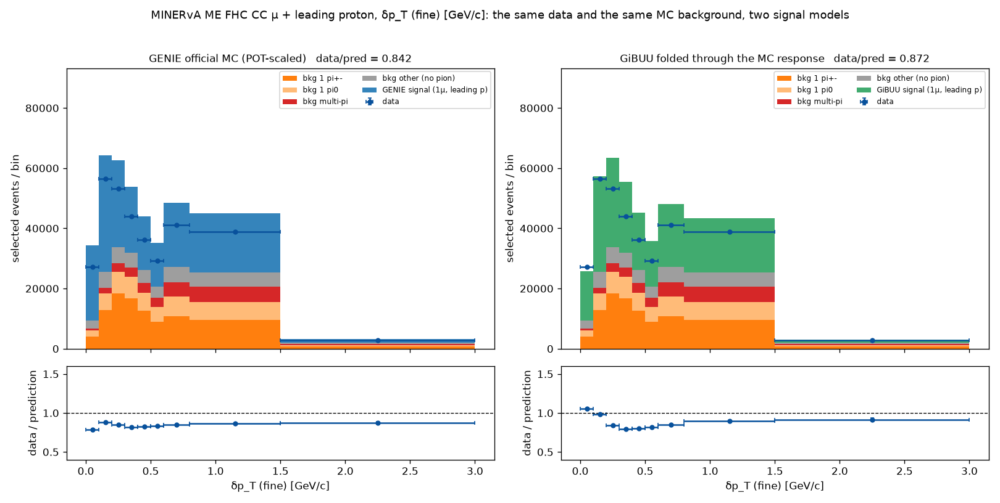

*data/GENIE 0.842, shape rms 0.032 (worst bin 0.063); data/GiBUU 0.872, shape rms 0.095 (worst bin 0.208).*

### δp_Tx [GeV/c]

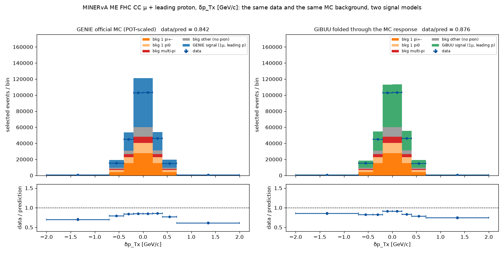

*data/GENIE 0.842, shape rms 0.097 (worst bin 0.271); data/GiBUU 0.876, shape rms 0.061 (worst bin 0.151).*

### δp_Ty [GeV/c]

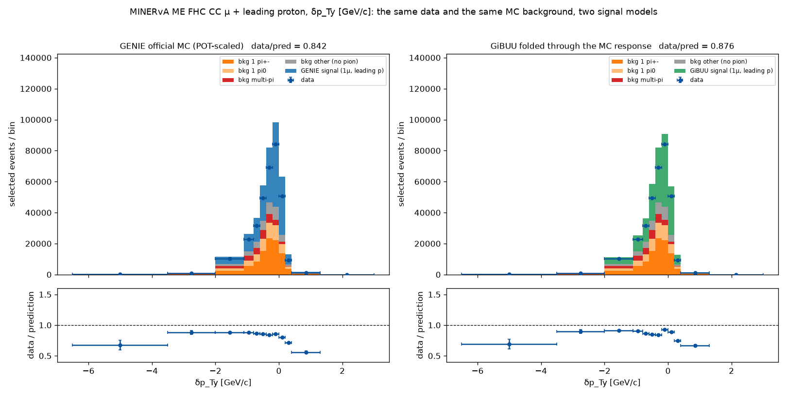

*data/GENIE 0.842, shape rms 0.120 (worst bin 0.335); data/GiBUU 0.876, shape rms 0.101 (worst bin 0.241).*

### δα_T [deg]

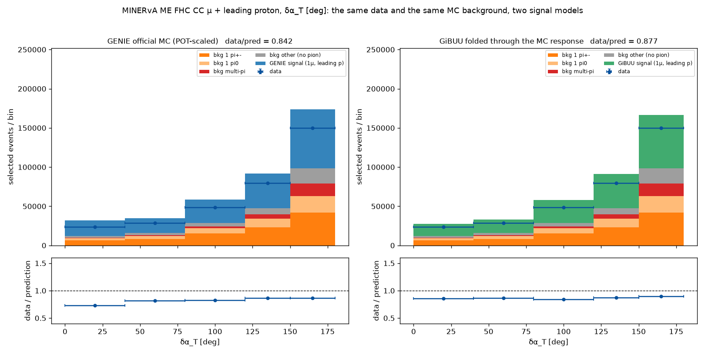

*data/GENIE 0.842, shape rms 0.059 (worst bin 0.135); data/GiBUU 0.877, shape rms 0.022 (worst bin 0.043).*

### φ_T [deg]

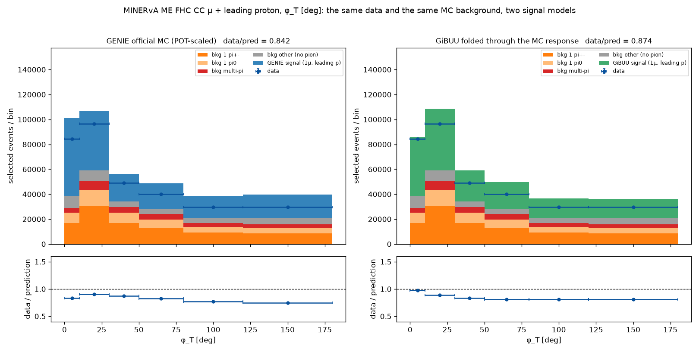

*data/GENIE 0.842, shape rms 0.065 (worst bin 0.115); data/GiBUU 0.874, shape rms 0.071 (worst bin 0.119).*

### δp_L [GeV/c]

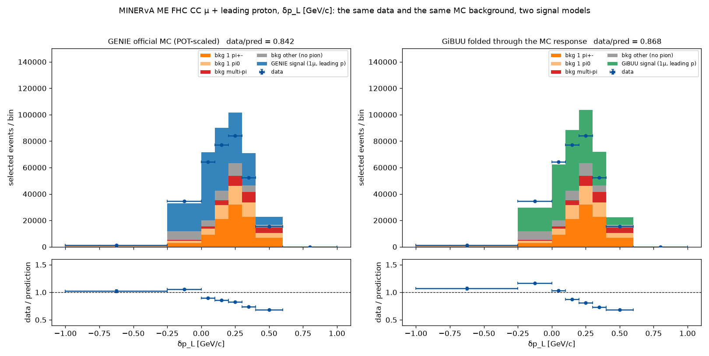

*data/GENIE 0.842, shape rms 0.151 (worst bin 0.252); data/GiBUU 0.868, shape rms 0.194 (worst bin 0.341).*

### p_n [GeV/c]

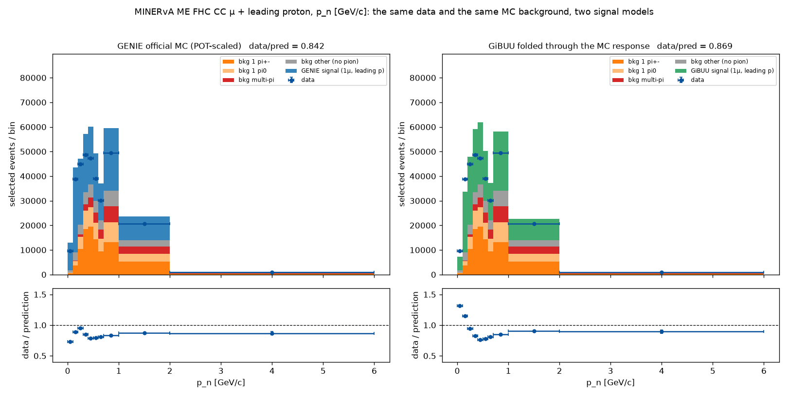

*data/GENIE 0.842, shape rms 0.070 (worst bin 0.133); data/GiBUU 0.869, shape rms 0.194 (worst bin 0.519).*

## Reading these plots

- The background is **the same in both panels**: it comes from the official MC in both cases, because no generator predicts the non-signal part of this selection on its own. Only the coloured signal block on top is the model under test.
- Both generators sit above the data. That offset is shared with the MC that supplies the background and the response, which is itself untuned, so it should not be read as a measured discrepancy of either generator.
- The ratio panels are where the models separate: look at the first bins of p_n, δp_T and δp_L for the Fermi-motion peak, and at the low end of the muon angle and muon p_T for the missing low-Q² suppression.
- The axes use the paper's released binning, so several grids end in one or two very wide bins (p_n to 6 GeV/c, δp_Ty to 3 GeV/c). Those bins hold few events and squeeze the interesting region; read them together with the numbers in the summary table.
- The two panels of a figure share the vertical scale, so the height difference between the coloured signal blocks is the difference between the models at a glance.

## Where the two models actually differ

| | GENIE | GiBUU |
|---|---|---|
| signal, averaged over the grids | 188,496 events | 174,296 events |
| data / prediction | 0.841 | 0.873 |
| quasi-elastic | 46.7 % | 36.7 % |
| resonance with the pion absorbed | 25.5 % | 31.2 % |
| 2p2h | 21.0 % | 16.5 % |
| deep inelastic | 6.9 % | 15.6 % |

The GENIE column is the share of the **fiducial truth signal** in `2026-09-14_signal_minerva_me_ccqelike_1mu1p_FHC`; the GiBUU column is the share of the **signal cross section** in the cached sample behind `2026-09-16_gibuu_2025_me_fhc_c12__minerva_me_ccqelike_1mu1p__all_3`. GiBUU builds a similar total out of a visibly different mixture, and that is what the ratio panels show.

The clearest consequences: GiBUU describes δα_T better than GENIE (shape rms 0.022 against 0.059) and is the milder of the two in the low-Q² region, while GENIE describes δp_T and p_n better (0.018 and 0.070 against 0.072 and 0.194). In the first p_n bin, below 0.1 GeV/c, the data stand 32 % above GiBUU and 27 % below GENIE, a genuine reversal at the Fermi-motion peak.

