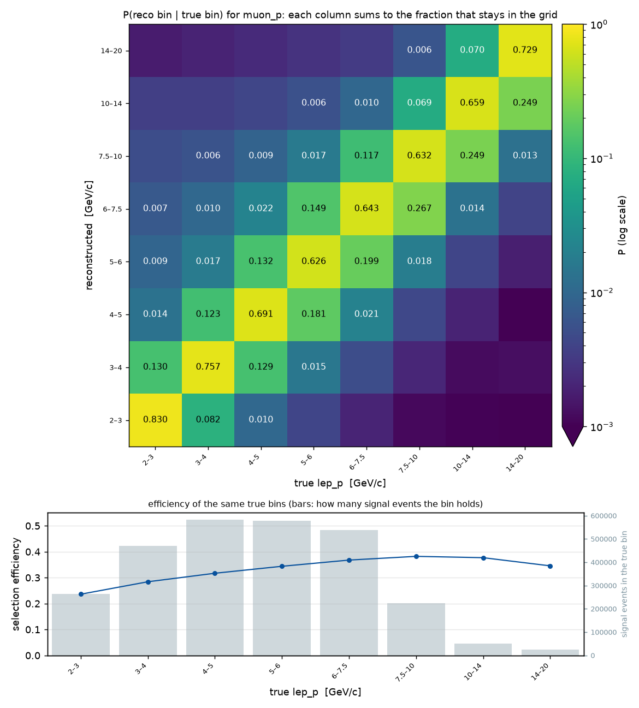
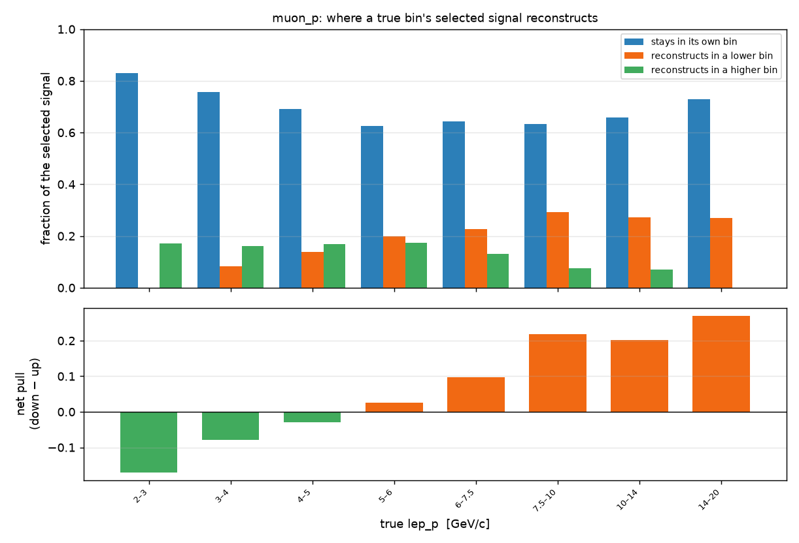
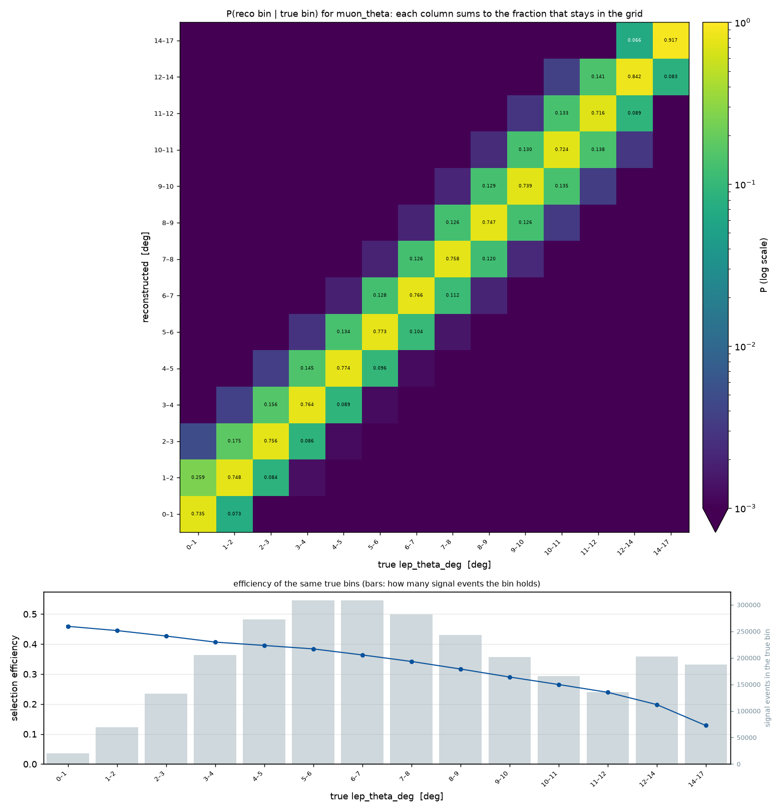
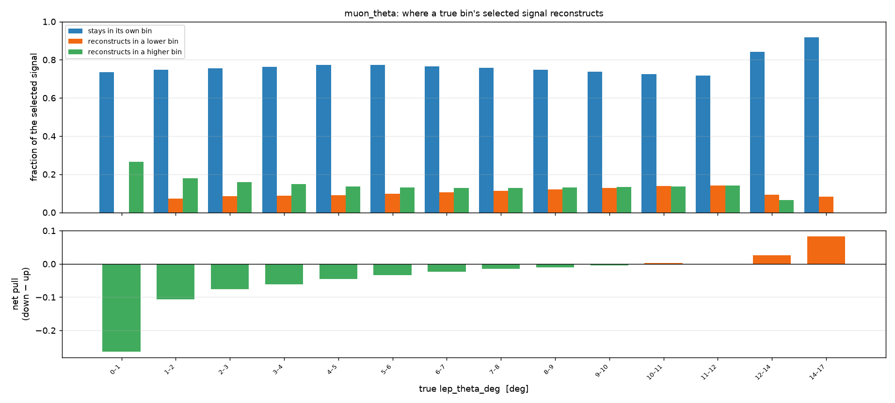

# The detector response of the muon variables in the MINERvA muon + leading-proton selection

**What this is.** The binned surrogate that carries a truth prediction into reconstructed space for this analysis. For one grid it is a pair: a migration matrix and a selection efficiency, kept as separate factors. The prediction in reco bin *i* is

```
reco[i] = Σ_j  P[i,j] · ε[j] · true[j]  +  bkg[i]
```

**The convention matters.** P is normalised by column against the *selected* signal of that true bin, P[i,j] = M[i,j] / num[j]. A column therefore gives the probability distribution of the reco bin of an event born in true bin j, and a column sum below one is signal that reconstructs outside the grid entirely. That loss is real and stays lost. Normalising instead by the column sum of M would push those events back into the visible bins and silently inflate every prediction. Efficiency is never folded into P: it is a separate per-true-bin factor, ε[j] = num[j] / den[j].

**Provenance.** Channel `minerva_me_ccqelike_1mu1p`, selection `minerva_ccqelike_1mu1p_v0`, built 2026-09-15 by `ndp.surrogate.chunked.build_surrogates_chunked` over 12 playlist products (FHC/1A, FHC/1B, FHC/1C, FHC/1D, FHC/1E, FHC/1F, FHC/1G, FHC/1L, FHC/1M, FHC/1N, FHC/1O, FHC/1P) at 4.9784e+21 protons on target of official MC. Every array below is read from the built surrogate directories; nothing is typed in. Rendered by `report/make_migration_report.py`.

---

## muon_p: lep_p → reco_p, 8 bins in GeV/c

Edges at 2, 3, 4, 5, 6, 7.5, 10, 14, 20.

```
muon_p:  rows = reco bin, columns = true bin

                   2–3     3–4     4–5     5–6   6–7.5  7.5–10   10–14   14–20
reco    2–3     0.830   0.082   0.010   0.004   0.002   0.001   0.001       -
reco    3–4     0.130   0.757   0.129   0.015   0.005   0.002   0.001   0.001
reco    4–5     0.014   0.123   0.691   0.181   0.021   0.004   0.002   0.001
reco    5–6     0.009   0.017   0.132   0.626   0.199   0.018   0.004   0.002
reco  6–7.5     0.007   0.010   0.022   0.149   0.643   0.267   0.014   0.004
reco 7.5–10     0.005   0.006   0.009   0.017   0.117   0.632   0.249   0.013
reco  10–14     0.004   0.004   0.004   0.006   0.010   0.069   0.659   0.249
reco  14–20     0.002   0.002   0.002   0.003   0.003   0.006   0.070   0.729

                 1.000   1.000   1.000   1.000   1.000   1.000   1.000   1.000   <- column sums
```



*Top: the matrix on a logarithmic colour scale. Cells at or below the colour floor of 0.001, exact zeros included, are drawn in the floor colour; only entries above 0.005 carry a printed number. Bottom: the efficiency of the same true bins with binomial errors, over the number of signal events each bin holds.*


Per true bin: how much of its selected signal stays, how much reconstructs lower, how much higher, and the net pull, positive meaning a downward tilt. The first and last bins are structurally one-sided, since nothing can migrate below the first or above the last, so compare only the interior.

| true lep_p [GeV/c] | efficiency | stays | down | up | net pull | signal events |
|---|---|---|---|---|---|---|
| 2–3 | 0.236 ± 0.001 | 0.830 | 0.000 | 0.170 | -0.170 | 264,185 |
| 3–4 | 0.284 ± 0.001 | 0.757 | 0.082 | 0.161 | -0.080 | 470,127 |
| 4–5 | 0.317 ± 0.001 | 0.691 | 0.139 | 0.170 | -0.030 | 582,864 |
| 5–6 | 0.344 ± 0.001 | 0.626 | 0.200 | 0.174 | +0.026 | 578,697 |
| 6–7.5 | 0.368 ± 0.001 | 0.643 | 0.227 | 0.130 | +0.096 | 538,938 |
| 7.5–10 | 0.382 ± 0.001 | 0.632 | 0.293 | 0.075 | +0.217 | 223,608 |
| 10–14 | 0.377 ± 0.002 | 0.659 | 0.271 | 0.070 | +0.201 | 51,491 |
| 14–20 | 0.346 ± 0.003 | 0.729 | 0.271 | 0.000 | +0.271 | 24,317 |



*Where each true bin's selected signal reconstructs, and the net direction of the pull. A positive net pull means the bin loses more events downward than it gains upward.*

Diagonal strength runs from 0.626 (bin 5–6) to 0.830 (bin 2–3), averaging 0.696, and the diagonal plus its two neighbours holds at least 0.953 of every column. Efficiency runs from 0.236 to 0.382, a factor of 1.6. Every column sums to one: 0 selected signal events reconstruct outside this grid and 0 feed in from outside it, so the grid is closed.

---

## muon_theta: lep_theta_deg → reco_theta_deg, 14 bins in deg

Edges at 0, 1, 2, 3, 4, 5, 6, 7, 8, 9, 10, 11, 12, 14, 17.

```
muon_theta:  rows = reco bin, columns = true bin

                  0–1     1–2     2–3     3–4     4–5     5–6     6–7     7–8     8–9    9–10   10–11   11–12   12–14   14–17
reco   0–1     0.735   0.073   0.001       -       -       -       -       -       -       -       -       -       -       -
reco   1–2     0.259   0.748   0.084   0.001       -       -       -       -       -       -       -       -       -       -
reco   2–3     0.005   0.175   0.756   0.086   0.001       -       -       -       -       -       -       -       -       -
reco   3–4     0.001   0.004   0.156   0.764   0.089   0.001       -       -       -       -       -       -       -       -
reco   4–5         -       -   0.003   0.145   0.774   0.096   0.001       -       -       -       -       -       -       -
reco   5–6         -       -       -   0.003   0.134   0.773   0.104   0.001       -       -       -       -       -       -
reco   6–7         -       -       -       -   0.002   0.128   0.766   0.112   0.002       -       -       -       -       -
reco   7–8         -       -       -       -       -   0.002   0.126   0.758   0.120   0.002       -       -       -       -
reco   8–9         -       -       -       -       -       -   0.002   0.126   0.747   0.126   0.003       -       -       -
reco  9–10         -       -       -       -       -       -       -   0.002   0.129   0.739   0.135   0.003       -       -
reco 10–11         -       -       -       -       -       -       -       -   0.002   0.130   0.724   0.138   0.003       -
reco 11–12         -       -       -       -       -       -       -       -       -   0.003   0.133   0.716   0.089       -
reco 12–14         -       -       -       -       -       -       -       -       -       -   0.004   0.141   0.842   0.083
reco 14–17         -       -       -       -       -       -       -       -       -       -       -   0.001   0.066   0.917

                1.000   1.000   1.000   1.000   1.000   1.000   1.000   1.000   1.000   1.000   1.000   1.000   1.000   1.000   <- column sums
```



*Top: the matrix on a logarithmic colour scale. Cells at or below the colour floor of 0.001, exact zeros included, are drawn in the floor colour; only entries above 0.01 carry a printed number. Bottom: the efficiency of the same true bins with binomial errors, over the number of signal events each bin holds.*


Per true bin: how much of its selected signal stays, how much reconstructs lower, how much higher, and the net pull, positive meaning a downward tilt. The first and last bins are structurally one-sided, since nothing can migrate below the first or above the last, so compare only the interior.

| true lep_theta_deg [deg] | efficiency | stays | down | up | net pull | signal events |
|---|---|---|---|---|---|---|
| 0–1 | 0.459 ± 0.004 | 0.735 | 0.000 | 0.265 | -0.265 | 20,058 |
| 1–2 | 0.445 ± 0.002 | 0.748 | 0.073 | 0.179 | -0.106 | 69,259 |
| 2–3 | 0.427 ± 0.001 | 0.756 | 0.084 | 0.160 | -0.076 | 132,740 |
| 3–4 | 0.407 ± 0.001 | 0.764 | 0.088 | 0.148 | -0.061 | 205,331 |
| 4–5 | 0.395 ± 0.001 | 0.774 | 0.090 | 0.136 | -0.046 | 272,027 |
| 5–6 | 0.384 ± 0.001 | 0.773 | 0.097 | 0.130 | -0.033 | 308,578 |
| 6–7 | 0.364 ± 0.001 | 0.766 | 0.105 | 0.128 | -0.023 | 308,838 |
| 7–8 | 0.342 ± 0.001 | 0.758 | 0.114 | 0.128 | -0.014 | 281,880 |
| 8–9 | 0.317 ± 0.001 | 0.747 | 0.122 | 0.132 | -0.010 | 242,892 |
| 9–10 | 0.290 ± 0.001 | 0.739 | 0.128 | 0.133 | -0.005 | 201,530 |
| 10–11 | 0.265 ± 0.001 | 0.724 | 0.139 | 0.137 | +0.002 | 165,615 |
| 11–12 | 0.239 ± 0.001 | 0.716 | 0.142 | 0.142 | +0.000 | 135,230 |
| 12–14 | 0.198 ± 0.001 | 0.842 | 0.092 | 0.066 | +0.026 | 202,842 |
| 14–17 | 0.129 ± 0.001 | 0.917 | 0.083 | 0.000 | +0.083 | 187,407 |



*Where each true bin's selected signal reconstructs, and the net direction of the pull. A positive net pull means the bin loses more events downward than it gains upward.*

Diagonal strength runs from 0.716 (bin 11–12) to 0.917 (bin 14–17), averaging 0.768, and the diagonal plus its two neighbours holds at least 0.993 of every column. Efficiency runs from 0.129 to 0.459, a factor of 3.6. Every column sums to one: 0 selected signal events reconstruct outside this grid and 0 feed in from outside it, so the grid is closed.

---

## Reading the two together

- **Both grids are closed.** The reconstruction-level muon window is identical to the truth-level one, so a selected event necessarily lands inside both grids. Every column sums to one and there is no feed-in. This is special to the muon variables: the transverse-imbalance grids all leak.
- **Smearing is short range in both.** Counting only the diagonal and its two neighbours already accounts for 0.953 to 0.979 of each momentum column and 0.993 to 1.000 of each angle column. Nothing migrates far.
- **The momentum pull changes sign with momentum.** Read the outer bins with care, since the lowest can only migrate up and the highest can only migrate down. Among the interior bins the low end tilts upward, -0.080 at 3–4 GeV/c, and the tilt turns over and grows downward with momentum, reaching +0.201 at 10–14 GeV/c. Averaged over the interior the net is +0.072 downward.
- **The angle pull is outward, and strongest near the beam axis.** 9 of the 12 interior bins push away from zero, by 0.106 at 1–2 degrees, decaying smoothly to about zero by 10–11 degrees. Angle is positive definite and multiple scattering only adds to it, so resolution near the axis can scatter a track outward but not inward. The mean interior net is -0.029.
- **Bin width dominates the diagonal, not resolution.** Read the diagonal against the edge list before comparing bins: the widest momentum bin keeps 0.729 and the widest angle bin 0.917, both inflated simply because a wide bin is harder to leave.
- **The efficiencies run opposite ways.** Momentum efficiency rises from 0.236 to a maximum of 0.382 and eases off at the top, while angle efficiency falls monotonically from 0.459 to 0.129. Forward muons are far easier to keep, which is the MINOS acceptance.

## Caveats

- The matrix is the official MC's own detector response, unweighted and untuned. It carries that generator's kinematic distribution inside each bin, so it is only as good as the assumption that the shape within a bin is close to the truth being folded.
- The efficiency shown per bin is the marginal of the full two-dimensional map over the other variable. For a sample whose muon and proton kinematics differ from the official MC's, fold through the full response rather than reweighting by these marginals.
- Statistical errors on the efficiency are binomial on the denominator shown. The matrix carries a multinomial error per column that is propagated in the folding but not drawn here.

