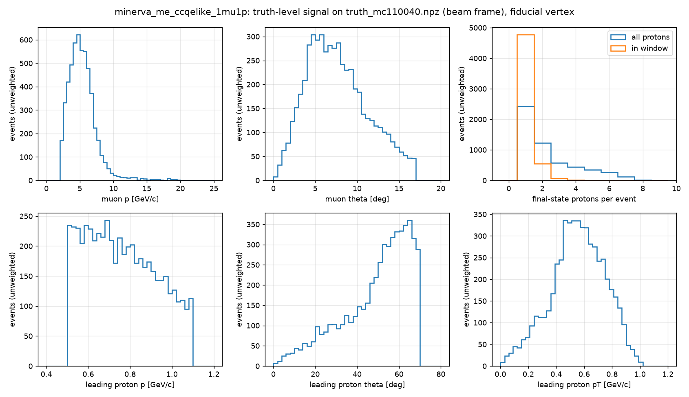
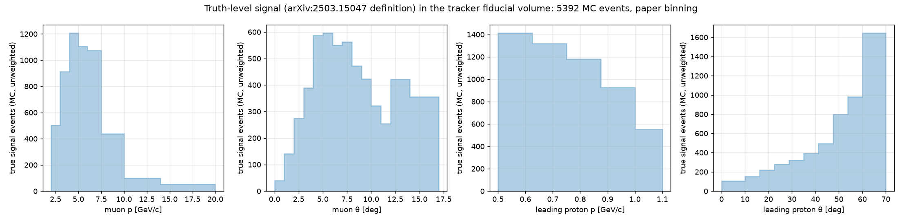
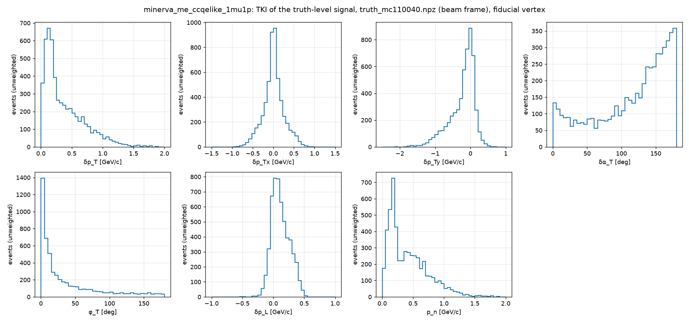
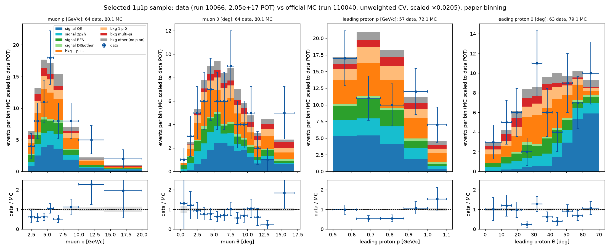
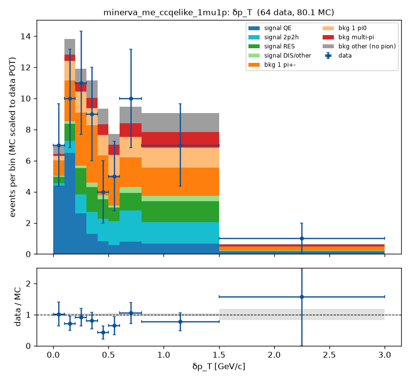
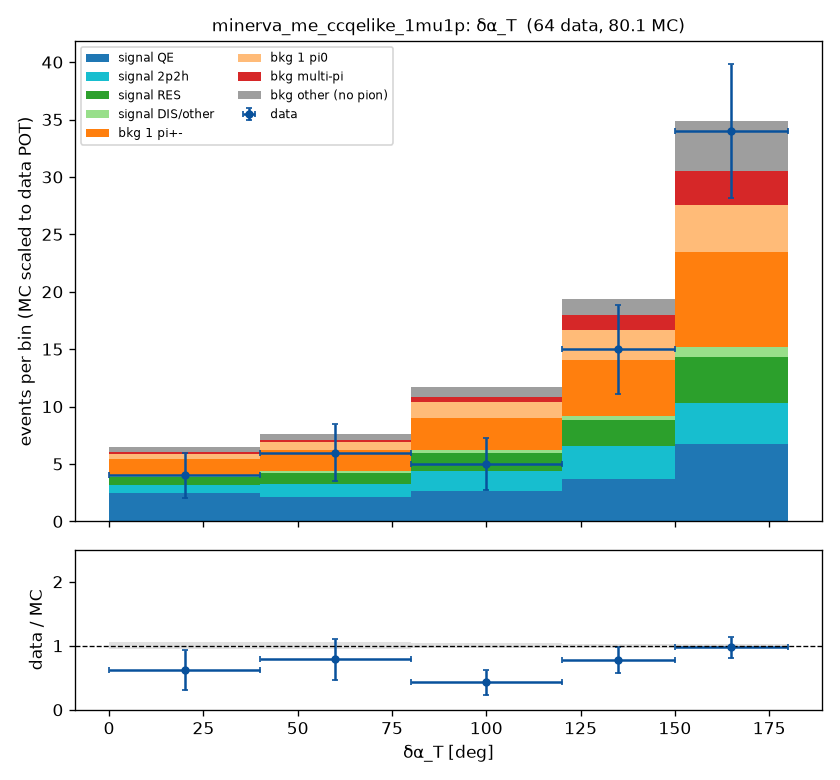
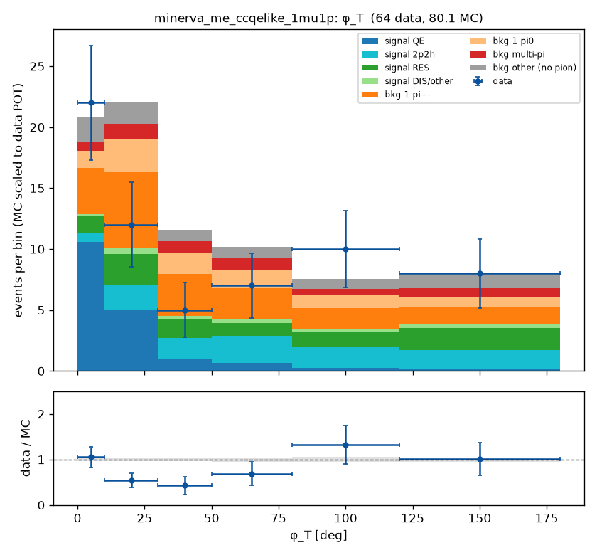
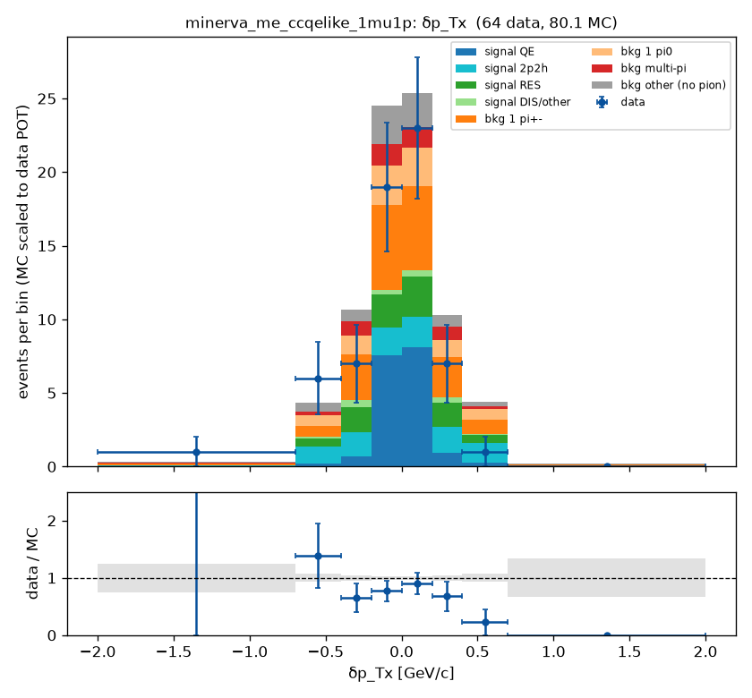
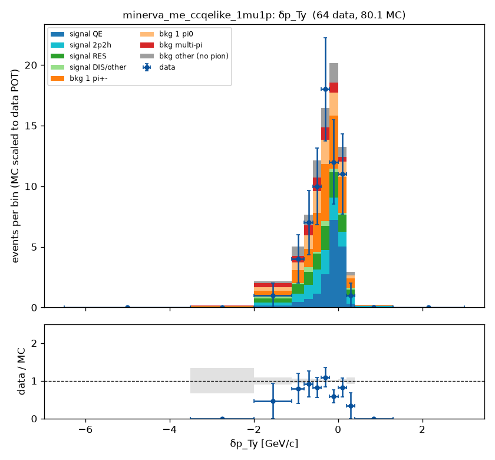
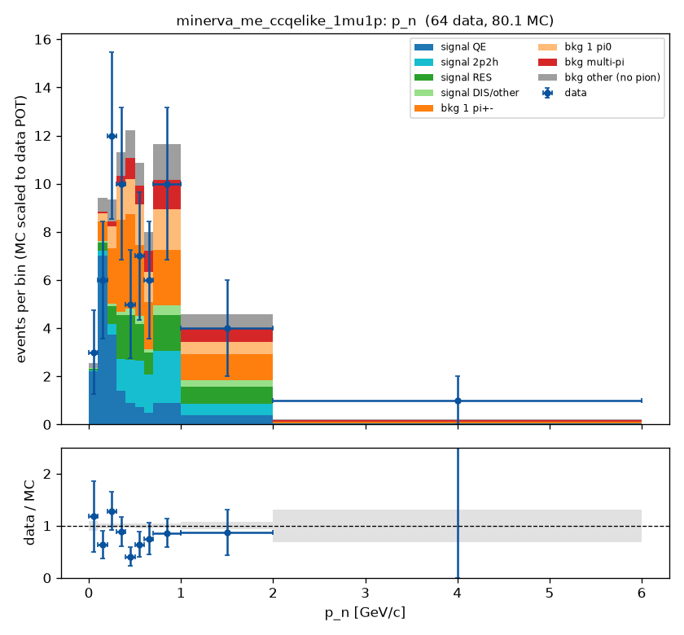

# MINERvA CCQE-like 1μ1p / TKI analysis on the open data: signal definition and event selection

**Status:** first pass, 2026-09-14. Truth-level signal decided; reconstruction-level selection
transcribed from the paper with the unpublished cut values marked as defaults. Comparison of the
local data file with the official MC at reconstruction level, shape only.

**Reference analysis:** J. Kleykamp et al. (MINERvA), *Measurement of the A dependence of the
νμ charged-current quasielastic-like cross section as a function of muon and proton kinematics
at ⟨Eν⟩ ∼ 6 GeV*, arXiv:2503.15047, Phys. Rev. D 112, 052005 (2025). Extraction of the paper in
the exploration repository under `papers/minerva/2503.15047/` (`paper_2503.15047.md`,
`open_questions.md`). Only the CH (tracker) result is reproduced here.

**Code:** `ndp-platform` commit `b971c93`. Channel manifest
`channels/minerva_me_ccqelike_1mu1p.yaml`; signal `ndp/channels/signal.py`; observables
`ndp/channels/observables.py`, `ndp/channels/reco_observables.py`; selection
`ndp/adapters/minerva_anatuple.py::ccqelike_1mu1p_cutflow` via `ndp/channels/selections.py`;
diagnostics `ndp/diagnostics.py` (`python -m ndp signal`, `python -m ndp selection`).
Tests: `tests/test_signal.py`, `tests/test_tki.py`, `tests/test_selection.py` (51 tests pass).

**Runs (numbers below are quoted from these directories, not from memory):**
`runs/2026-09-14_signal_minerva_me_ccqelike_1mu1p_2/` (truth level) and
`runs/2026-09-14_selection_minerva_me_ccqelike_1mu1p_2/` (reconstruction level).

---

## 1. Inputs

| item | value | source |
|---|---|---|
| Data | `MasterAnaDev_data_AnaTuple_run00010066_Playlist.root`, playlist minervame1A | MINERvA Open Data |
| Data exposure | 2.0498 × 10¹⁷ POT | Meta tree, `POT_Used` |
| Official MC | `MasterAnaDev_mc_AnaTuple_run00110040_Playlist.root`, GENIE 2.12.6 StandardMC, unweighted central value (no MINERvA-tune, flux or GENIE weights applied) | MINERvA Open Data |
| MC exposure | 9.9888 × 10¹⁸ POT; data/MC POT scale 0.020521 | Meta tree |
| Truth tree | 544 600 generated events (all detector regions) | cache `truth_mc110040.npz` |
| Reco tree (MC) | 186 205 reconstructed candidates, with the reco rows' truth including the final-state particle list | cache `reco_mc110040.npz`, `reco_mc110040_truthcols.npz` (cache version 3) |
| Reco tree (data) | 6 304 reconstructed candidates | cache `reco_data10066.npz` |
| Paper exposure | 10.61 × 10²⁰ POT, 218 000 selected CH events | arXiv:2503.15047 |

The local data file is 0.02 % of the paper's exposure. Every data/MC statement below is a
shape check with ~10 % statistical error on the total.

## 2. Signal definition (truth level)

### 2.1 The paper's definition

Verbatim from the paper's tex (`NuclTargTKI_PRD.tex` lines 293–301):

> "The interactions are considered signal if they have a muon with an angle with respect to the
> beam of <17° and a momentum within the range 2 GeV/c < p_μ < 20 GeV/c, and a proton with an
> angle <70° and a momentum in the range 500 MeV/c < p_p < 1100 MeV/c. Additionally, the
> interaction must not have mesons, baryons heavier than neutrons, or photons above 10 MeV.
> [...] For events with more than one proton matching the constraints, the highest momentum
> matching proton is used. [...] The photons with an energy less than 10 MeV are accepted since
> they can come from nuclear de-excitations."

As implemented (channel manifest, `signal:` block, status **decided**):

| item | requirement |
|---|---|
| interaction | νμ charged current (`nu_pdg = 14`, `current = CC`, primary lepton `lep_pdg = 13`) |
| muon | θμ < 17° with respect to the beam; 2 < pμ < 20 GeV/c |
| proton | ≥ 1 proton with θp < 70° and 0.5 < pp < 1.1 GeV/c; the highest-momentum proton inside this window is the **leading proton** used by every proton and TKI observable |
| vetoes | no mesons; no baryons heavier than the neutron; no photons above 10 MeV |
| allowed | any number of neutrons, photons ≤ 10 MeV, protons outside the window, nuclear remnants |
| phase space | true vertex inside the tracker fiducial box of the inclusive channel (z 5980–8422 mm, apothem 850 mm) — **open**: the paper does not state its CH fiducial volume |

Implementation choices, logged in `docs/decisions.md` (2026-09-14):

- Final-state classes are PDG **ranges**, not an enumerated list: meson = 100 ≤ |pdg| < 1000;
  heavy baryon = 1000 ≤ |pdg| < 10000 except p and n; antinucleons are *not* heavier than the
  neutron and are not vetoed; nuclear remnants (|pdg| ≥ 10⁹) and GENIE bookkeeping particles
  (2000000101) are ignored. Against MAT's enumerated `IsQELike` (`MAT-MINERvA/universes/
  CCQE3DFitsSystematics.cxx`) this differs on 6 of 397 604 νμ CC events (2 anti-Λ, 1 anti-K⁰
  events vetoed here but not by MAT; 3–4 events with a second final-state muon kept here, rejected
  by MAT).
- Both the muon and the proton angles are evaluated in the **NuMI beam frame** (rotation of the
  detector-frame momenta about x by −0.05887 rad, MAT's convention), the frame the paper measures
  angles in and the platform's default with the 2026-09-04 evidence.

### 2.2 Truth-level result on the official MC

Cumulative cutflow on the truth tree (`cutflow.json` of the signal run):

| step | all generated events | inside tracker fiducial |
|---|---|---|
| all cached truth events | 544 600 | 138 140 |
| νμ CC with μ⁻ | 397 604 | 100 016 |
| muon window | 224 629 | 56 887 |
| ≥ 1 proton in window | 74 184 | 19 594 |
| no mesons | 21 974 | 5 566 |
| no heavy baryons | 21 973 | 5 565 |
| no photons > 10 MeV | **21 369** | **5 392** |

Signal fraction of fiducial νμ CC events: 5.4 %. Composition of the 5 392 fiducial signal events
by GENIE process: QE 2 543 (47.2 %), RES with the pion absorbed 1 332 (24.7 %), 2p2h 1 129
(20.9 %), DIS 388 (7.2 %). Protons inside the window per signal event: one in 4 774 events,
two in 540, three or more in 78.

Kinematics of the fiducial signal (median, 16th–84th percentile): muon p 5.06 (3.42–6.92) GeV/c,
muon θ 7.2° (4.0–11.7°), leading proton p 0.745 (0.577–0.955) GeV/c, leading proton θ 53.3°
(31.0–64.5°), leading proton pT 0.559 (0.365–0.754) GeV/c.


*Figure 1 — Muon and leading-proton kinematics of the fiducial truth-level signal (beam frame),
and the proton multiplicity (all final-state protons vs protons inside the window).*


*Figure 2 — The same four distributions on the paper's released bin edges.*

## 3. TKI observables

Definitions follow Lu et al., PRC 94 (2016) 015503 and Furmanski & Sobczyk, PRC 95 (2017)
065501, as cited by the paper; ẑ is the neutrino direction, p_T the transverse momenta of the
muon (μ) and the leading proton (p):

- δp_T = |p_T^μ + p_T^p|
- δα_T = arccos[ −p̂_T^μ · δp_T / |δp_T| ]
- φ_T = arccos[ −p̂_T^μ · p̂_T^p ]
- δp_Tx = (ẑ × p̂_T^μ) · δp_T, δp_Ty = −p̂_T^μ · δp_T (negative when the proton carries less
  transverse momentum than the muon; the release's δp_Ty grid has its long tail negative)
- δp_L = R/2 − (m_A'² + δp_T²)/(2R), R = m_A + p_L^μ + p_L^p − E^μ − E^p
- p_n = √(δp_T² + δp_L²)

MAT's legacy `MnvRecoShifter::Calc_tki_vars` uses the opposite sign for both δp_Tx and δp_Ty;
the paper's Fig. 1 and its released grid match the convention above. Nuclear masses are not
stated by the paper; the manifest carries m_A = 11.174864 GeV (¹²C nuclear mass), b = 27.13 MeV
(carbon excitation, from the LE TKI paper arXiv:1805.05486), so m_A' = m_A − m_n + b =
10.262429 GeV, status **default**. The formulas are verified by an exact p_n recovery on a
four-momentum-conserving knockout event and by frame-rotation consistency (`tests/test_tki.py`).

TKI of the fiducial truth-level signal (median, 16th–84th percentile):

| observable | median | 16 %–84 % |
|---|---|---|
| δp_T [GeV/c] | 0.261 | 0.092–0.708 |
| δp_Tx [GeV/c] | 0.003 | −0.215–0.226 |
| δp_Ty [GeV/c] | −0.127 | −0.596–0.069 |
| δα_T [deg] | 132.9 | 48.6–167.6 |
| φ_T [deg] | 16.6 | 2.5–82.2 |
| δp_L [GeV/c] | 0.093 | −0.023–0.276 |
| p_n [GeV/c] | 0.346 | 0.129–0.748 |


*Figure 3 — TKI distributions of the fiducial truth-level signal: the Fermi peak in p_n near
0.2 GeV/c with the FSI tail, δα_T rising toward 180°, δp_Ty peaked at zero with the
deceleration tail, φ_T peaked at zero.*

## 4. Event selection (reconstruction level)

### 4.1 The paper's selection and its transcription

The paper (Sec. "Analysis and results"): events have a negatively charged muon reconstructed in
MINOS and at least one proton candidate whose energy is measured by range; protons that exit or
interact inelastically are flagged by the end-of-track deposits and stopping protons with a
Bragg-peak hit pattern are accepted, the Bragg-peak shape also vetoing pions; no Michel electron
candidates near the vertex or any track endpoint; no more than one isolated cluster of energy.
The muon and the highest-momentum proton candidate define the TKI variables. A commented-out
tex line (unpublished) gives the reconstruction windows: muon 17°, 2–20 GeV/c; proton 90°,
400–1300 MeV/c, "a larger fiducial to avoid cutting on the efficiency edge".

Transcription onto the MasterAnaDev AnaTuple (selection `minerva_ccqelike_1mu1p_v0`, values in
`selection.params` of the channel manifest):

| # | cut | paper wording | tuple branch / value | status |
|---|---|---|---|---|
| 1 | ZRange, Apothem | fiducial vertex in the tracker | `vtx` in z 5980–8422 mm, hexagon apothem 850 mm (inclusive channel's box) | open (paper fiducial not stated) |
| 2 | HasMINOSMatch, NoDeadtime, IsNeutrino | μ⁻ reconstructed in MINOS | `isMinosMatchTrack == 1`; ≤ 1 dead discriminator pair upstream; `MasterAnaDev_minos_trk_qp < 0` | decided (inclusive chain) |
| 3 | MuonWindow | 17°, 2–20 GeV/c | beam-frame `muon_thetaX/Y` angle < 17°, 2 < p < 20 GeV/c | default (commented tex line) |
| 4 | HasProtonCandidate | ≥ 1 proton candidate, energy by range | `MasterAnaDev_proton_P_fromdEdx > 0` (the tool's primary candidate; secondary candidates never exceed it) | decided |
| 5 | ProtonContained | exiting protons not well reconstructed | `MasterAnaDev_hadron_isExiting[0] == 0` (slot 0 = proton candidate in ~93 % of events) | default |
| 6 | ProtonScore | Bragg-peak stopping proton, pion veto | `MasterAnaDev_proton_score1 > 0.35` | default (paper gives no value) |
| 7 | ProtonWindow | 90°, 400–1300 MeV/c | `MasterAnaDev_proton_theta` (beam frame) < 90°, 0.4 < P_fromdEdx < 1.3 GeV/c | default (commented tex line) |
| 8 | NoMichel | no Michel electron near vertex or track ends | `improved_nmichel == 0` | decided |
| 9 | IsoBlobs | ≤ 1 isolated cluster | `n_nonvtx_iso_blobs ≤ 1` (`_all` variant agrees in 95 % of candidate events) | decided (counter choice open) |

Verified on the MC before adopting the branches: `MasterAnaDev_proton_theta` equals the angle of
the detector-frame (Px, Py, Pz)_fromdEdx after the NuMI beam rotation (median difference
0.0000°), the same convention as the muon; the proton candidate's truth PDG (`proton_prong_PDG`)
is a proton in 45 % of candidates before the score cut, π± in 38 %, π⁰ in 9 %.

### 4.2 Cutflow, purity, efficiency

Cumulative counts; MC scaled by the POT ratio 0.020521; purity = fraction of selected MC that is
truth signal inside the fiducial volume; efficiency = selected truth signal / 5 392
(`cutflow.json` of the selection run):

| step | data | MC (scaled) | data / MC | MC purity | MC efficiency |
|---|---|---|---|---|---|
| all candidates | 6 304 | 3 821.1 | 1.650 | 0.023 | 0.811 |
| ZRange | 2 658 | 2 590.8 | 1.026 | 0.034 | 0.804 |
| Apothem | 1 656 | 1 643.3 | 1.008 | 0.054 | 0.801 |
| HasMINOSMatch | 913 | 988.9 | 0.923 | 0.087 | 0.780 |
| NoDeadtime | 899 | 976.0 | 0.921 | 0.088 | 0.772 |
| IsNeutrino | 860 | 913.3 | 0.942 | 0.092 | 0.758 |
| MuonWindow | 766 | 824.0 | 0.930 | 0.101 | 0.751 |
| HasProtonCandidate | 414 | 464.1 | 0.892 | 0.127 | 0.532 |
| ProtonContained | 402 | 450.0 | 0.893 | 0.130 | 0.530 |
| ProtonScore | 128 | 166.1 | 0.770 | 0.261 | 0.392 |
| ProtonWindow | 123 | 156.8 | 0.785 | 0.272 | 0.385 |
| NoMichel | 99 | 123.2 | 0.804 | 0.332 | 0.369 |
| IsoBlobs | **64** | **80.1** | **0.799** | **0.486** | **0.352** |

The paper quotes, for the CH tracker, efficiency 28 % and purity 60 %. This selection is
looser: efficiency 35 %, purity 49 %. The excess of data over MC before the fiducial cuts
(1.65) is rock-muon and non-fiducial activity that the MC does not simulate; after the fiducial
cuts the ratio is 1.03, and it drops to 0.89 at the proton-candidate requirement and 0.80 after
the score cut. The MC is unweighted, so these ratios are not normalisation statements.

Composition of the 3 904 selected MC candidates (categories from the reco rows' truth):

| category | n MC | fraction |
|---|---|---|
| signal QE | 866 | 0.222 |
| signal 2p2h | 487 | 0.125 |
| signal RES (pion absorbed) | 459 | 0.118 |
| signal DIS/other | 85 | 0.022 |
| background, single π± | 938 | 0.240 |
| background, single π⁰ | 449 | 0.115 |
| background, multi-pion | 251 | 0.064 |
| background, no pion (out of window / fiducial, NC, ν̄, …) | 369 | 0.095 |

Proton-score threshold scan with all other cuts fixed:

| `proton_score1` > | data | MC (scaled) | MC purity | MC efficiency |
|---|---|---|---|---|
| none | 132 | 156.2 | 0.333 | 0.470 |
| 0.2 | 82 | 94.9 | 0.454 | 0.389 |
| **0.35** | **64** | **80.1** | **0.486** | **0.352** |
| 0.5 | 54 | 67.4 | 0.503 | 0.307 |
| 0.6 | 49 | 56.7 | 0.515 | 0.264 |
| 0.7 | 36 | 44.4 | 0.523 | 0.210 |
| 0.8 | 24 | 26.9 | 0.537 | 0.131 |

No threshold reaches the paper's purity: the plateau near 0.5 means the remaining background
(dominantly single π± and π⁰ with the pion undetected) is not separated by the dE/dx score. The
paper's Bragg-peak / end-of-track criterion, its isolated-cluster counter, or its Michel tagger
may differ from the branches used here, or the sideband tuning may absorb part of the gap. This
is the main open question of the selection.

### 4.3 Data versus MC

Selected sample, MC stacked by category and scaled to the data POT, data with Poisson errors,
ratio panels with the MC-statistics band. Bin edges are the paper's released grids (verified
from `anc/tki_release.root`).


*Figure 4 — Muon momentum and angle, leading-proton momentum and angle.*


*Figure 5 — δp_T (fine grid).*


*Figure 6 — δα_T.*


*Figure 7 — φ_T.*



*Figure 8 — δp_Tx and δp_Ty.*


*Figure 9 — p_n.*

Within the statistical errors (64 events in total) the data follow the MC shapes: δp_T and p_n
peak where the MC peaks, δα_T rises toward 180°, φ_T is concentrated at small angles, δp_Tx is
symmetric and δp_Ty has the negative tail. The data run about 20 % below the MC overall, with
the deficit concentrated at proton momenta 0.6–0.9 GeV/c and muon momenta 3–4 GeV/c. With this
exposure and an unweighted MC no further conclusion is drawn.

## 5. Caveats

- **Exposure.** 2.05 × 10¹⁷ POT of data versus the paper's 10.61 × 10²⁰; 64 selected events.
- **MC weights.** The official MC is used as generated: no MINERvA tune (2p2h enhancement, RPA,
  pion-production retune), no flux constraint, no detector-systematic universes.
- **Unpublished cut values.** The muon and proton reconstruction windows come from commented-out
  tex lines; the score threshold and the containment criterion are this analysis's defaults.
- **Fiducial volume and normalisation.** The paper does not state its CH fiducial volume or
  target count; absolute comparisons need them.
- **Frame.** All angles, truth and reco, are in the NuMI beam frame; the detector-frame numbers
  differ (the 70° proton edge moves by the 3.4° tilt).

## 6. Open questions (tracked in `docs/open_questions.md`, 2026-09-14)

1. Purity gap versus the paper (0.49 vs 0.60): which score threshold, containment criterion and
   isolated-blob counter to adopt.
2. The CH fiducial volume and n_nucleons of the paper.
3. Which released grid is the channel's published measurement (14 exist; the placeholder is the
   leading-proton momentum).
4. Ratification of the TKI constants (m_A, b) and confirmation of the δp_Tx sign convention
   against the paper's schematic.
5. Events with a second final-state muon (10⁻⁴ level): signal under the primary-lepton
   definition, background under MAT's `IsQELike`.
6. More data (playlist 1A) and a weight set before any normalisation is read.

## 7. Next steps

Settle the thresholds with the analyst; extend the data sample; build the per-measurement
surrogates (`python -m ndp surrogate build --channel minerva_me_ccqelike_1mu1p --measurement
<grid>`) so theorist models can be forward-folded onto the selected data; write the release
manifest for the unfolded comparison against the published CH cross sections.

## 8. Reproduce

```bash
cd /exp/dune/data/users/liangliu/ndp-dev/ndp-platform
python -m ndp data cache --channel minerva_me_ccqelike_1mu1p --reco-only   # cache v3 (data + MC)
python -m ndp signal    --channel minerva_me_ccqelike_1mu1p               # truth-level signal run
python -m ndp selection --channel minerva_me_ccqelike_1mu1p               # reco selection + data vs MC
python tests/run_tests.py
```
