# MINERvA CCQE-like 1μ1p / TKI analysis on the open data — full ME FHC data set

**Status:** rendered 2026-09-15 from runs of 2026-09-14. Truth-level signal decided (paper definition); reconstruction-level selection transcribed from the paper with the unpublished cut values marked as defaults; data versus the official MC at reconstruction level, shape only (the MC is the unweighted central value).

**Reference analysis:** J. Kleykamp et al. (MINERvA), *Measurement of the A dependence of the νμ charged-current quasielastic-like cross section as a function of muon and proton kinematics at ⟨Eν⟩ ∼ 6 GeV*, arXiv:2503.15047, Phys. Rev. D 112, 052005 (2025). Only the CH (tracker) result is reproduced here.

**Code:** `ndp-platform` (report rendered at commit `cbad5f7`; signal run at `d524e8e`, selection run at `d524e8e`). Channel manifest `channels/minerva_me_ccqelike_1mu1p.yaml`; signal `ndp/channels/signal.py`; observables `ndp/channels/observables.py`, `ndp/channels/reco_observables.py`; selection `ndp/adapters/minerva_anatuple.py::ccqelike_1mu1p_cutflow` via `ndp/channels/selections.py`; diagnostics `ndp/diagnostics.py` (`python -m ndp signal`, `python -m ndp selection`); grid processing `ndp/grid/`, playlist products `ndp/products.py`.

**Runs (every number below is quoted from these directories):** `runs/2026-09-14_signal_minerva_me_ccqelike_1mu1p_FHC/` (truth level) and `runs/2026-09-14_selection_minerva_me_ccqelike_1mu1p_FHC/` (reconstruction level). This file was rendered by `report/make_report.py` from them.

---

## 1. Inputs

| item | value | source |
|---|---|---|
| Data | ME FHC playlists 1A, 1B, 1C, 1D, 1E, 1F, 1G, 1L, 1M, 1N, 1O, 1P: 1 818 MasterAnaDev AnaTuple files, streamed on the FNAL grid (campaign `grid/campaigns/fhc_2026-09`) | MINERvA Open Data |
| Data exposure | 1.057 × 10²¹ POT | Meta tree `POT_Used`, summed over files (`pot_<pl>_data.json`) |
| Official MC | StandardMC, same playlists: 489 files, GENIE 2.12.6, unweighted central value (no MINERvA-tune, flux or GENIE weights) | MINERvA Open Data |
| MC exposure | 4.978 × 10²¹ POT; data/MC POT scale 0.21239 | Meta tree, summed |
| Truth (MC) | 62 257 466 CC events in the skim box (z 5880–8522 mm, apothem 900 mm), 51 551 370 inside the tracker fiducial | `truth_<pl>_skim.npz` |
| Reco candidates (MC) | 91 394 900 reconstructed candidates, with the reco rows' truth | `reco_<pl>_mc.npz`, `reco_<pl>_truthcols_skim.npz` (cache version 3) |
| Reco candidates (data) | 32 238 583 reconstructed candidates | `reco_<pl>_data.npz` |
| Paper exposure | 10.61 × 10²⁰ POT, 218 000 selected CH events | arXiv:2503.15047 |

Per playlist (files and POT_Used):

| playlist | data files | data POT | MC files | MC POT |
|---|---|---|---|---|
| 1A | 253 | 8.97 × 10¹⁹ | 41 | 4.07 × 10²⁰ |
| 1B | 47 | 1.87 × 10¹⁹ | 11 | 1.09 × 10²⁰ |
| 1C | 102 | 4.29 × 10¹⁹ | 21 | 2.09 × 10²⁰ |
| 1D | 283 | 1.44 × 10²⁰ | 61 | 6.07 × 10²⁰ |
| 1E | 219 | 1.03 × 10²⁰ | 51 | 5.09 × 10²⁰ |
| 1F | 260 | 1.67 × 10²⁰ | 71 | 7.07 × 10²⁰ |
| 1G | 233 | 1.38 × 10²⁰ | 61 | 5.95 × 10²⁰ |
| 1L | 15 | 1.34 × 10¹⁹ | 6 | 5.82 × 10¹⁹ |
| 1M | 202 | 1.58 × 10²⁰ | 98 | 8.98 × 10²⁰ |
| 1N | 138 | 1.07 × 10²⁰ | 31 | 5.12 × 10²⁰ |
| 1O | 26 | 2.98 × 10¹⁹ | 16 | 1.58 × 10²⁰ |
| 1P | 40 | 4.68 × 10¹⁹ | 21 | 2.08 × 10²⁰ |

This data set is 99.7 % of the paper's exposure. The statistical error on the selected data/MC ratio is ±0.002; every ratio below is a shape statement because the MC carries no weights.

## 2. Signal definition (truth level)

### 2.1 The paper's definition

Verbatim from the paper's tex (`NuclTargTKI_PRD.tex` lines 293–301):

> "The interactions are considered signal if they have a muon with an angle with respect to the
> beam of <17° and a momentum within the range 2 GeV/c < p_μ < 20 GeV/c, and a proton with an
> angle <70° and a momentum in the range 500 MeV/c < p_p < 1100 MeV/c. Additionally, the
> interaction must not have mesons, baryons heavier than neutrons, or photons above 10 MeV.
> [...] For events with more than one proton matching the constraints, the highest momentum
> matching proton is used. [...] The photons with an energy less than 10 MeV are accepted since
> they can come from nuclear de-excitations."

As implemented (channel manifest, `signal:` block, status **decided**):

| item | requirement |
|---|---|
| interaction | νμ charged current (`nu_pdg = 14`, `current = CC`, primary lepton `lep_pdg = 13`) |
| muon | θμ < 17° with respect to the beam; 2 < pμ < 20 GeV/c |
| proton | ≥ 1 proton with θp < 70° and 0.5 < pp < 1.1 GeV/c; the highest-momentum proton inside this window is the **leading proton** used by every proton and TKI observable |
| vetoes | no mesons; no baryons heavier than the neutron; no photons above 10 MeV |
| allowed | any number of neutrons, photons ≤ 10 MeV, protons outside the window, nuclear remnants |
| phase space | true vertex inside the tracker fiducial box of the inclusive channel (z 5980–8422 mm, apothem 850 mm) — **open**: the paper does not state its CH fiducial volume |

Implementation choices, logged in `docs/decisions.md` (2026-09-14):

- Final-state classes are PDG **ranges**, not an enumerated list: meson = 100 ≤ |pdg| < 1000; heavy baryon = 1000 ≤ |pdg| < 10000 except p and n; antinucleons are *not* heavier than the neutron and are not vetoed; nuclear remnants (|pdg| ≥ 10⁹) and GENIE bookkeeping particles (2000000101) are ignored. Against MAT's enumerated `IsQELike` this differs on 6 of 397 604 νμ CC events of the certification file (2 anti-Λ, 1 anti-K⁰ events vetoed here but not by MAT; 3–4 events with a second final-state muon kept here, rejected by MAT).
- Both the muon and the proton angles are evaluated in the **NuMI beam frame** (rotation of the detector-frame momenta about x by −0.05887 rad, MAT's convention), the frame the paper measures angles in and the platform's default with the 2026-09-04 evidence.
- On the grid the definition is evaluated per file by the same code and stored as derived columns of the truth skim (`signal_minerva_ccqelike_1mu1p`, `lp_*`, veto counts); the numbers below re-evaluate it from those columns.

### 2.2 Truth-level result on the official MC

Cumulative cutflow on the truth skims (`cutflow.json` of the signal run):

| step | all skimmed events | inside tracker fiducial |
|---|---|---|
| all cached truth events | 62 257 466 | 51 551 370 |
| νμ CC with μ⁻ | 60 274 591 | 49 908 726 |
| muon window | 34 270 726 | 28 391 086 |
| ≥ 1 proton in window | 11 774 421 | 9 751 296 |
| no mesons | 3 403 070 | 2 816 292 |
| no heavy baryons | 3 403 032 | 2 816 259 |
| no photons > 10 MeV | **3 304 412** | **2 734 227** |

Signal fraction of fiducial νμ CC events: 5.48 % (2 734 227 of 49 908 726). Composition of the fiducial signal by GENIE process: QE 1 275 863 (46.7 %), RES with the pion absorbed 696 114 (25.5 %), 2p2h 573 911 (21.0 %), DIS 188 339 (6.9 %). Protons inside the window per signal event: one in 2 420 600 events, two in 274 911, three or more in 38 716.

Kinematics of the fiducial signal (median, 16th–84th percentile): muon p 5.08 (3.40–6.96) GeV/c, muon θ 7.2° (4.0–11.6°), leading proton p 0.741 (0.576–0.954) GeV/c, leading proton θ 53.5° (31.4–64.4°), leading proton pT 0.556 (0.364–0.753) GeV/c.

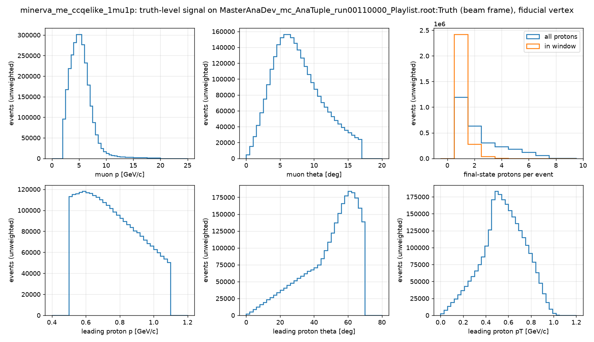
*Figure 1 — Muon and leading-proton kinematics of the fiducial truth-level signal (beam frame), and the proton multiplicity (all final-state protons vs protons inside the window).*

## 3. TKI observables

Definitions follow Lu et al., PRC 94 (2016) 015503 and Furmanski & Sobczyk, PRC 95 (2017) 065501, as cited by the paper; ẑ is the neutrino direction, p_T the transverse momenta of the muon (μ) and the leading proton (p):

- δp_T = |p_T^μ + p_T^p|
- δα_T = arccos[ −p̂_T^μ · δp_T / |δp_T| ]
- φ_T = arccos[ −p̂_T^μ · p̂_T^p ]
- δp_Tx = (ẑ × p̂_T^μ) · δp_T, δp_Ty = −p̂_T^μ · δp_T (negative when the proton carries less transverse momentum than the muon)
- δp_L = R/2 − (m_A'² + δp_T²)/(2R), R = m_A + p_L^μ + p_L^p − E^μ − E^p
- p_n = √(δp_T² + δp_L²)

MAT's legacy `MnvRecoShifter::Calc_tki_vars` uses the opposite sign for both δp_Tx and δp_Ty; the paper's Fig. 1 and its released grid match the convention above. Nuclear masses are not stated by the paper; the manifest carries m_A = 11.174864 GeV (¹²C nuclear mass), b = 27.13 MeV (carbon excitation, LE TKI paper arXiv:1805.05486), so m_A' = m_A − m_n + b = 10.262429 GeV, status **default**. The formulas are verified by an exact p_n recovery on a four-momentum-conserving knockout event and by frame-rotation consistency (`tests/test_tki.py`).

TKI of the fiducial truth-level signal (2 734 227 events; median, 16th–84th percentile):

| observable | median | 16 %–84 % |
|---|---|---|
| δp_T [GeV/c] | 0.263 | 0.091–0.732 |
| δp_Tx [GeV/c] | 0.000 | -0.226–0.227 |
| δp_Ty [GeV/c] | -0.123 | -0.618–0.071 |
| δα_T [deg] | 132.0 | 47.3–167.4 |
| φ_T [deg] | 16.6 | 2.5–86.7 |
| δp_L [GeV/c] | 0.091 | -0.022–0.273 |
| p_n [GeV/c] | 0.347 | 0.125–0.766 |

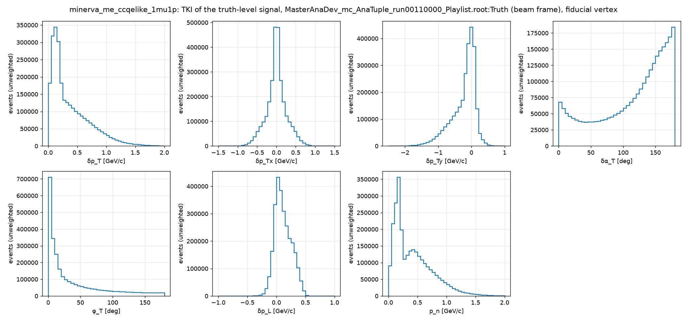
*Figure 2 — TKI distributions of the fiducial truth-level signal: the Fermi peak in p_n near 0.2 GeV/c with the FSI tail, δα_T rising toward 180°, δp_Ty peaked at zero with the deceleration tail, φ_T peaked at zero.*

## 4. Event selection (reconstruction level)

### 4.1 The paper's selection and its transcription

The paper (Sec. "Analysis and results"): events have a negatively charged muon reconstructed in MINOS and at least one proton candidate whose energy is measured by range; protons that exit or interact inelastically are flagged by the end-of-track deposits and stopping protons with a Bragg-peak hit pattern are accepted, the Bragg-peak shape also vetoing pions; no Michel electron candidates near the vertex or any track endpoint; no more than one isolated cluster of energy. The muon and the highest-momentum proton candidate define the TKI variables. A commented-out tex line (unpublished) gives the reconstruction windows: muon 17°, 2–20 GeV/c; proton 90°, 400–1300 MeV/c, "a larger fiducial to avoid cutting on the efficiency edge".

Transcription onto the MasterAnaDev AnaTuple (selection `minerva_ccqelike_1mu1p_v0`, values in `selection.params` of the channel manifest):

| # | cut | paper wording | tuple branch / value | status |
|---|---|---|---|---|
| 1 | ZRange, Apothem | fiducial vertex in the tracker | `vtx` in z 5980–8422 mm, hexagon apothem 850 mm (inclusive channel's box) | open (paper fiducial not stated) |
| 2 | HasMINOSMatch, NoDeadtime, IsNeutrino | μ⁻ reconstructed in MINOS | `isMinosMatchTrack == 1`; ≤ 1 dead discriminator pair upstream; `MasterAnaDev_minos_trk_qp < 0` | decided (inclusive chain) |
| 3 | MuonWindow | 17°, 2–20 GeV/c | beam-frame `muon_thetaX/Y` angle < 17°, 2 < p < 20 GeV/c | default (commented tex line) |
| 4 | HasProtonCandidate | ≥ 1 proton candidate, energy by range | `MasterAnaDev_proton_P_fromdEdx > 0` (the tool's primary candidate; secondary candidates never exceed it) | decided |
| 5 | ProtonContained | exiting protons not well reconstructed | `MasterAnaDev_hadron_isExiting[0] == 0` (slot 0 = proton candidate in ~93 % of events) | default |
| 6 | ProtonScore | Bragg-peak stopping proton, pion veto | `MasterAnaDev_proton_score1 > 0.35` | default (paper gives no value) |
| 7 | ProtonWindow | 90°, 400–1300 MeV/c | `MasterAnaDev_proton_theta` (beam frame) < 90°, 0.4 < P_fromdEdx < 1.3 GeV/c | default (commented tex line) |
| 8 | NoMichel | no Michel electron near vertex or track ends | `improved_nmichel == 0` | decided |
| 9 | IsoBlobs | ≤ 1 isolated cluster | `n_nonvtx_iso_blobs ≤ 1` (`_all` variant agrees in 95 % of candidate events) | decided (counter choice open) |

`MasterAnaDev_proton_theta` equals the angle of the detector-frame (Px, Py, Pz)_fromdEdx after the NuMI beam rotation (median difference 0.0000° on the certification file), the same convention as the muon.

### 4.2 Cutflow, purity, efficiency

Cumulative counts; MC scaled by the POT ratio 0.21239; purity = fraction of selected MC that is truth signal inside the fiducial volume; efficiency = selected truth signal / 2 734 227 (the fiducial signal count of Sec. 2.2; `cutflow.json` of the selection run):

| step | data | MC (scaled) | data / MC | MC purity | MC efficiency |
|---|---|---|---|---|---|
| all_candidates | 32 238 583 | 19 411 098.4 | 1.661 | 0.023 | 0.783 |
| ZRange | 13 438 456 | 13 069 501.9 | 1.028 | 0.035 | 0.776 |
| Apothem | 8 260 041 | 8 304 969.0 | 0.995 | 0.054 | 0.772 |
| HasMINOSMatch | 4 588 852 | 4 993 631.0 | 0.919 | 0.087 | 0.751 |
| NoDeadtime | 4 474 185 | 4 896 782.9 | 0.914 | 0.088 | 0.740 |
| IsNeutrino | 4 199 343 | 4 579 769.0 | 0.917 | 0.092 | 0.725 |
| MuonWindow | 3 744 137 | 4 137 496.0 | 0.905 | 0.101 | 0.718 |
| HasProtonCandidate | 2 082 254 | 2 300 521.1 | 0.905 | 0.126 | 0.500 |
| ProtonContained | 2 015 591 | 2 227 498.4 | 0.905 | 0.130 | 0.497 |
| ProtonScore | 722 674 | 821 063.7 | 0.880 | 0.260 | 0.368 |
| ProtonWindow | 684 173 | 775 635.8 | 0.882 | 0.269 | 0.360 |
| NoMichel | 529 247 | 608 033.3 | 0.870 | 0.328 | 0.344 |
| IsoBlobs | **329 653** | **391 384.4** | **0.842** | **0.484** | **0.326** |

The paper quotes, for the CH tracker, efficiency 28 % and purity 60 %. This selection: efficiency 32.6 %, purity 48.4 %. The excess of data over MC before the fiducial cuts (1.66) is rock-muon and non-fiducial activity that the MC does not simulate; after the fiducial cuts the ratio is 0.99, 0.91 at the proton-candidate requirement, 0.88 after the score cut and 0.842 ± 0.002 (stat) for the selected sample. The MC is unweighted, so these ratios are not normalisation statements.

Composition of the 1 842 788 selected MC candidates (categories from the reco rows' truth):

| category | n MC | fraction |
|---|---|---|
| signal QE | 402 501 | 0.218 |
| signal 2p2h | 219 799 | 0.119 |
| signal RES (pion absorbed) | 227 182 | 0.123 |
| signal DIS/other | 41 695 | 0.023 |
| background, single π± | 446 955 | 0.243 |
| background, single π⁰ | 214 805 | 0.117 |
| background, multi-pion | 119 477 | 0.065 |
| background, no pion (out of window / fiducial, NC, ν̄, …) | 170 374 | 0.092 |

Proton-score threshold scan with all other cuts fixed:

| `proton_score1` > | data | MC (scaled) | MC purity | MC efficiency |
|---|---|---|---|---|
| none | 660 502 | 763 008.1 | 0.332 | 0.436 |
| 0.2 | 401 323 | 462 683.2 | 0.456 | 0.364 |
| **0.35** | **329 653** | **391 384.4** | **0.484** | **0.326** |
| 0.5 | 260 735 | 322 109.7 | 0.502 | 0.279 |
| 0.6 | 211 727 | 271 548.4 | 0.512 | 0.239 |
| 0.7 | 155 278 | 209 057.9 | 0.522 | 0.188 |
| 0.8 | 89 858 | 127 705.4 | 0.537 | 0.118 |

No threshold reaches the paper's purity: the plateau near 0.54 means the remaining background (dominantly single π± and π⁰ with the pion undetected) is not separated by the dE/dx score. The paper's Bragg-peak / end-of-track criterion, its isolated-cluster counter, or its Michel tagger may differ from the branches used here, or the sideband tuning may absorb part of the gap. This is the main open question of the selection.

### 4.3 Per playlist

The comparison accumulates the playlists one at a time; per playlist, with the MC scaled to that playlist's own data POT:

| playlist | data POT | data selected | MC selected (scaled) | data / MC | MC purity | MC efficiency |
|---|---|---|---|---|---|---|
| 1A | 8.97 × 10¹⁹ | 30 049 | 35 245 | 0.853 | 0.484 | 0.347 |
| 1B | 1.87 × 10¹⁹ | 6 219 | 7 341 | 0.847 | 0.482 | 0.347 |
| 1C | 4.29 × 10¹⁹ | 14 492 | 17 019 | 0.851 | 0.484 | 0.350 |
| 1D | 1.44 × 10²⁰ | 48 014 | 56 963 | 0.843 | 0.485 | 0.349 |
| 1E | 1.03 × 10²⁰ | 33 341 | 40 350 | 0.826 | 0.486 | 0.347 |
| 1F | 1.67 × 10²⁰ | 51 398 | 62 144 | 0.827 | 0.485 | 0.329 |
| 1G | 1.38 × 10²⁰ | 42 748 | 51 831 | 0.825 | 0.484 | 0.333 |
| 1L | 1.34 × 10¹⁹ | 3 819 | 4 678 | 0.816 | 0.483 | 0.309 |
| 1M | 1.58 × 10²⁰ | 45 111 | 55 431 | 0.814 | 0.482 | 0.308 |
| 1N | 1.07 × 10²⁰ | 32 864 | 37 183 | 0.884 | 0.481 | 0.303 |
| 1O | 2.98 × 10¹⁹ | 8 327 | 9 461 | 0.880 | 0.483 | 0.279 |
| 1P | 4.68 × 10¹⁹ | 13 271 | 14 780 | 0.898 | 0.480 | 0.278 |

### 4.4 Data versus MC

Selected sample, MC stacked by category and scaled to the data POT, data with Poisson errors, ratio panels with the MC-statistics band. Bin edges are the paper's released grids (verified from `anc/tki_release.root`). Events in range and data/MC per grid (`summary.json` of the selection run):

| measurement | data in range | MC scaled in range | data NaN | MC NaN | data/MC first bin | last bin | range over bins |
|---|---|---|---|---|---|---|---|
| muon p [GeV/c] | 329 653 | 391 384.4 | 0 | 0 | 0.76 | 1.11 | 0.76–1.11 |
| muon θ [deg] | 329 653 | 391 384.4 | 0 | 0 | 0.50 | 0.91 | 0.50–0.91 |
| muon p_T [GeV/c] | 329 650 | 391 374.4 | 0 | 0 | 0.43 | 0.86 | 0.43–0.96 |
| leading proton p [GeV/c] | 289 289 | 350 208.9 | 0 | 0 | 0.90 | 0.78 | 0.78–0.90 |
| leading proton θ [deg] | 323 116 | 386 535.4 | 0 | 0 | 0.85 | 0.98 | 0.79–0.98 |
| leading proton p_T [GeV/c] | 329 382 | 391 156.3 | 186 | 737 | 0.87 | 1.11 | 0.82–1.11 |
| δp_T [GeV/c] | 329 293 | 390 999.4 | 186 | 737 | 0.85 | 0.85 | 0.83–0.88 |
| δp_T, fine grid [GeV/c] | 329 293 | 390 999.4 | 186 | 737 | 0.79 | 0.87 | 0.79–0.88 |
| δp_Tx [GeV/c] | 329 467 | 391 227.9 | 186 | 737 | 0.70 | 0.61 | 0.61–0.86 |
| δp_Ty [GeV/c] | 329 467 | 391 227.9 | 186 | 737 | 0.68 | – | 0.56–0.88 |
| δα_T [deg] | 329 467 | 391 227.9 | 186 | 737 | 0.73 | 0.86 | 0.73–0.86 |
| φ_T [deg] | 329 467 | 391 227.9 | 186 | 737 | 0.83 | 0.75 | 0.75–0.90 |
| δp_L [GeV/c] | 329 420 | 391 170.1 | 186 | 737 | 1.02 | – | 0.68–1.05 |
| p_n [GeV/c] | 329 467 | 391 227.2 | 186 | 737 | 0.73 | 0.87 | 0.73–0.95 |

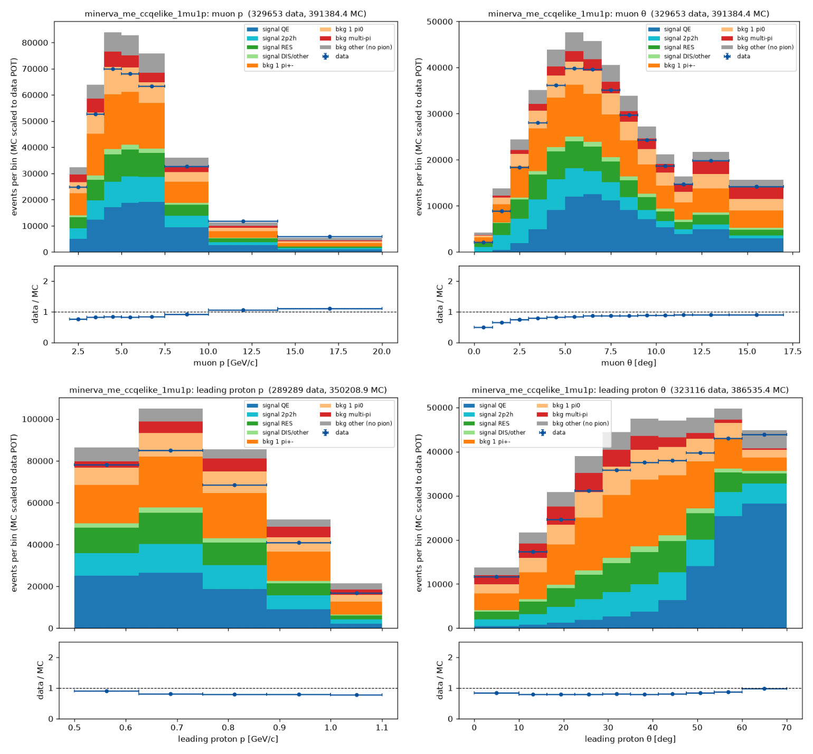
*Figure 3 — Muon momentum and angle, leading-proton momentum and angle.*

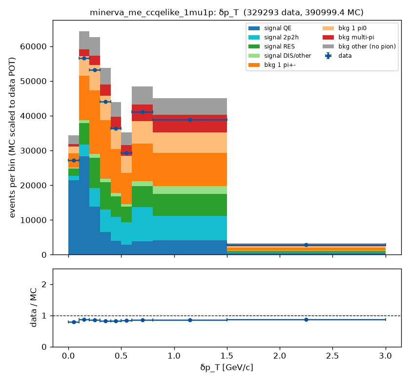
*Figure 4 — δp_T (fine grid).*

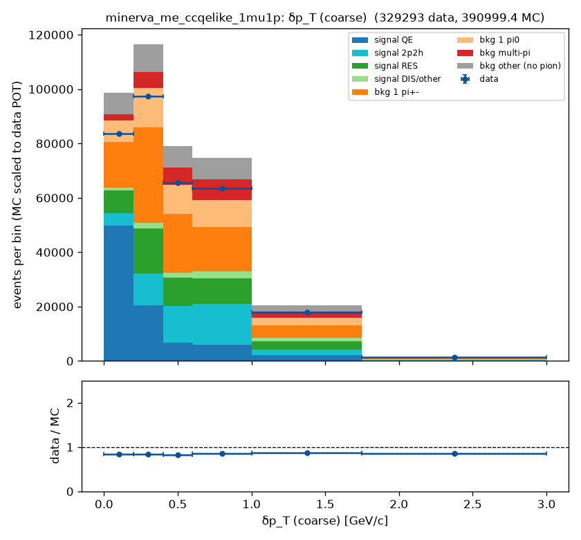
*Figure 5 — δp_T (released grid).*

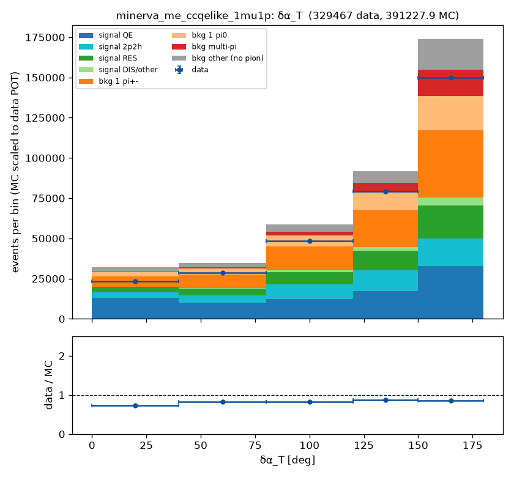
*Figure 6 — δα_T.*

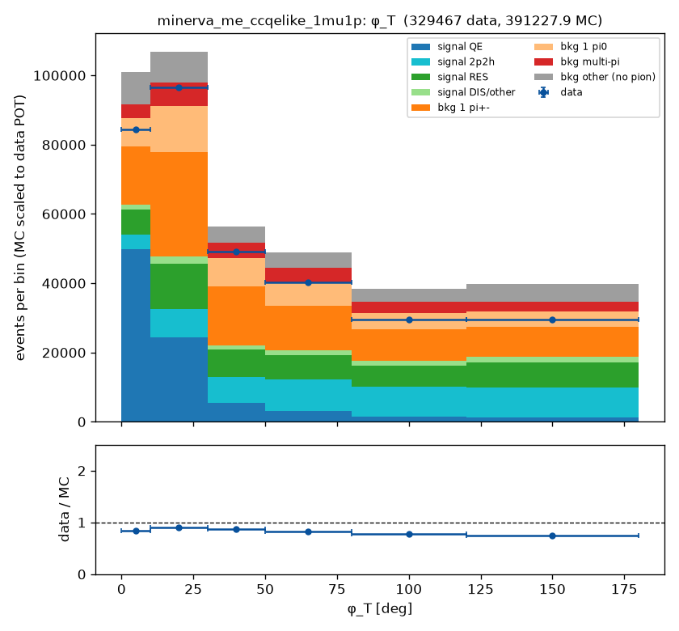
*Figure 7 — φ_T.*

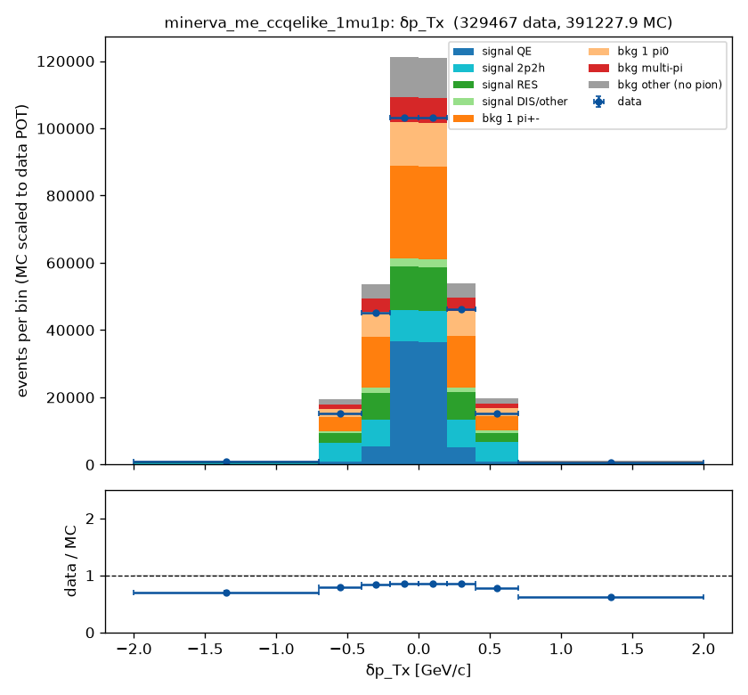
*Figure 8 — δp_Tx.*

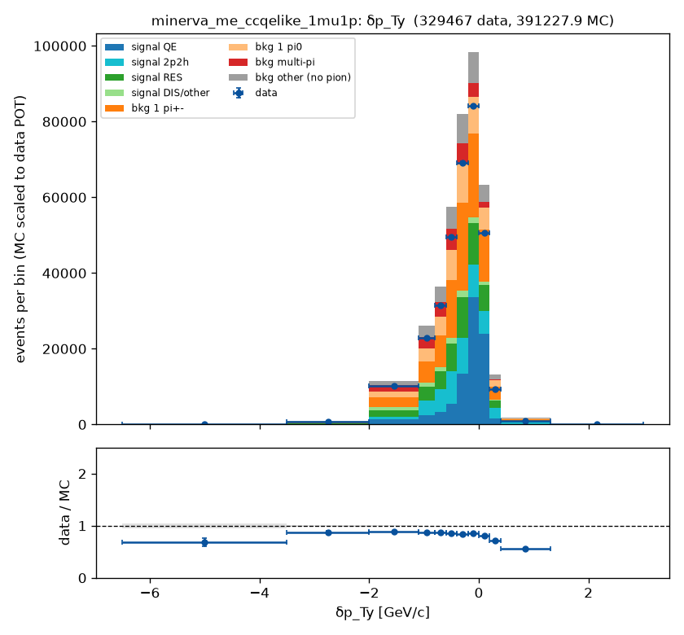
*Figure 9 — δp_Ty.*

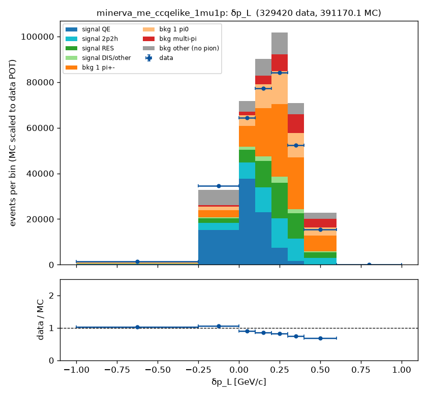
*Figure 10 — δp_L.*

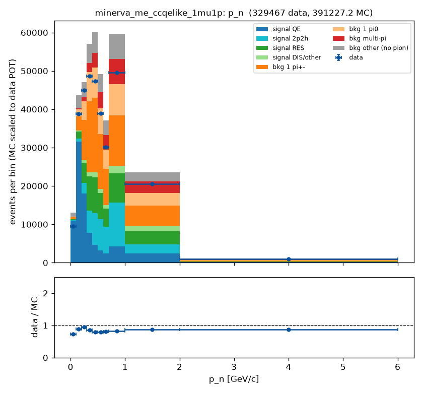
*Figure 11 — p_n.*

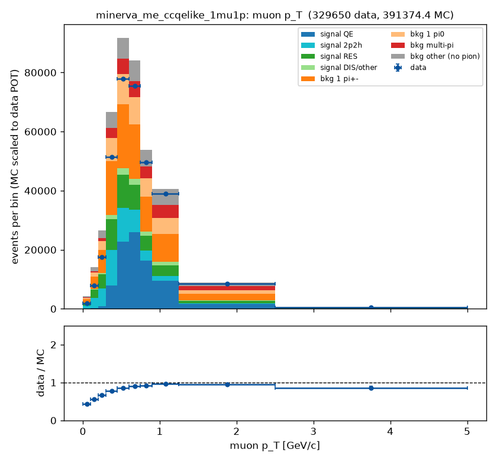
*Figure 12 — muon p_T.*

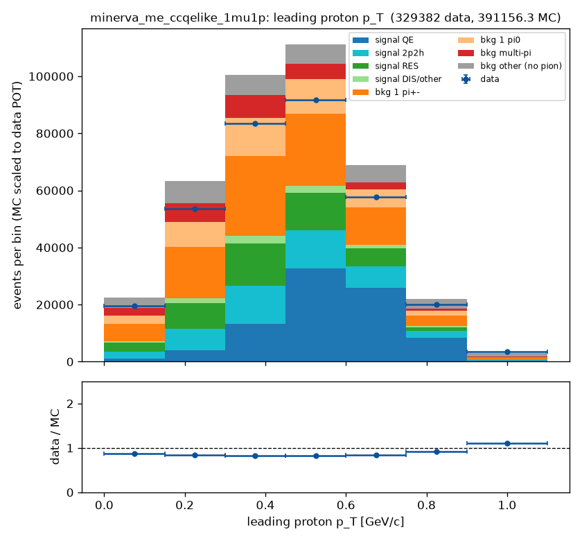
*Figure 13 — leading proton p_T.*

**Reading of the figures (full ME FHC).** With 0.2 % statistics on the selected sample the trends seen
in playlist 1A are confirmed and sharpened. The data/MC ratio is 0.842 ± 0.002 overall; it rises
with the muon angle from 0.50 in the first degree to 0.91 at 15–17°, with the muon momentum from
0.76 (2–3 GeV/c) to 1.11 (14–20 GeV/c) and with the muon p_T from 0.43 to 0.86 (0.96 at most). δp_T
is flat within 0.83–0.88 on the released grid (0.79–0.88 on the fine grid), δα_T moves from 0.73 to
0.86, p_n from 0.73 at the lowest bin to 0.87–0.95 beyond the Fermi peak, and the leading-proton
momentum falls from 0.90 at 0.5–0.625 GeV/c to 0.78 above 0.875 GeV/c. The muon-angle and muon-p_T
trends are the signature of the low-Q² (RPA) suppression and the 2p2h enhancement that the MINERvA
tune applies and this unweighted central-value MC lacks; the transverse-imbalance shapes are less
sensitive to those weights.

The per-playlist table (Sec. 4.3) adds what one playlist cannot show: the MC efficiency is not one
number. It falls from 0.35 in playlists 1A–1E to 0.33 (1F–1G), 0.31 (1L–1N) and 0.28 (1O–1P) at
constant purity, while data/MC moves the other way in the last three playlists (0.88–0.90 against
0.81–0.85 before). The truth denominator uses the same fiducial volume for every playlist, so this is
the simulated detector response changing with the playlist and the data not following it in the same
measure; the paper's 28 % efficiency is the POT-weighted average of such numbers. Which cut loses the
efficiency per playlist has to be looked at before any tune weight is judged (`docs/open_questions.md`).
No normalisation should be read from these ratios before the weight set is decided.

## 5. Caveats

- **Exposure.** 1.057 × 10²¹ POT of data (329 653 selected events) against the paper's 10.61 × 10²⁰.
- **MC weights.** The official MC is used as generated: no MINERvA tune (2p2h enhancement, RPA, pion-production retune), no flux constraint, no detector-systematic universes. Ratios are shape statements.
- **Unpublished cut values.** The muon and proton reconstruction windows come from commented-out tex lines; the score threshold and the containment criterion are this analysis's defaults.
- **Fiducial volume and normalisation.** The paper does not state its CH fiducial volume or target count; absolute comparisons need them.
- **Frame.** All angles, truth and reco, are in the NuMI beam frame; the detector-frame numbers differ (the 70° proton edge moves by the 3.4° tilt).
- **Truth skims.** The truth-level numbers come from the per-file skims (CC events in an enlarged tracker box with the final-state list reduced to derived columns, `docs/decisions.md` 2026-09-14); the full truth tables stay on DUNE scratch.

## 6. Open questions (tracked in `docs/open_questions.md`)

1. Purity gap versus the paper (0.48 vs 0.60): which score threshold, containment criterion and isolated-blob counter to adopt.
2. The CH fiducial volume and n_nucleons of the paper.
3. Which released grid is the channel's published measurement (14 exist; the placeholder is the leading-proton momentum).
4. Ratification of the TKI constants (m_A, b) and confirmation of the δp_Tx sign convention against the paper's schematic.
5. Events with a second final-state muon (10⁻⁴ level): signal under the primary-lepton definition, background under MAT's `IsQELike`.
6. The MC weight set before any normalisation is read; the playlist dependence of the MC efficiency (full-FHC report).
7. Which playlists to write into the committed channel manifest (`data.playlists`) and where the full truth archives live.

## 7. Reproduce

```bash
cd /exp/dune/data/users/liangliu/ndp-dev/ndp-platform
# products: grid/README.md (ndp grid plan / submit / status / harvest --no-archive; ndp data merge --beam FHC --playlist <pl> --kind data,mc)
# a copy of channels/minerva_me_ccqelike_1mu1p.yaml with data.playlists = {mc: [1A, 1B, 1C, 1D, 1E, 1F, 1G, 1L, 1M, 1N, 1O, 1P], data: [1A, 1B, 1C, 1D, 1E, 1F, 1G, 1L, 1M, 1N, 1O, 1P]} and products_dir set:
python -m ndp signal    --channel <manifest.yaml> --slug signal_minerva_me_ccqelike_1mu1p_FHC
python -m ndp selection --channel <manifest.yaml> --slug selection_minerva_me_ccqelike_1mu1p_FHC
python report/make_report.py --label "full ME FHC data set" --tag fhc --signal runs/2026-09-14_signal_minerva_me_ccqelike_1mu1p_FHC --selection runs/2026-09-14_selection_minerva_me_ccqelike_1mu1p_FHC --out <this file>
```
