# 1mu + leading proton: results

Channel `minerva_me_ccqelike_1mu1p` (MINERvA ME FHC, arXiv:2503.15047 signal definition). Model: GiBUU 2025
numu CC on 12C under the NuMI ME FHC flux (energy-scan sample `runs/_generator_cache/gibuu_1f8bcb950be1dcd0`).
Each section adds one stage; the scripts next to this file make the figures.

## 1. GiBUU truth: muon momentum and angle, signal definition only

The only requirement is the truth signal definition of the channel: one muon with angle to the beam below 17 degrees
and momentum between 2 and 20 GeV/c, at least one proton with angle below 70 degrees and momentum between 0.5 and
1.1 GeV/c, no mesons, no baryons heavier than the neutron, no photons above 10 MeV. No reconstruction cut,
efficiency or smearing is applied. Angles are with respect to the beam. Weights are the GiBUU event weights scaled
to the data exposure (1.057e21 POT), so the histograms count expected signal events in the fiducial volume.

Of 979,395 generated CC events, 56,132 pass the signal definition, corresponding to 533,040 signal events at the
data exposure out of 8,902,466 CC events.

True muon momentum of the signal events: median 5.25 GeV/c, mean 5.43 GeV/c, peak bin 5.0 to 5.5 GeV/c.

True muon angle to the beam of the signal events: median 7.25 degrees, mean 7.67 degrees, peak bin 6.0 to 6.5 degrees.

The same angle as cos(theta), from the signal window's edge cos(17 degrees) = 0.9563 to 1 in 44 bins of 0.001: median 0.9926, mean 0.9892, peak bin 0.9970 to 0.9980.

Script: `make_muon_truth_signal.py` (default pixi environment); histogram contents and the numbers above:
`muon_truth_signal.json`.

## 2. Selection cuts applied

The cuts are the channel's reconstruction-level selection (`minerva_ccqelike_1mu1p_v0`): tracker fiducial vertex,
MINOS-matched negative muon, dead time, muon window (17 degrees, 2 to 20 GeV/c), a contained proton candidate with
dE/dx score above 0.35 inside 90 degrees and 0.4 to 1.3 GeV/c, no Michel electron, at most one isolated blob. A
generator sample has no reconstruction, so the cuts are applied as the selection efficiency learned from the official
MC (the 12 ME FHC playlists): per true cell of a grid, efficiency = selected truth signal / truth signal in the
fiducial volume. Each signal event of section 1 is weighted by the efficiency of its true cell on the grid of the
plotted variable; the lower panel of each plot shows the resulting efficiency per bin. Events are otherwise unchanged,
so the distributions are still in true kinematics.

The cuts keep 175,118 of the 533,040 signal events at the data exposure, a mean efficiency of 0.33.

Muon momentum: the efficiency rises from 0.24 in the 2 to 3 GeV/c bin to 0.38 at 7.5 to 10 GeV/c and falls back to
0.35 above 14 GeV/c; after the cuts the median is 5.25 GeV/c and the mean 5.65 GeV/c, peak bin 5.0 to 5.5 GeV/c.

Muon angle: the efficiency falls steadily with angle, from 0.46 below 1 degree to 0.13 in the 14 to 17 degree bin,
because the MINOS match favours forward muons; after the cuts the median is 6.25 degrees and the mean 6.79 degrees,
peak bin 5.5 to 6.0 degrees.

The same in cos(theta): efficiency from 0.09 at the window edge to 0.40 in the most forward bin; after the cuts the
median is 0.9935 and the mean 0.9915, peak bin 0.9970 to 0.9980.

Script: `make_muon_cuts_applied.py` (default pixi environment); histogram contents, the grid efficiencies and the numbers
above: `muon_cuts_applied.json`.

## 3. VBLL surrogate smearing applied

The detector resolution is applied with the ported VBLL surrogate `x60_het` (a VBLL_SurrogateModel checkpoint trained
on MINERvA StandardMC pairs of true and reconstructed muon and proton 4-vectors; port and certification in
`report/VBLL_surrogate_1mu1p.md`). For every signal event of section 2 the true muon and leading-proton 4-vectors
are rotated into the model's detector frame and 20 reconstructed copies are drawn from the model's predictive
distribution; the copies are conditioned on the selection's kinematic windows (85.6 percent of them pass, the
event's weight being shared among the passing ones, no event lost) and each event keeps the selection efficiency of
section 2. The plotted quantities are now the smeared, reconstructed muon momentum and angle to the beam. This is
the prediction that the platform compares with the data in reconstructed space; the lower panel shows the ratio of
the smeared to the unsmeared distribution, the effect of the migration alone.

The smearing conserves the totals of section 2 (175,118 events at the data exposure on the momentum grid).

Muon momentum: median 5.25 GeV/c and peak bin 5.0 to 5.5 GeV/c as before the smearing; the migration is within 5
percent below 6 GeV/c, removes 5 to 15 percent between 6 and 8 GeV/c, adds up to 70 percent between 9 and 11 GeV/c and
removes 20 to 60 percent above 16 GeV/c. This is the effect of the model's muon energy width, 1.35 GeV on average,
which is larger than the 0.48 GeV core width of the residual it was trained on.

Muon angle: median 6.25 degrees, peak bin 5.0 to 5.5 degrees (5.5 to 6.0 before); both ends of the window gain,
30 to 70 percent below 2 degrees and 60 to 100 percent above 14 degrees, while 4 to 12 degrees lose about 10 percent.

The same in cos(theta): median 0.9945 (0.9935 before), peak bin 0.9970 to 0.9980 unchanged; the bins nearest the
window edge, cos(theta) below 0.962, gain a factor 2 to 3 and the most forward bin gains 37 percent.

### Migration matrices

The same smeared copies, histogrammed in two dimensions: true value on the horizontal axis, VBLL-reconstructed value
on the vertical axis. Each column is normalised to the events of its true bin, so a cell reads as the probability
P(reconstructed bin | true bin) in percent. The left panel uses the analysis grid of the corresponding measurement,
the grid on which the platform folds; the right panel uses the fine bins of the plots above. No copy leaves the
grids' ranges, because for these three variables the ranges coincide with the reconstruction windows the copies are
conditioned on.

Muon momentum on the 8-bin grid: 32 to 35 percent of the events stay in their true bin below 6 GeV/c, 41 percent at
6 to 7.5 GeV/c and 51 to 57 percent in the three wide bins above 7.5 GeV/c; averaged over the signal, 37 percent stay.

Muon angle on the 14-bin grid (1-degree bins up to 12 degrees): 40 to 45 percent stay in their bin below 3 degrees,
falling to 10 percent at 10 to 12 degrees where the smearing exceeds the bin width, 17 to 20 percent in the two wider
bins above 12 degrees; 23 percent on average.

Muon cos(theta) on the 8-bin grid: 80 percent stay in the most forward bin (cos(theta) above 0.9945) and 7 to 23
percent in the six bins below 0.989; 47 percent on average.

The matrices in percent, the diagonal fractions and the per-column losses are in `muon_vbll_smeared.json` under
`migration`.

### Migration matrices from the official MC, same bins

The same matrices from the MINERvA StandardMC of the 12 ME FHC playlists, the sample the platform's binned responses
are learned from: reconstructed candidates passing the channel selection whose truth is signal inside the fiducial
volume, 891,177 events, true muon kinematics from the primary lepton and reconstructed ones from the MINERvA
reconstruction (`reco_p`, `reco_theta`). Same analysis grids, same fine bins, same column normalisation. On the analysis
grids the matrices reproduce the migration counts stored in the binned responses exactly.

Probability of reconstructing in the true bin, official MC against the VBLL surrogate, averaged over the signal:

| grid | official MC | VBLL x60_het |
|---|---|---|
| muon momentum, 8 bins | 68 % (63 to 83 % per bin) | 37 % (32 to 57 %) |
| muon angle, 14 bins | 77 % (72 to 92 %) | 23 % (10 to 45 %) |
| muon cos(theta), 8 bins | 91 % (71 to 96 %) | 47 % (7 to 80 %) |

The MINERvA reconstruction keeps three quarters of the muons inside a 1-degree bin and two thirds inside a 1 GeV/c
bin; the VBLL surrogate, whose sigma is calibrated to the root-mean-square of a heavy-tailed residual rather than to
its core, spreads them over several bins, most strongly in angle. Matrices, counts and diagonals: `muon_mc_migration.json`;
script `make_muon_mc_migration.py` (default pixi environment, one playlist at a time, about 4 minutes).

Script: `make_muon_vbll_smeared.py` (ml pixi environment: `pixi run -e ml python ...`); histogram contents, including
the smeared distributions without the efficiency, and the numbers above: `muon_vbll_smeared.json`.

## 4. Official MC, signal channel: true without cut, true with cuts, reconstructed

The same three stages for the MINERvA StandardMC of the 12 ME FHC playlists (4.978e21 POT, scaled by 0.2124 to the
data exposure), signal channel only. "True, no cut" is every truth signal event with its true vertex inside the
tracker fiducial volume, the denominator of the selection efficiency. "True, cuts applied" is the reconstructed
candidates passing the channel selection whose truth is signal in the fiducial volume, the numerator, drawn in their
true muon kinematics. "Reconstructed" is the same candidates in the kinematics the MINERvA reconstruction assigned
them. The lower panels show the selection efficiency per bin and the reconstructed-over-true ratio of the selected
events, the migration alone. Unweighted CV MC; true angles from the primary lepton rotated into the beam frame,
reconstructed angles from the tuple's beam-frame branches.

2,734,227 fiducial truth signal events (580,715 at the data exposure), 891,177 selected (189,275), efficiency 0.326.

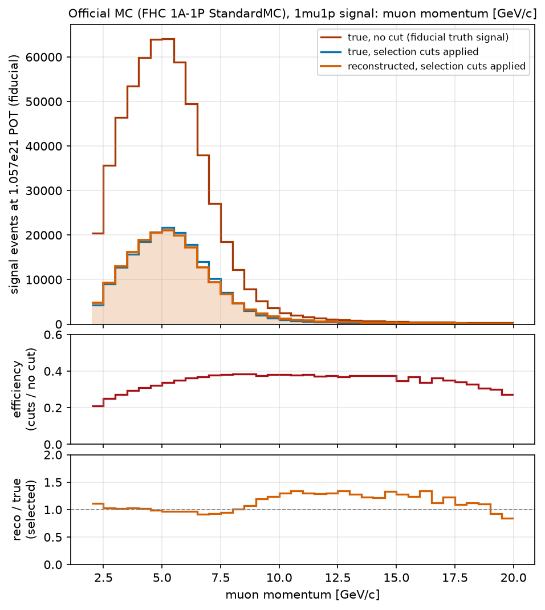

Muon momentum: median 5.25 GeV/c at all three stages, mean 5.33, 5.56 and 5.59 GeV/c; the reconstruction moves
events upward above 8 GeV/c (reconstructed over true 1.2 to 1.3 between 9 and 16 GeV/c, 0.84 to 0.93 in the last
bins) and is within 3 percent below 6 GeV/c.

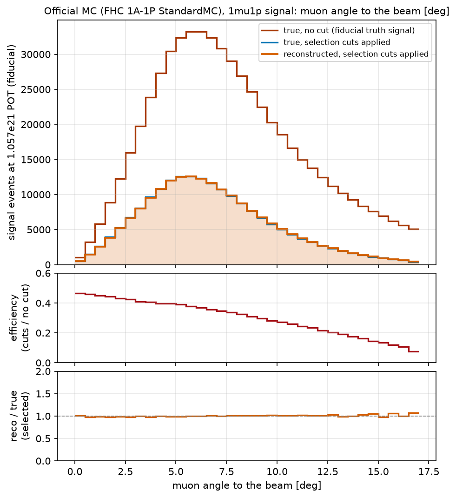

Muon angle: the cuts move the median from 7.25 to 6.25 degrees, the reconstruction leaves it there; reconstructed
over true is within 2 percent up to 12 degrees and up to 7 percent above 14 degrees.

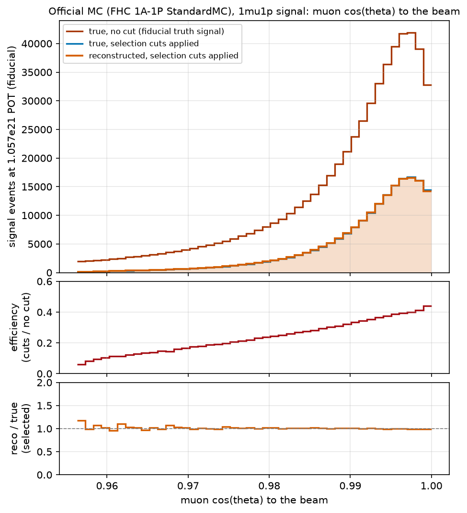

The same in cos(theta): median 0.9926, 0.9935, 0.9935; reconstructed over true within a few percent everywhere except
the bin at the window edge (1.18).

Compared with section 3, the MINERvA reconstruction migrates far less than the VBLL surrogate: in momentum the
reconstruction's ratio stays between 0.84 and 1.34 where the surrogate's runs from 0.42 to 1.70, and in angle it
stays within 7 percent where the surrogate's runs from 0.82 to 1.96. Script: `make_muon_mc_stages.py` (default pixi
environment, one playlist at a time, about 5 minutes); histogram contents and the numbers above: `muon_mc_stages.json`.

## 5. A VBLL surrogate trained in the platform with momentum and cos(theta) as extra inputs and outputs

A new model, `fhc6_het`, was trained inside the platform (`ndp surrogate train-vbll`, script
`ndp/surrogate/vbll_train.py`) instead of porting the collaborator's checkpoint. Per particle the network reads six
inputs, the true (E, px, py, pz) plus the true momentum p and cos(theta), and predicts the same six reconstructed
quantities, all in the beam frame and in MeV. The training pairs are the platform's own: the true and reconstructed
muon and leading proton of every selected signal candidate in the fiducial volume of the 12 ME FHC StandardMC
playlists, 891,040 pairs, of which 712,832 trained the model and 178,208 were held out. Architecture and objective are
those of the VBLL_SurrogateModel repository (embedding, three layers of 64, one heteroscedastic VBLL head per particle,
with the training-loss fix); Adam at 1e-3, batches of 512, early stopping on the validation predictive
negative log-likelihood. It stopped after 23 epochs (17 minutes on 16 threads) at a validation NLL of 1.684. When the
model is applied, the reconstructed 3-momentum takes its magnitude from the predicted p, its polar angle from the
predicted cos(theta) (draws above 1 reflected back below 1) and its azimuth from the predicted (px, py).

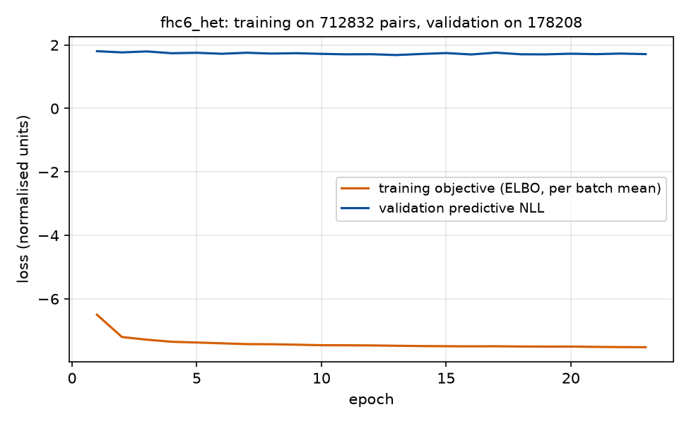

On the held-out pairs the 68 percent coverage is 0.853 for the muon and 0.878 for the proton; the predicted muon
momentum width has a median of 979 MeV against a residual core width of 417 MeV, and the transverse components
73 to 77 MeV against 44 to 45 MeV. The ported x60_het model had 1346 against 477 MeV and 115 to 130 against 58 to
63 MeV, so the new model is tighter but its widths are still calibrated to the root-mean-square of the residual, not
its core.

### Closure on the official MC

Both models were used to fold the fiducial truth signal of the official MC (2,734,227 events) on the three muon
grids and compared with the selected signal per bin, the same closure the platform certifies its surrogates with.

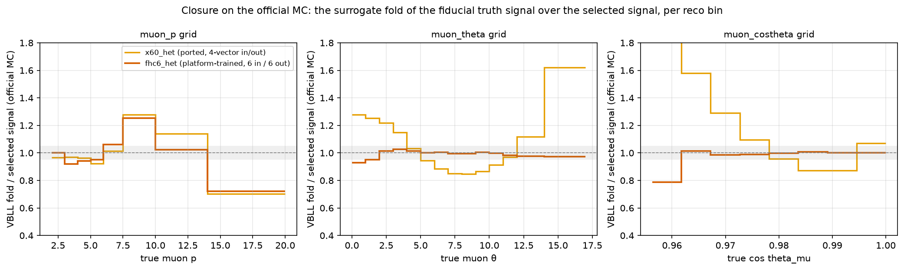

| grid | bins within 5 percent, x60_het | bins within 5 percent, fhc6_het |
|---|---|---|
| muon momentum, 8 bins | 4 | 3 |
| muon angle, 14 bins | 2 | 13 |
| muon cos(theta), 8 bins | 1 | 7 |

The new model closes in angle: the fold over the selected signal is between 0.93 and 1.03 in every angle bin and
between 0.985 and 1.015 in every cos(theta) bin except the one at the window edge (0.79). In momentum it is no
better than the ported model: 0.92 to 0.95 between 3 and 6 GeV/c, 1.25 at 7.5 to 10 GeV/c and 0.72 at 14 to 20 GeV/c,
the same over-smearing pattern.

### Applied to GiBUU

The same three stages as section 3, with the new model in place of the ported one (dashed: the ported model).
97 percent of the smeared copies pass the reconstruction windows; totals are conserved.

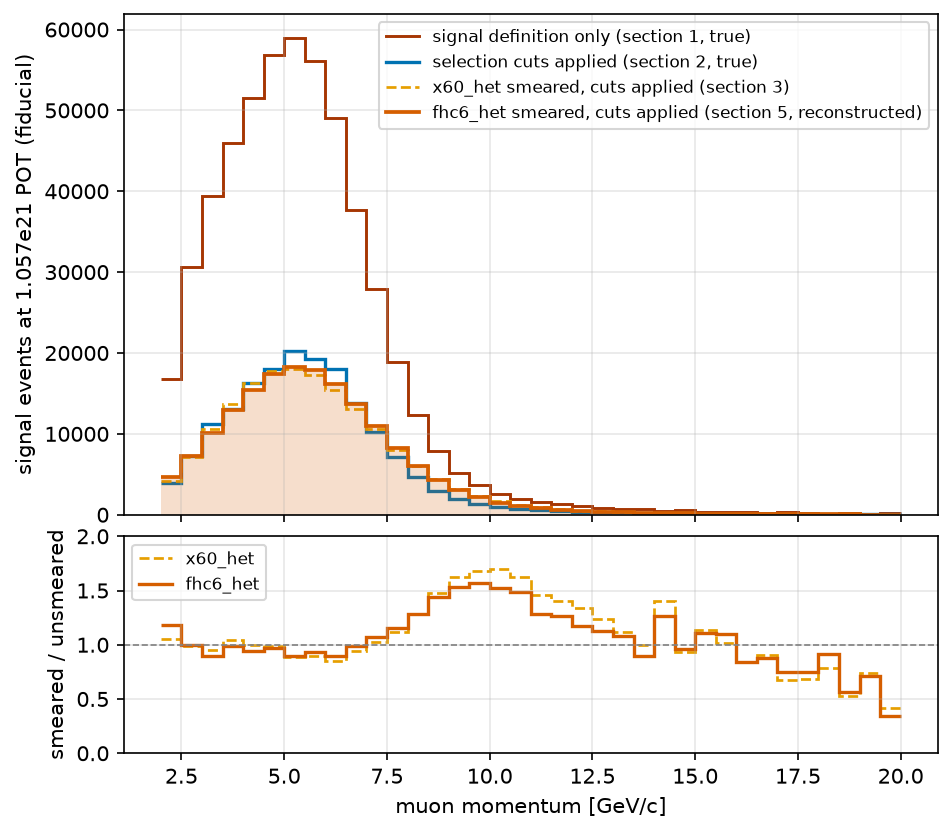

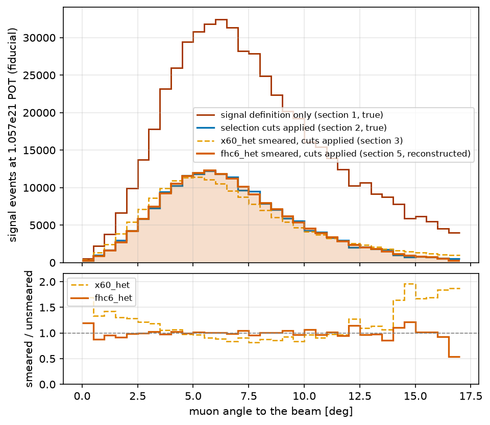

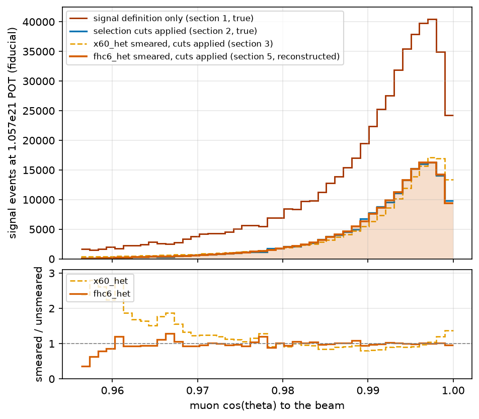

Muon momentum: median 5.75 GeV/c after smearing (5.25 before), smeared over unsmeared within 10 percent below 7 GeV/c,
up to 1.56 between 9 and 11 GeV/c and 0.34 to 0.75 above 17 GeV/c. Muon angle: median 6.25 degrees, ratio within
about 5 percent from 2 to 12 degrees, 0.87 to 0.96 below 2 degrees and 0.54 to 1.21 in the last bins. cos(theta):
median 0.9935, ratio within a few percent above 0.965.

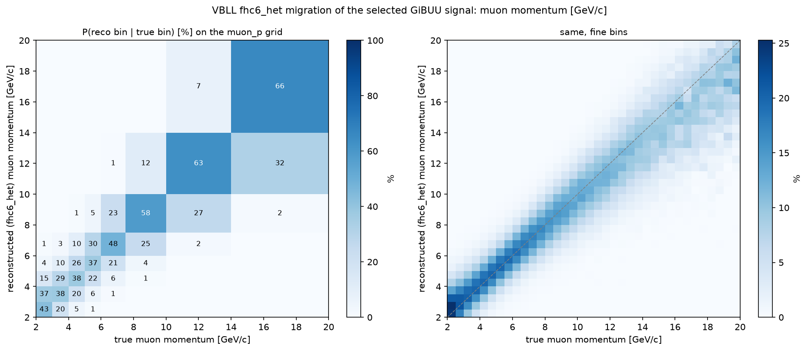

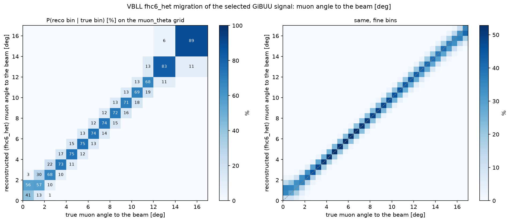

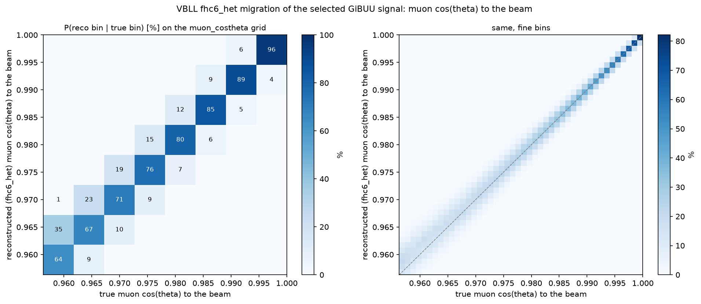

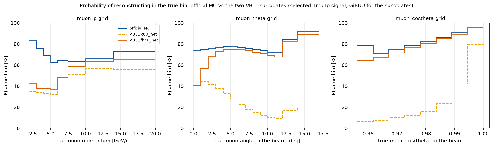

### Official MC and fhc6_het migration matrices side by side

The two analysis-grid matrices of the sections above next to each other, both column-normalised to
P(reconstructed bin | true bin) in percent, with their difference in percentage points (fhc6_het minus MC). The
true-bin populations differ, MINERvA StandardMC on the left and GiBUU on the right, which the column normalisation
removes.

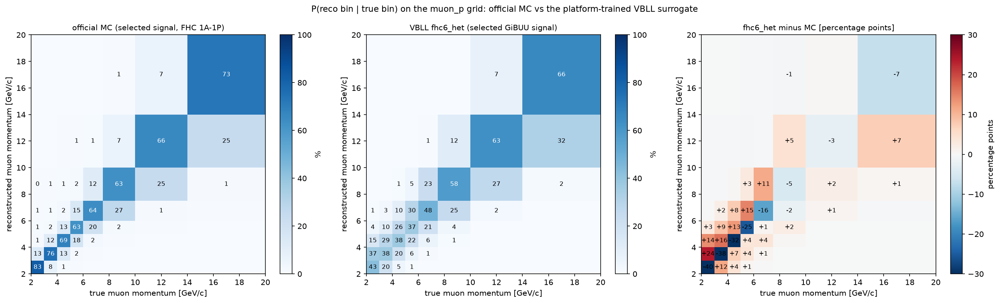

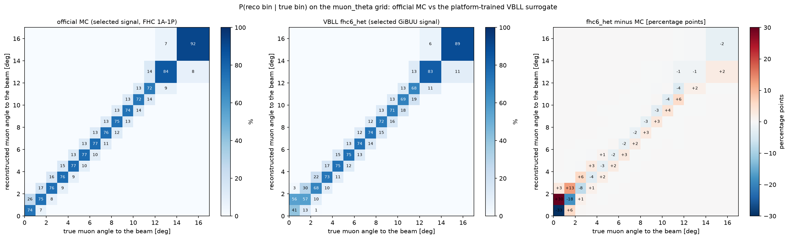

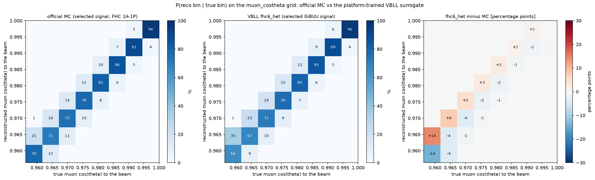

On the diagonal the surrogate falls short of the detector by 40, 38, 32 and 25 percentage points in the four
momentum bins below 6 GeV/c and by 3 to 16 points above, the missing probability going to the neighbouring bins
(off-diagonal differences up to 24 points); in angle it is within 4 points of the detector from 3 degrees upward and
short by 33 and 18 points in the two most forward 1-degree bins; in cos(theta) it is within 4 points everywhere except
the bin at the window edge (14 points). Numbers: `migration_mc_vs_fhc6.json`; script `make_migration_side_by_side.py`
(default pixi environment, reads the two JSON files).

Probability of reconstructing in the true bin, averaged over the signal:

| grid | official MC | VBLL x60_het | VBLL fhc6_het |
|---|---|---|---|
| muon momentum, 8 bins | 68 % | 37 % | 43 % |
| muon angle, 14 bins | 77 % | 23 % | 74 % |
| muon cos(theta), 8 bins | 91 % | 47 % | 88 % |

With the platform's own pairs and the angle among its outputs, the surrogate reproduces the detector's angular
migration to within a few percent per bin; the momentum migration remains about half as sharp as the detector's,
which is what the momentum width calibrated to the residual's root-mean-square implies. Files: model
`surrogates/minerva_me_ccqelike_1mu1p/_vbll/fhc6_het/`; script `make_muon_vbll_fhc6.py` (ml pixi environment, about
6 minutes after training); numbers in `muon_vbll_fhc6.json`; training log `train_fhc6_het.log`; pairs cache
`<data_dir>/cache/vbll_pairs_minerva_me_ccqelike_1mu1p_beam.npz` (not in git).
