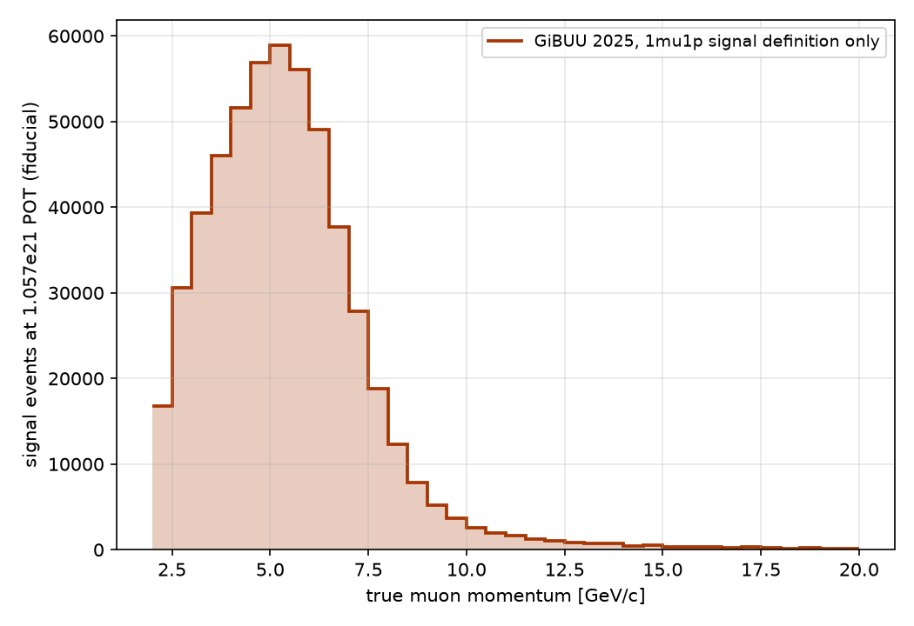
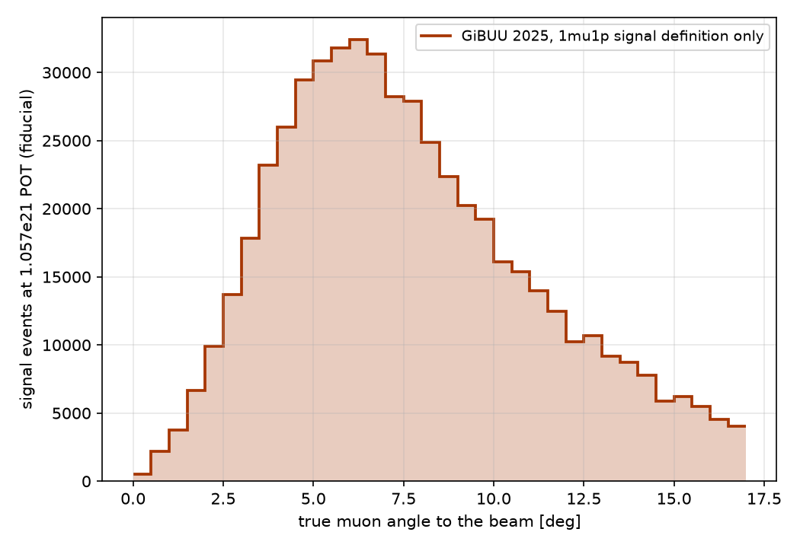

# 1mu + leading proton: results

Channel `minerva_me_ccqelike_1mu1p` (MINERvA ME FHC, arXiv:2503.15047 signal definition). Model: GiBUU 2025
numu CC on 12C under the NuMI ME FHC flux (energy-scan sample `runs/_generator_cache/gibuu_1f8bcb950be1dcd0`).
Each section adds one stage; the scripts next to this file make the figures.

## 1. GiBUU truth: muon momentum and angle, signal definition only

The only requirement is the truth signal definition of the channel: one muon with angle to the beam below 17 degrees
and momentum between 2 and 20 GeV/c, at least one proton with angle below 70 degrees and momentum between 0.5 and
1.1 GeV/c, no mesons, no baryons heavier than the neutron, no photons above 10 MeV. No reconstruction cut,
efficiency or smearing is applied. Angles are with respect to the beam. Weights are the GiBUU event weights scaled
to the data exposure (1.057e21 POT), so the histograms count expected signal events in the fiducial volume.

Of 979,395 generated CC events, 56,132 pass the signal definition, corresponding to 533,040 signal events at the
data exposure out of 8,902,466 CC events.

True muon momentum of the signal events: median 5.25 GeV/c, mean 5.43 GeV/c, peak bin 5.0 to 5.5 GeV/c.

True muon angle to the beam of the signal events: median 7.25 degrees, mean 7.67 degrees, peak bin 6.0 to 6.5 degrees.

Script: `make_muon_truth_signal.py` (default pixi environment); histogram contents and the numbers above:
`muon_truth_signal.json`.
